In 1990, Jakob Nielsen [developed 10 usability
](https://www.nngroup.com/articles/ten-usability-heuristics/)[heuristics](https://www.nngroup.com/articles/ten-usability-heuristics/)
for evaluating user interfaces. These heuristics have stood the test of time,
providing designers with a quick and easy way of evaluating the usability of
software interfaces against a set of universal design principles.

While standards and best practices for building bots will continue to emerge
over time, for now it’s a little bit Wild West. Are Nielsen’s heuristics still
applicable to bots? Let’s take a look and see which ones are still relevant;
then, let’s run a heuristic evaluation against three popular bots.

*****

### Nielsen’s Ten Heuristics

> 1) Visibility of system status&mdash; The system should always keep users informed about what is going on, through appropriate feedback within reasonable time.

The medium of bots is a conversation, and a bot conversation is governed by a
few fundamental facts:

1.  **Conversations are ephemeral**&mdash; Messages are cheap, disposable and become
stale with time. A message from a day ago is less valuable than a message from a
few seconds ago.
1.  **Old messages are not up to date**&mdash; There’s no guarantee that older
messages accurately reflect the current state of the system. The older the
message, the less confident we can be in its relevancy.
1.  **Limited real estate**&mdash; There’s a hard limit of how many characters are
visible at any one time, and a soft limit of how many words a user can
comprehend before becoming overwhelmed.

So, since messages are ephemeral we should constantly keep the user updated on
what’s going, while also avoiding overwhelming the user with a wall of
information. How do we satisfy both these imperatives?

Here’s what I propose: **The system should allow the user to request
information about what is going on, through appropriate feedback within
reasonable time.** By putting the onus on the user to request system status
as necessary, we avoid overwhelming the user with potentially redundant
information.

Also, *appropriate feedback within reasonable time*should go without saying.
Bots should be responsive,and if a network request is taking a long time, should
not leave the user waiting for a response. Providing a typing indicator, like a
human does, is a delightful touch, and indicating how long a request will take,
like “hey, still working on this… give me a few minutes” is just being
thoughtful.

> 2) Match between system and the real world&mdash; The system should speak the
> users’ language, with words, phrases and concepts familiar to the user, rather
than system-oriented terms.Follow real-world conventions, making information
appear in a natural and logical order.

You can’t get closer to speaking users’ language than, well, actually speaking
users’ language.

The problem is that understanding language is a really hard problem, and bots
are going to fall short of being smart enough, at least in the short term.

> Chatbots, you see, don’t chat very well. Even those built atop the latest tech
> are limited in what they can understand and how well they can respond. For now,
talking to a bot is like talking to, well, a machine.That makes conversational
commerce feel like a false promise. But maybe the problem isn’t the tech. Maybe
it’s the promise.&mdash; [Cade Metz,
Wired](http://www.wired.com/2016/04/tech-behind-bots-isnt-good-enough-deliver-promise/)

I think the key here is to **know your audience**. Some users will appreciate a
command line style interaction style, and others will expect to converse in
natural language. Still others might speak in slang or abbreviations. Bots
should be built with a solid understanding of the audience they seek to appeal
to.

> 3) User control and freedom&mdash; Users often choose system functions by mistake
> and will need a clearly marked “emergency exit” to leave the unwanted state
without having to go through an extended dialogue. Support undo and redo.

Conversations in real life don’t generally support the ability to undo and redo
(I wish they did), but a conversation with a bot could.

We should assume that [fat finger
syndrome](https://en.wikipedia.org/wiki/Typographical_error) will lead to all
kinds of typos and misinterpreted messages.Interactions with bots should provide
an escape hatch, and keep the user aware of valid options during any stage of an
interaction.

> 4) Consistency and standards&mdash; Users should not have to wonder whether
> different words, situations, or actions mean the same thing. Follow platform
conventions.

Platform conventions are still being worked out, but in the meantime we can
interpret this heuristic to mean that bots should be **internally consistent**;
a bot should stick to a single style of language, [whether that’s natural
language, command line, or something in
between.](https://chatbotsmagazine.com/which-is-best-for-you-rule-based-bots-or-ai-bots-298b9106c81d)

In the case of command line interactions, it’s extra important to distinguish
between keywords and natural language interactions.One technique we’ve used in
our Emojinary bot is to denote commands as capitalized words: i.e., HELP, or
NEXT.

> 5) Error prevention&mdash; Even better than good error messages is a careful
> design which prevents a problem from occurring in the first place.Either
eliminate error-prone conditions or check for them and present users with a
confirmation option before they commit to the action.

Getting confirmation is imperative in bot interactions. Designers should build
interactions with the assumption that errors will happen early and often, given
the ambiguity and impreciseness of most human dialogue. **Ask for confirmation
from the user for any critical step in an interaction.**

> 6) Recognition rather than recall&mdash; Minimize the user’s memory load by
> making objects, actions, and options visible. The user should not have to
remember information from one part of the dialogue to another. Instructions for
use of the system should be visible or easily retrievable whenever appropriate.

Judging from the research we’ve done, users don’t seem to read much, if at
all.For folks who’ve been building websites for years, this won’t come as a
surprise,but it’s a particularly rich irony given that the medium of bot
communication is mostly text.

While building our Emojinary bot, we’ve run usability tests seeking to
understand why users get lost in our onboarding flow. We’ve found that a common
problem is users will read the first message we send and then their eyes glaze
over.They skim the rest.After we ask them to reread the messages in more detail,
their confusion evaporates.

This is a clear example of the bot design failing the users.**If users fail
to read and comprehend the messages we send, it’s our fault.**

We need to, again, satisfy two competing goals: We need to avoid overwhelming
the user with a wall of text, while also providing clues as to what her options
are at any given point in the interaction.

Facebook’s [structured
messages](https://developers.facebook.com/docs/messenger-platform/quickstart)
are a great solution to this problem. They remove the ambiguity from a
particular interaction by providing a discrete set of options for the user to
choose from.Over-reliance on structured messages can feel contrived, however, as
I explore in the next section when evaluating the bots.

> 7) Flexibility and efficiency of use&mdash; Accelerators-unseen by the novice
> user-may often speed up the interaction for the expert user such that the system
can cater to both inexperienced and experienced users. Allow users to tailor
frequent actions.

Lots of Slack bots can be invoked with something like:

    /giphy hotdog

Which loads a relevant gif into the channel.

<capt>/giphy hotdog</capt>

Bots are supremely well positioned to provide these types of invisible
accelerators to power users.While one user might say “Hey, Giphybot, can you
look for a picture of hotdogs?”, another user cuts right to the chase with a
command.

An open question for me is: what’s the best way to provide affordance for
discovering these power moves?How can we teach users to become power users
without resorting to a clunky help menu?

> 8) Aesthetic and minimalist design&mdash; Dialogues should not contain
> information which is irrelevant or rarely needed.Every extra unit of information
in a dialogue competes with the relevant units of information and diminishes
their relative visibility.

<capt>Business in the front, party in the back</capt>

Judging from the interactions I’ve seen with my two bots, first time users
invariably launch into a very human-like interaction:

    “Hey there. How’s it going?”

How should bots respond to queries unrelated to their core competency?Should
they be all business, or engage in some frivolity? If I’m a bot selling shoes,
and you ask me about my life, should I engage in some small talk? Should I
gently nudge you back to shoes? If I’m nudging you, how hard do I nudge? If I
engage in some banter, how much banter should I support?

These questions get at the heart of what a bot’s personality is and should be,
and crafting compelling personalities will be key differentiators between
successful bots and the rest of the pack.

<capt>ZapposBot wants to sell you these shoes</capt>

Imagine you’re shopping on Zappos for a pair of shoes. The brand voice of Zappos
is friendly, chatty, super helpful. You wouldn’t expect your conversation to get
right down to business; I want to get to know ZapposBot a little bit, find out
what makes it tick. Conversely, if I’m talking to some LawyerBot, I expect a
more professional interaction, because you’re probably billing me by the message
(kidding!)

There’s a distinction between content (the *information*), and the medium (the
[*personality*](https://chatbotsmagazine.com/designing-a-chatbots-personality-52dcf1f4df7d)).The
content can stay minimal, but the medium doesn’t have to.If I ask you how your
day is going, I expect an answer.Bots that fail to oblige users in this way
inevitably let them down and lead to a subpar experience.

> 9) Help users recognize, diagnose, and recover from errors&mdash; Error messages
> should be expressed in plain language (no codes), precisely indicate the
problem, and constructively suggest a solution.

Still applicable. If your bot barfs out a “500 error” you’re doing it wrong.

> 10) Help and documentation&mdash; Even though it is better if the system can be
> used without documentation, it may be necessary to provide help and
documentation. Any such information should be easy to search, focused on the
user’s task, list concrete steps to be carried out, and not be too large.

Also still applicable. Help and documentation should be accessible via the bot
itself.I suspect a convention will be established over time regarding the best
way to fetch bot documentation; in the meantime, make it quick and easy to get
help and documentation.

*****

#### The Relevant Heuristics

A few heuristics go together: **Visibility of System Status** & **Recognition
Rather than Recall** speak to the difficulty of balancing too much information
with providing enough information for the user to make informed choices.**User
Control and Freedom** & **Error Prevention** both prescribe the same solutions,
specifically demanding confirmation for critical steps and providing escape
hatches. Finally, **Match between system and real world** & **Help users
recognize, diagnose and recover from errors** both speak to the necessity of
consistency in language.

This leaves us with six relevant heuristics:

1.  **Visibility of System Status & Recognition rather than recall**&mdash; Keep the user
appraised of the system and their options at critical points, and give the user
options to request additional information at any point.
2.  **Match between system and real world & Help users recognize, diagnose and
recover from errors**&mdash; Know your audience. Don’t switch communication styles.
3.  **User control and freedom & Error Prevention**&mdash; Get confirmation from the
user at critical points, and provide escape hatches for multi step interactions.
4.  **Flexibility and efficiency of use**&mdash; Provide accelerators to power users.
5.  **Consistency and standards & Aesthetic and minimalist design**&mdash Keep the
communication style and personality / voice consistent.
6.  **Help and documentation**&mdash; Provide help within the bot.

Let’s take a look at some popular bots and see how they hold up.

*****

### The Contenders

I’m going to look at the following three bots since they were some of the first
out of the gate on Facebook’s Messenger platform:

* [Poncho](https://www.messenger.com/t/hiponcho/)
* [CNN](https://www.messenger.com/t/cnn/)
* [1–800-Flowers](https://www.messenger.com/t/1800flowers/)

#### Poncho

Poncho starts out strong by providing a hint as to what to do: talk about the
weather.

Ok, sounds good, let’s talk about it, Poncho!

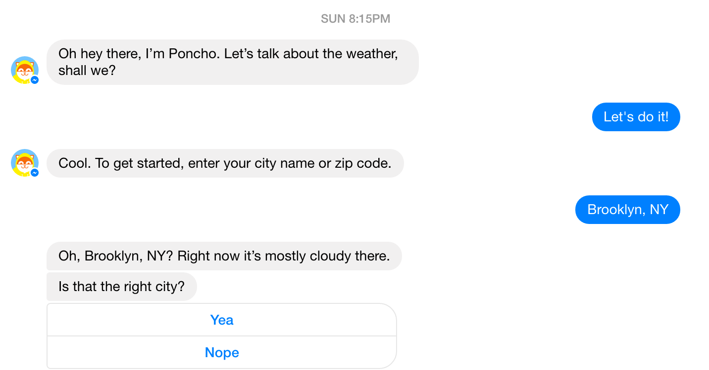

This is an awesome interaction so far. Let’s recap:

* There’s no ambiguity about what to do or say
* Poncho has confirmed the information provided (my location)
* Poncho is giving me the ability to “undo”; aka, amend the information I’ve
provided.

Let’s see what it looks like if I say “Nope”:

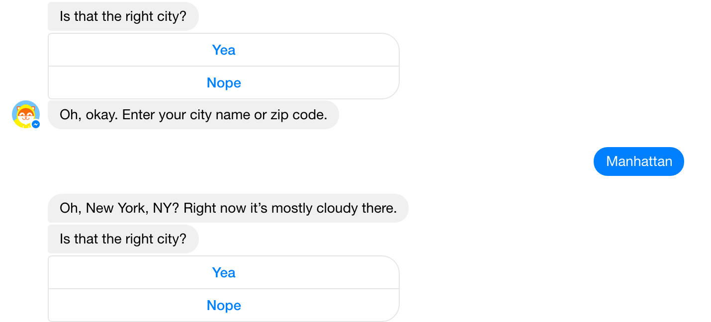

Decent, though I’m not a fan of Poncho running me through identical language
here (Is that the right city?). Up to this point, I forgot I was conversing with
a bot; now my innocence is lost.

Anyways, let’s keep going and say “Yea”.

I get the weather along with the next CTA; I don’t want to set any notifications
for now, but thanks for asking, Poncho.

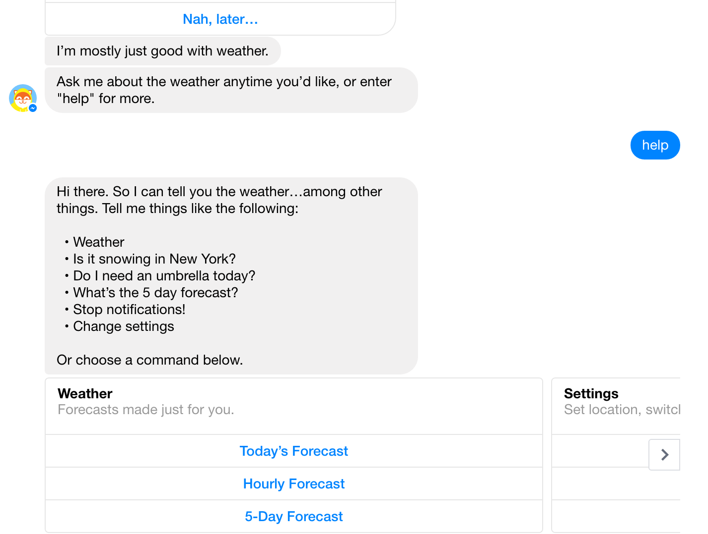

This is just a fantastic job of providing inline documentation, and Poncho even
prompted me to ask for this help. Awesome. Also a great example of structured
messages in Facebook to remove any potential for ambiguity.

Let’s see if we can get at some system visibility:

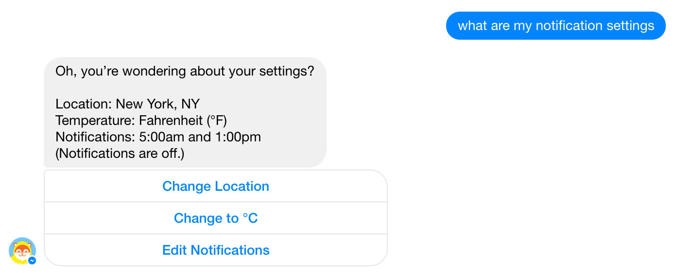

Succinct and clear.

Poncho also does a great job with banter, and when you reach the limits he pulls
you back:

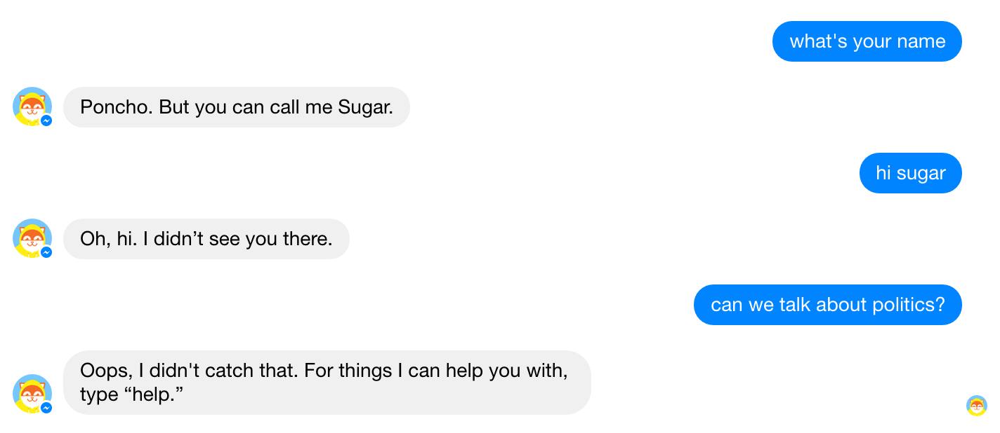

#### Verdict

1.  **Visibility of System Status & Recognition rather than recall**&mdash; Responds to
queries regarding system status. Provides structured messages to guide the user.
1.  **Match between system and real world & Help users recognize, diagnose and
recover from errors**&mdash;Poncho uses vocabulary I’m familiar with.
1.  **User control and freedom & Error Prevention**&mdash; I made an “error” entering my
location and Poncho let me fix it. Awesome.
1.  **Flexibility and efficiency of use** &mdash; If I come back, Poncho will remember my
location, saving me a few keystrokes.
1.  **Consistency and standards & Aesthetic and minimalist design**&mdash; Poncho is
pretty straight to the point, and the structured messages are clear and concise.
Poncho is also a delight to talk to, most of the time.
1.  **Help and documentation**&mdash; Fantastic example of inline documentation done
right.

Poncho knocks it out of the park.

#### CNN

Next up, CNN.

CNN makes good use of structured messages. However, this already feels less like
a conversation and more of a command line.

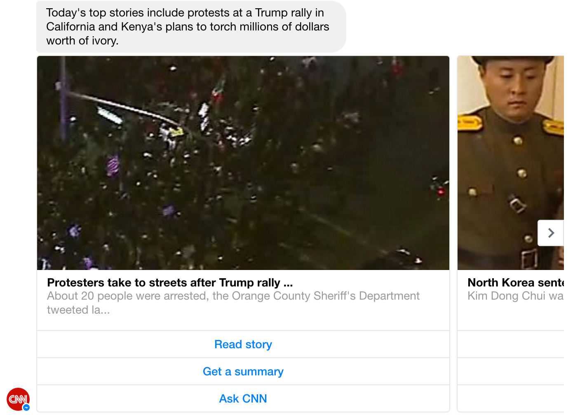

While the CNN bot is definitely not something I’d want to have a beer with, it
works in its favor when it comes to guiding my actions; I’m more inclined to
treat it like a command line and less like a pal.

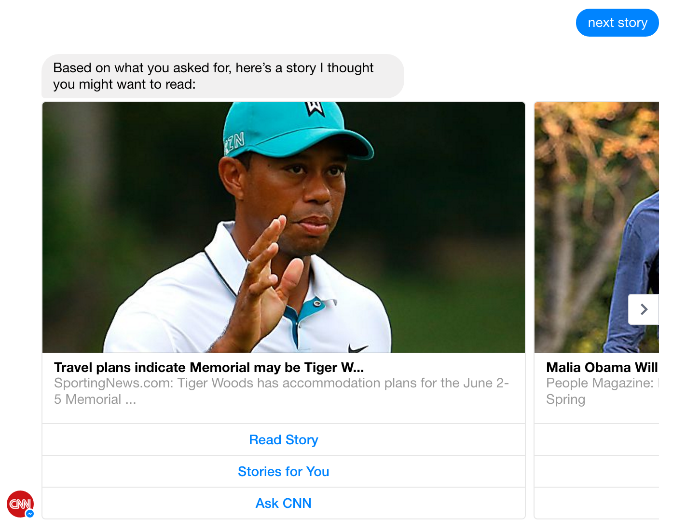

Other than giving me stories, it’s unclear what I can do, and seems to rely
overly much on accepting interactions via structured message. “Ask cnn” doesn’t
really do too much.

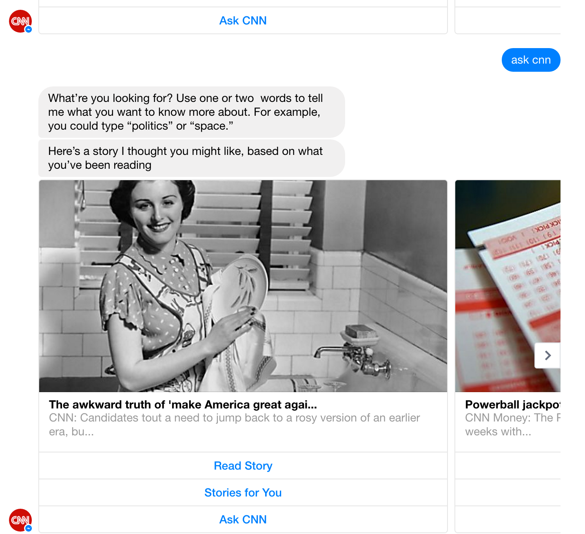

This bot gets the job done, but is a tad underwhelming. I’d rather just use the
website.

#### Verdict

1.  **Visibility of System Status & Recognition rather than recall**&mdash; Structured
messages are very clear, but fails to accommodate regular messaging; unclear
CTAs at times.
2.  **Match between system and real world & Help users recognize, diagnose and
recover from errors**&mdash; Very little opportunity for interacting outside of
structured messages.
3.  **User control and freedom & Error Prevention**&mdash; Not too many opportunities for
errors here.
4.  **Flexibility and efficiency of use** &mdash; CNN bot all but asks you to treat it
like a command line, though it seems to not differentiate between power users
and novices.
5.  **Consistency and standards & Aesthetic and minimalist design**&mdash; Consistent,
but no voice here; it’s like I’m looking at an RSS feed in Messenger.
6.  **Help and documentation**&mdash; Provides inline help, though it seems like some
stuff is missing: for instance, what should “ask cnn” do?

#### 1–800-Flowers

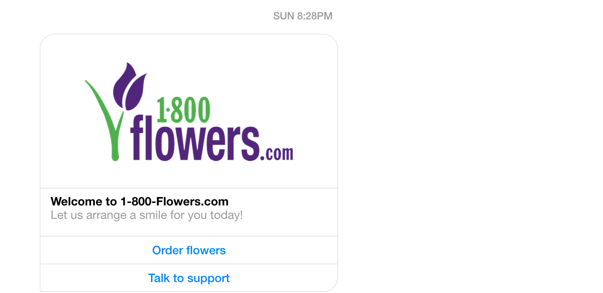

Leads with a structured message. Doesn’t really make me want to have a
conversation with this thing. Let’s see what happens if I hit “Talk to support”:

Oh crap, I don’t want to talk to a human. Cancel, cancel!

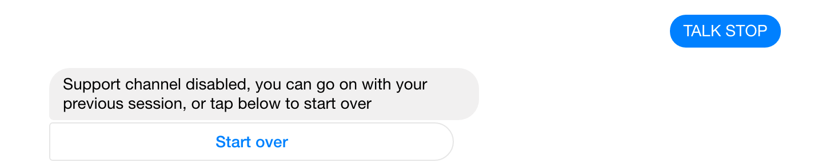

Coincidentally, that is an awesome example of undo in action right there.

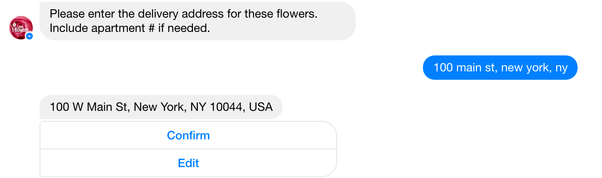

Great use of confirmation right here.

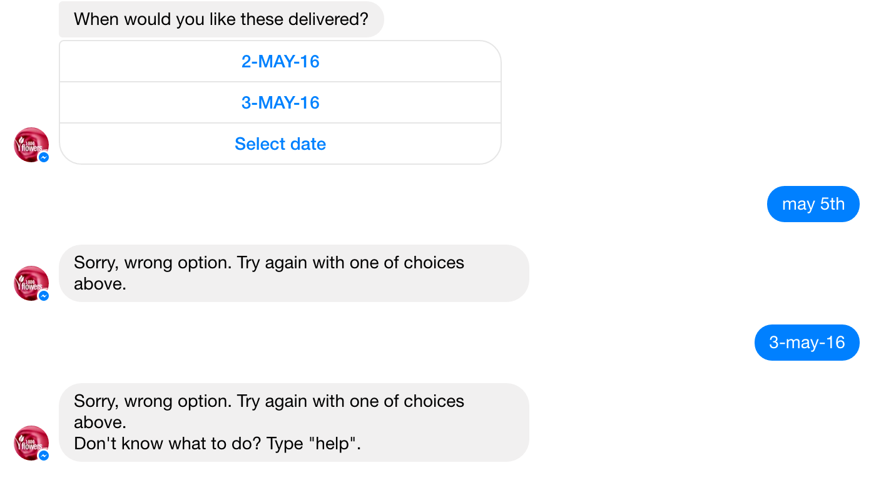

Not a fan of this interaction here. They’re forcing the user into using
structured messages, which feels limiting. However, it is nice that they
prompted me to ask ‘help’. Let’s ask for help.

I let the bot sit fallow for a while, and then this happened:

That’s a really nice touch!

#### Verdict

1.  **Visibility of System Status & Recognition rather than recall**&mdash; Great job
using structured messages to guide a user through the interaction.
2.  **Match between system and real world & Help users recognize, diagnose and
recover from errors**&mdash; Fails, especially at the end: when I tried to enter an
exact date, it choked.
3.  **User control and freedom & Error Prevention**&mdash; Did a great job of allowing me
to go back and change my order.
4.  **Flexibility and efficiency of use** &mdash; Nice use of humans to fill in the gaps;
novice users would appreciate the human touch, while power users can get right
to ordering.
5.  **Consistency and standards & Aesthetic and minimalist design**&mdash; It feels like
I’m interacting with a webpage inside Messenger.
6.  **Help and documentation**&mdash; Great inline help.

*****

### Conclusion

While I think there’s still plenty of opportunity to figure out some
bot-specific design heuristics, Nielsen’s hold up pretty well. We can see that
all three bots we looked at do a great job of providing affordance around error
prevention and recovery, and all three provide inline help right in the bot.
These go a long way towards grounding the user in the experience.

Crafting a compelling, delightful bot experience is going to be a key
differentiator between the bots that see adoption and those that don’t. Nielsen’s
heuristics continue to provide a great benchmark to point us in the right
direction.
