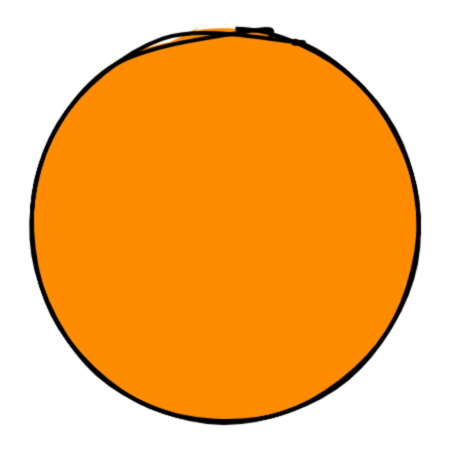

When I was growing up, I read a story about a man from Serbia named [Kalfa Manojlo](http://elevate.airserbia.com/Elevate_Specijal_jul2017/index.html#28/z). He was a blacksmith's apprentice who dreamt of becoming the first man in human history to fly.

He wasn't the first to try. People had been flapping their arms like birds for centuries with no apparent success, but Manojlo, with the confidence of somebody too young to know what they don't know, believed he could build a pair of wings better than any that had come before. On a chilly November day in 1841 Manojlo took his winged contraption, scaled the town Customs Office, and launched himself into the air above a crowd of bemused onlookers.

You've probably never heard of this guy unless you're Serbian, so you can probably guess what happened: Manojlo landed head first in a nearby snowbank to much amusement from the gathered crowd. (Pretty good entertainment in the 1840s.)

Many early attempts at flight were like this. People thought that to fly like a bird, you had to imitate a bird. It's not an unreasonable assumption; birds have been flying pretty darn well for a pretty long time. But to conquer flight on a human scale requires a fundamentally different approach.

Neural Networks, the engines that power Deep Learning, are inspired by the human brain, in particular its capacity to learn over time. Similar to biological brains, they are composed of cells connected together that change in response to exposure from stimulus. However, Neural Networks are really closer to statistics on steroids than they are to a human brain, and the strategies we'll use to build and train them are diverge pretty quickly from anything related to the animal kingdom.

Neural Networks have been around since at least the '50s, and from the beginning people have asked when we might expect machines to achieve consciousness. Depending on the speaker, the term Artificial Intelligence can mean anything from Logistic Regression to Skynet taking over the world. For this reason, we'll instead refer to the technology we're interested in as **Machine Learning** and **Deep Learning**.

Machine Learning is the act of making predictions. That's it. You put data in, you get data out. This includes a large range of methods not under the Deep Learning umbrella, including many traditional statistical methods. And Deep Learning covers the specific technology we'll study in this book, Neural Networks.

## The Proliferation of Deep Learning

Though the concepts behind Neural Networks have been around since at least the '50s, it's only within the past decade that it's exploded in industry, largely because of advances in hardware, in the volume of data, and in cutting-edge research advancements.

It turns out that asking a machine to make predictions, and giving it the tools to improve those predictions, is applicable to a startlingly diverse set of applications.

You've probably encountered Neural Networks in use through one of the popular virtual assistants, like Siri, Alexa, or Google Home, on the market today. When you use your face or fingerprint to unlock your phone, that's a Neural Network. There's a Neural Network running on your phone's keyboard, predicting which words you're likely to type next, or autosuggesting likely phrases in your email application. Perhaps you've been prompted to tag your friends in uploaded photos, with your friends' faces highlighted and their names autosuggested.

Deep Learning can recognize and classify images to a [degree of accuracy that exceeds humans](https://arxiv.org/pdf/1706.06969.pdf). Deep Learning monitors your inbox for spam and monitors your purchases for fraud. An autonomous agent uses Deep Learning to decide which move to make in a game of Go. An autonomous car uses Deep Learning to decide whether to speed up, slow down, and turn right or left. Hedge funds use Deep Learning to predict what stocks to buy, and stores use it to forecast demand. Magazines and newspapers use Deep Learning to automatically generate summaries of sports, and doctors are using Deep Learning to identify cancerous cells, perform surgery, and sequence genomes. Researchers recently trained a Neural Network to [diagnose early-stage Alzheimer's disease long before doctors could](https://www.ucsf.edu/news/2018/12/412946/artificial-intelligence-can-detect-alzheimers-disease-brain-scans-six-years
).

There's almost no industry that won't realize huge changes from Deep Learning, and these changes are coming not in decades, but *today* and over the next few years.

Andrew Ng, co-founder of Google Brain, often refers to this technology as ["the new electricity"](https://www.theguardian.com/future-focused-it/2018/nov/12/is-ai-the-new-electricity): a technology that will become so ubiquitous as to be embedded in every device, everywhere around us. This oncoming sea change has huge implications for how we build applications and craft software. Andrej Karpathy, Director of AI at Tesla, calls it "Software 2.0":

> It turns out that a large portion of real-world problems have the property that it is significantly easier to collect the data (or more generally, identify a desirable behavior) than to explicitly write the program. In these cases, the programmers will split into two teams. The 2.0 programmers manually curate, maintain, massage, clean and label datasets; each labeled example literally programs the final system because the dataset gets compiled into Software 2.0 code via the optimization. Meanwhile, the 1.0 programmers maintain the surrounding tools, analytics, visualizations, labeling interfaces, infrastructure, and the training code. &mdash; [Andrej Karpathy](https://medium.com/@karpathy/software-2-0-a64152b37c35)

## Intelligent Devices

Traditionally, Neural Networks have been run exclusively on servers, massive computers with the computing horsepower to support them. That's beginning to change.

Companies are investing huge sums of money in improving consumer-grade hardware to run Neural Networks. Apple's recently released NPU chip - a dedicated neural processing unit embedded in every new iPhone - saw an astounding *9x* increase over the [previous year's model](https://www.apple.com/in/iphone-xs/a12-bionic/). As Moore's Law slows down for traditional CPUs, manufacturers are finding that they can eke out big gains by focusing on more specialized domains, like Neural Networks. This means that, increasingly, consumer-level hardware will feature powerful specialized hardware tuned to efficiently run Neural Networks.

And just in time, because there's compelling reasons to run Neural Networks directly on the device.

A big one is privacy. Consumers and governments are increasingly asking question about how data is being collected, used, and stored. If you run your Neural Network on-device, the data never needs to leave the device, and all processing can happen locally. While this is a compelling argument to users tired of hearing about yet another breach of their data in the news, it also opens up new use cases that demand increased respect for privacy, like smart devices expanding into the more intimate spaces of our homes.

Another reason is latency. If you're in a self-driving car, you can't rely on a cloud connection to detect whether pedestrians are in front of you. Even with a good connection, it's hard to do real time analysis on a 60 FPS video or audio stream if you're processing it on the server; that goes double for cutting-edge AR and VR applications. Processing directly on the device avoids the round trip.

Consumer devices have direct access to a wide array of sensors - proximity sensors, motion sensors, ambient light sensors, moisture sensors - that Neural Networks can hook into, and the devices in turn provide a rich surface for enabling direct interactivity with Neural Networks in ways that servers can't match.

> I believe we're currently at an inflection point, and mobile devices are soon going to dominate inference. The growth of the entire AI ecosystem is going to be fueled by mobile inference capabilities. Thanks to the scale of the mobile ecosystem, the world will become filled with amazing experiences enabled by mainstream AI technology ... Tasks that were once only practical in the cloud are now being pushed to the edge as mobile devices become more powerful. &mdash; Dan Abdinoor, CTO of Fritz.ai

As more companies face the decision of whether to deploy their Neural Network on a server or directly on the device, increasingly that answer will be the device. It just makes sense.

## Javascript and Neural Networks

While there's no shortage of domain-specific languages for on-device Neural Networks, I think Javascript is well positioned to garner market share for *on-device* Neural Networks going forward.

Javascript boasts a chameleon-like ability to exist on every platform, everywhere. It starts out with an enormous installed base of every browser on every phone and desktop, but it's also a popular environment for building native mobile application development (with React Native), native desktop development (Electron), or server-side development (Node.js).

In most AI frameworks (for instance, Tensorflow) the framework serves as a translation layer between high level abstractions and the actual mathematical operations farmed out to the GPU. Since the underlying math layer is C++, software developers have the freedom to build abstractions in whatever language is most comfortable.

Javascript is ideal for our purposes in this book, because you already have it installed (through your web browser) and it excels as a language in handling rich interactive experiences. Though all the Networks we'll write in this book are designed to run in a browser, you may wish to tackle larger datasets requiring more computation in the future; if so, all examples can be ported to run in Node.js and can take advantage of whatever server-side GPUs you have at your disposal.

> Any application that can be written in JavaScript, will eventually be written in JavaScript. &mdash; Jeff Atwood, co-founder of StackOverflow

The biggest drawback I see for using Javascript for Deep Learning is the nascent ecosystem. `npm` still lags Python's tools in the breadth and depth of packages supporting Deep Learning, and a huge amount of resources, tutorials, and books demonstrate AI concepts in Python or R. To me, this presents an opportunity as a community to step up and contribute the next generation of tools. Javascript is a wily language and I have no doubt developers will fill in the gaps soon.

## Neural Networks

We've talked about why Neural Networks are important, but what exactly *is* a Neural Network?

Earlier we said Machine Learning is the act of making predictions. More precisely, you put numbers in, those numbers get put through some number of mathematical functions, and new numbers come out.

The fundamental building block of a Neural Network is a **Neuron**. In code, Neurons are commonly referred to as **units**.

The Neuron takes in a single number and transforms it. You'll specify the nature of this transformation when you architect your Network.

A collection of Neurons comprise a **Layer**.

Since a layer is a collection of neurons acting in concert, it is capable of much richer computation than a single Neuron.

Neurons are connected to other Neurons via **Weights**.

Weights describe the strength of the connection between a given pair of Neurons. A bigger weight implies a stronger connection between one Neuron and another, increasing the influence that Neuron will have on the final prediction.

A Neural Network is made up of some number of layers.

This diagram shows a three-layer Neural Network. The first layer is the **input layer**. This is where data enters the Network. The last layer is the **output layer**, responsible for emitting the transformed values from the Network.

The layer in the middle is called a **hidden layer**. Hidden layers make up the bulk of Neural Networks, and it's Networks with a lot of hidden layers that give rise to the phrase "Deep Learning": those Networks are "Deep". There's no limit to the number of hidden layers you can use.

A Neural Network exists in one of two phases: **Inference** or **Training**.

**Inference** describes the flow of data moving forward in one direction through the Network, from the input layer to the output layer. You can think of this as the network *predicting* the expected value, based on the given input values. For instance, you might feed it a picture of an animal, and the Network might answer "dog".

When you do this, specific Neurons fire based on the presence or absence of certain characteristics: Does it have fur? Does it have floppy ears? Is its tongue hanging out at an odd angle? Based on the answers to these questions, the Network might answer "Yes, I think this is a dog!"

Inference is usually, though not always, how your users will interact with your Neural Network.

**Training** describes the flow of data forward *and* backward through the network. Based on the accuracy of the Network's predictions, changes ripple backwards, adjusting weights so that the network can improve and produce more accurate predictions in the future. You might feed the network a hundred photos of dogs, allowing the network to figure out - on its own - that all dogs tend to have fur and oddly angled tongues.

*(You may see the terms **forward propagation** and **backpropagation**. These are formal terms for describing Inference and an element of Training, respectively.)*

<!--
Often these two phases - Inference and Training - are approached separately, and in this book that's how we'll tackle them. We'll start by looking at **Inference**, including how to interact with pretrained Neural Networks, how to pass them data, and how to interpret predictions. After that, we'll discuss **Training**, including how to build Neural Networks from scratch, and how to train them to return accurate predictions.

We'll start by learning how to load a Neural Network in our browser and use it.
-->

***

This is chapter 1 of my book about Neural Nets in Javascript. Want to get a few more sample chapters? Subscribe below!
