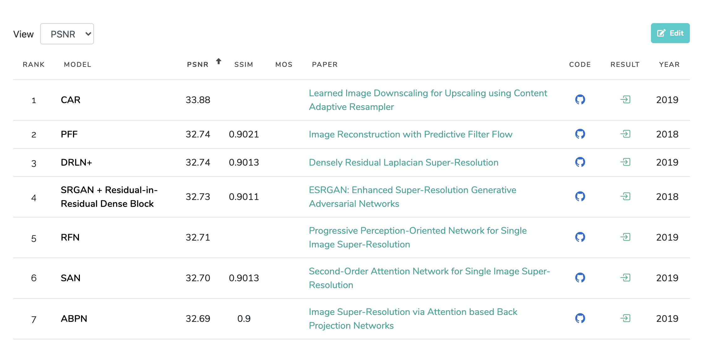

* Overview of article / intro / what article is about / what it is not about. Talk about the GAN solution and how this is mostly about JS.

* Show a GIF of the tool in action.

Use case: images on low latency.

* Define what upscaling is

* Talk about wanting a (somewhat) agnostic tool - something where we could switch in and out new pretrained models

* So nothing that requires a ton of bespoke work

Link to my tool.

## The Problem

Let's say you want to increase an image's size by 4 times. You could start by quadrupling each "pixel" - ending up with 16 pixels where before you had 1:

([You can actually do this directly in your browser with the `image-rendering` CSS property](https://css-tricks.com/almanac/properties/i/image-rendering/)).

On the one hand, it's pretty clear what's going on here. On the other hand, it looks pixelated. Outside of pixel art, this is not to the most aesthetically pleasing approach. It sort of looks like an 8-bit video game.

The more common approach - the one that [browsers use by default](https://developer.mozilla.org/en-US/docs/Web/CSS/image-rendering) - is something called [bicubic interpolation](https://en.wikipedia.org/wiki/Bicubic_interpolation):

This is obviously much less pixelated, and is more aesthetically pleasing. On the other hand, it's blurry.

There have been lots of other algorithmic improvements with various tradeoffs which I won't go into. Instead I'll jump straight to one of the most cutting edge solutions out there, based on GANs.

## Better Solutions

GANs

Talk about how GANs work, and why they're appropriate for this particular task.

### Choosing an Implementation

How do you go about choosing an architecture, and an implementation?

The first step I took is to see what the latest research was. Most (all?) cutting edge Machine Learning research is posted to arxiv.

I'm partial to a site called paperswithcode.com. They categorize papers by subject area, and lo and behold, [there's even a specific category dedicated to this problem]( https://paperswithcode.com/task/image-super-resolution). The site ranks papers based on their performance against standard problem datasets.

You can see the performance of each implementation against a standard dataset, and see how they're measured on different metrics. PSNR and SSIM are two common ways of measuring performance for Super Resolution tasks; [PSNR](https://en.wikipedia.org/wiki/Peak_signal-to-noise_ratio) can measure noise, and [SSIM](https://en.wikipedia.org/wiki/Structural_similarity) measures the similarity between two images.

### Evaluating Implementations

While accuracy is important, for our purposes it's not the only thing we're interested in. Since we're ultimately porting the model to Javascript, other important factors include:

* A clear and thorough paper - more than likely we'll need to tweak the code and the easier it is to understand, the better
* Fast inference speed - since this will be running in a browser
* An implementation in Tensorflow - Pytorch models will not convert into Tensorflow.js
* An implementation that can be saved, converted, and run in Javascript - I'll go more into specifically what this entails down below

These can be difficult to ascertain from just reviewing the repos. Often you need to grab the code and give it a whirl.

First, I chose [ESRGAN](https://paperswithcode.com/paper/esrgan-enhanced-super-resolution-generative) for my model. It's a well written paper, scored well (though not the best) on various metrics, and boasts numerous implementations in Tensorflow. (Often, not all implementations available on Github will be on this site - it's worth it to google and see if any additional ones come up).

After picking your model, it's time to evaluate the various implementations (or feel free to implement the paper from scratch - you are probably not the right audience for this article!)

I narrowed down the implementations to three I felt were of decent code quality and were well documented:

* idealo
* super-resolution
* the other one

Maybe this is just me - but I often have a hell of a time getting these things to run out of the box. Even the really well documented ones, I run into issues with dependencies hell, I run into python version mismatches - its a mess. Whenever I do this, I plan to spend at least a couple hours, oftentimes more, just wrestling with the tools to get them running.

Extra points to repos that include a Google Colab link; also extra points to repos that have a Dockerfile.

Oftentimes I will set up my own Dockerfile that pins dependencies and environments and gives me something reproducible. As you're exploring and experimenting, one of the worst problems to hit is to do some experimentation, come back a week later and have something be broken and be back in dependency hell.

ALSO - pretrained weights are a huge plus. If you have to train a model's implementation from scratch, that's a huge time sink, but with pretrained weights you'll be able to test inference out of the box which is much faster. Even if you intend to do your own training, this can be a huge win, and also provides a really great metric against which to compare your results.

ALSO - information on how those weights are trained! It can be incredible frustrating to have a pretrained model with no information on how it was made, and to be banging your head trying to reproduce it. Am I hammering this point enough? Reproducibility!

Specifically, information on Hyperparameters, and the dataset used are key. Also epochs, stuff like that.

I ultimately decided to use idealo's implementation. The code is easy to read, pretrained models are provided, and so and so's write up of the journey behind it was lucid and helpful. I was also able to convert the RDN implementation to TFJS with some mucking about, although not the RRDN out of the box - more on that later.

## Training

You _could_ just use the provided pretrained models in your implementation and call it a day, but there are often benefits to be reaped from getting a better understanding of the training, as well as training on your own particular dataset for your own use case.

_Talk about how training works_

One big thing about super resolution tasks is that models are tied to scale. A model trained to upscale to 2x will only ever work on 2x scales; if you want a 4x scaler, you'll need to train a model from scratch.

Datasets are also key, as well. One question I'm not clear on is whether a general dataset covers all cases that would be important, or whether models trained on specific datasets - a model trained on faces, or a model trained on animals - would perform better for its use cases. I'm still training models so I don't know the answer to this, but feel free to let me know what you've found!

A few months ago I spent some time with RAISR, another technique for doing super-resolution. One of the trick tucked away in the paper was that you could compress the low resolution images, and sharpen the high resolution images. Compressing low resolution images would make the RAISR model more resilient to compression artifacts (particularly if done somewhat randomly as an augmentation technique), whereas sharpening would often reduce in _lower_ scores on the measured metrics (SSIM and PSNR),
but conversely would produce more aesthetically pleasing images.

Would the same tricks work here? I don't know but I'd wager yes. I'm still looking into that.

## Conversion to Javascript

Converting a model to Javascript, you use the TFJS Converter. It's pretty good, and there's an implementation in Python as well as a command line tool.

So here's the things you need to be able to convert a model into a TFJS model:

* The model must be saved in a Keras or another format.
* Variables must not refer to self - this tripped me up with idealo's implementation.
* TFJS must implement all ops. I don't know a good way of checking this beforehand other than trying it and seeing if it runs in a browser.
* You must avoid custom layers - sort of, I'll talk more about how to get around this
* You have to change "Functional" to "Model" - no idea why this is the case.
* Any pre and post processing of images needs to be reproduced in JS

In the browser, performance is key, and there's two ways you can improve performance.

Here's some code to show how to save the model.

### Quantization

Quantization definition.

Out of the box, the tensorflowjs converter provides a few ways for quantizing your model.

### Pruning

Pruning definition.

There's no way that I'm aware of to prune an already trained model - you generally need to do this at train time. Keras provides a handy tool that should make this easy. This is an area of future work for me.

### RRDN

Let's also talk about custom layers. Hoo lordy that was a bitch.

## Inference in the Browser

First, you'll load an image. 

If you're dealing with images from the web, you'll run into CORS issues.

Here's some code for doing that. You'll need to get pixels into the right format.

### Warm ups

TFJS works by putting stuff in GPU. The first time you do this it takes a while. For this reason, it can help to "warm up" the shader by sending in a fake image.

Another issue you may run into is blocking the UI. There's a few ways of tackling this.

### Web workers

You can move your computation to a web worker. Web Workers shouldn't block the UI.

In my testing, this actually wasn't super helpful. It helped but was not a panacea. I believe that locking up the GPU locks up the system.

### Patch sizes

The other innovation is patch sizes. Instead of scaling up an entire image, scan it up in pieces. It'll take a little longer overall, but by splitting it up you'll be able to release the UI thread more regularly.

Provide some information on timing for whole images.

Let's provide some visuals on patch sizes:

However, patch sizes will run into an issue:

The edges have strange artifacting on them, see that? One way around that is to provide padding; here's a gif visualizing that:

However, that runs into a new issue (that I only fixed in 0.7.0 of my tool). Especially with padding, you'll end up with patch sizes whose sizes don't match:

Remember how we just talked about warm ups? If you have different size images, that negates the benefits of warm ups!

So, back to the drawing board and new algorithm:

Now we have consistently shaped patches to avoid the warm up issue, and that can feature padding to get around the artifacating. Success!

## The Final Product

I've put all this together into Upscaler.js.

The nice thing is that it's somewhat agnostic to the model being used.

