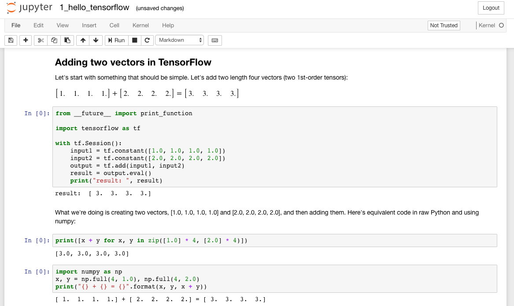
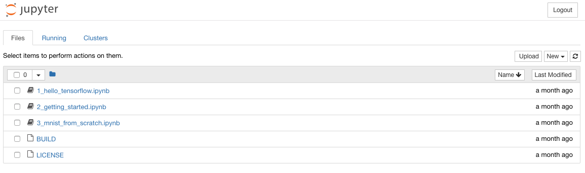
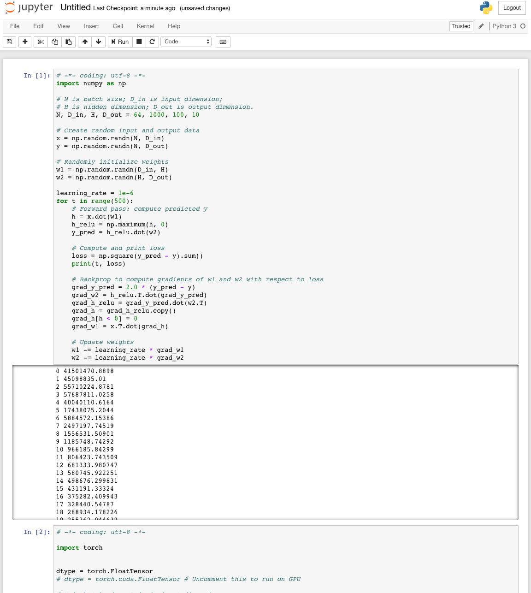

Among the buzzwords of this past year, two tower above the rest: deep learning and cryptocurrencies. It seems that everyone I know (in tech) wants to learn these things. And guess what — so do I! So much so that I'm building my own computer in order to facilitate that learning.

What follows are my notes-to-self as I build a computer to learn about deep learning and cryptocurrency mining. In the previous installments we discussed assembling the hardware, installing the OS, and setting up a mining operation. In this installment I'll talk about how to set up a cryptocurrency miner and connect to a pool.

<iframe style="height:400px;width:100%;max-width:800px;margin:30px auto;" src="https://upscri.be/96fcab/?as_embed"></iframe>
<hr />

To recap, in case you're just getting started with this series: my goal in purchasing and building my own PC was to have hardware on hand to run machine learning algorithms on, and bring myself up to speed on the exciting advances happening in AI. With the mining operation up and running, it's time for some AI!

The two packages we're going to install are [TensorFlow](https://www.tensorflow.org/) and [PyTorch](https://github.com/cdw/pytorch). I've heard lots of buzz about these two frameworks and there's tons of good resources for each. This article will walk through basic installation details on Ubuntu for both, plus instructions on setting up Jupyter notebooks. If you want to just pick one, [Awni Hannun provides a great overview of the differences](https://awni.github.io/pytorch-tensorflow/).


# Docker
**For both TensorFlow and PyTorch, we're going to install using Docker**.

Docker provides a virtualized environment that lets you isolate packages and libraries (or in our case, download pre-configured environments).

## Why Docker?

The TensorFlow [docs offer four options for installing TensorFlow](https://www.tensorflow.org/install/install_linux). My first instinct was to install directly using native `pip`.

I installed CUDA 9, the latest version, which as of this writing Tensorflow doesn't support, and got lost in dependency hell trying to downgrade / uninstall / reinstall CUDA. A friend recommended I leave all that nonsense alone and just install Docker.

So that's my recommendation: **install docker and avoid dependency hell**. 

## Step-by-step Docker installation instructions

1) Install `docker`. [Instructions for installing Docker on Ubuntu are here](https://www.digitalocean.com/community/tutorials/how-to-install-and-use-docker-on-ubuntu-16-04).
2) Make sure to follow the optional Step 2 instructions on adding yourself to the correct group so as to avoid needing `sudo`.
3) Install `nvidia-docker`. By default, `docker` doesn't support leveraging the NVIDIA GPUs effectively, so to take advantage of that hardware [you'll need to install `nvidia-docker`](https://github.com/NVIDIA/nvidia-docker#xenial-x86\_64).

# TensorFlow

[TensorFlow](https://www.tensorflow.org/) is software for machine learning released by the [Google Brain](https://research.google.com/teams/brain/) team in 2015. It provides a set of tools for specifying training instructions, and then translating those instructions into commands that can be run quickly and take advantage of GPUs.

It's a powerful piece of software and since it's release it's picked up a ton of developer mindshare.

## Installation

Assuming you followed the Docker instructions above, you should have `nvidia-docker` available and working. The next step is to [install the correct Docker image](https://www.tensorflow.org/install/install_linux#gpu_support).

We want the latest GPU version, so run:

```
nvidia-docker run -it gcr.io/tensorflow/tensorflow:latest-gpu bash
```

This command will find the Docker file (remotely or locally), spin it up and put you at a bash prompt. From there, you can [validate your installation](https://www.tensorflow.org/install/install_linux#ValidateYourInstallation).

## Validating your installation

Start `python`:

```
python
```

Paste this program, [provided by the TensorFlow docs](https://www.tensorflow.org/install/install_linux#ValidateYourInstallation):

```
# Python
import tensorflow as tf
hello = tf.constant('Hello, TensorFlow!')
sess = tf.Session()
print(sess.run(hello))
```

If you see "Hello, TensorFlow!" you'll know it's installed correctly.

## Jupyter
So we've got TensorFlow installed and working, but inputting python commands one line at a time is a terrible way to program. A much better approach to get started is to use a Jupyter notebook.

[A Jupyter notebook](http://jupyter.org/) is a web interface for documents containing code the evaluations of that code, displayed side by side on the page.



The TensorFlow Docker image [supports Jupyter notebooks out of the box](https://www.tensorflow.org/install/install_linux#gpu_support). You'll use a similar command to spin up the Docker image with a few tweaks (If the previous Docker image is still running, shut it down with `ctrl-c`):

```
nvidia-docker run -it -p 8888:8888 gcr.io/tensorflow/tensorflow:latest-gpu
```

What this command does is tell docker to expose port `8888` (in Docker) on port `8888` (of your local machine). (Port `8888` is the Jupyter notebook's default port, if you were wondering.)

To make sure that things are working as expected, open up another terminal on your box and run:

```
curl http://localhost:8888
```

If your machine is like mine, you won't see any output from this `curl` command, but you *should* see a request come in on the terminal running Docker, something like:

```
[I 02:05:57.912 NotebookApp] 302 GET / (xxx.xx.x.x) 0.22ms
```

You can access the Docker URL directly on your box. I use a laptop and prefer to access the PC remotely, so to do that, you'll need to be on the same wifi network as your Machine Learning PC and get it's IP.

On your Machine Learning PC, type:

```
ifconfig
```

Look for an IP address that starts with `192.168.x.x`. On your laptop, you'll take the URL provided by Docker and replace `localhost` with this IP. So, if the Machine Learning box's IP is `192.168.1.1`, you would type in your browser something like:

```
http://192.168.1.1:8888/?token=7f6b36f9d6b15272c76003b8c1cdfcdf306dc52ff310
```

At this URL, you should see the Jupyter notebook:



Having a Jupyter notebook handy will make it much easier to run through the TensorFlow tutorials.

# Pytorch
The other machine learning tool we're going to install is PyTorch.

[PyTorch](https://github.com/cdw/pytorch) was released in 2016 by [Facebook's team](https://twitter.com/fbOpenSource?ref_src=twsrc%5Etfw&ref_url=http%3A%2F%2Fpytorch.org%2F). It's still fairly new and changing quickly, but it's already picked up a lot of steam in the community.

## Installation

Let's install the appropriate pytorch docker image. Run:

```
nvidia-docker run --rm -ti --ipc=host -p 8888:8888 pytorch/pytorch:latest
```

This puts you right at a bash prompt.

I like learning via example, and [luckily the Pytorch docs provide plenty of examples to learn from](http://pytorch.org/tutorials/beginner/pytorch_with_examples.html). You can run through the tutorials by starting `python` and copy pasting code, but a Jupyter notebook is so much better. So let's get that working.

## Jupyter
Jupyter doesn't come standard on the `pytorch` docker image, [but it's easy to install](http://jupyter.org/install.html). In your docker container (that you started above), type:

```
python3 -m pip install --upgrade pip
python3 -m pip install jupyter
jupyter notebook
```

When I ran `jupyter notebook` for the first time, I got the following error:

```
OSError: [Errno 99] Cannot assign requested address
```

To fix this, I had to provide an explicit IP and allow root ([hat tip to this comment](https://github.com/ipython/ipython/issues/6193#issuecomment-350613300)):

```
jupyter notebook --allow-root --ip=0.0.0.0
```

### Validating the Jupyter notebook

From another terminal, run curl:

```
curl http://localhost:8888
```

And make sure you see logs appear in Docker. If that works, try accessing in the browser at `http://192.168.x.xx:8888`.

### Saving the Jupyter notebook

**IMPORTANT:** If you exit docker now, you'll lose the installation of Jupyter you just performed. You need to commit those changes as ([outlined in this article](https://www.techrepublic.com/article/how-to-commit-changes-to-a-docker-image/)) if you want to avoid installing every time you spin up the container.

First, in another terminal, get the name of the container:

```
docker ps -l
```

This should give you the most recently created container, which should be PyTorch. Then, commit with:

```
docker commit <CONTAINER_NAME> pytorch
```

Refer to our newly named container with:

```
nvidia-docker run --rm -ti --ipc=host -p 8888:8888 pytorch
```

And start up your notebook:

```
jupyter notebook --allow-root --ip=0.0.0.0
```

If that works, great! Try running through one or two of the tutorials to make sure everything's working.



# Next steps

At this point, you should have both [PyTorch](https://github.com/cdw/pytorch) and [TensorFlow](https://www.tensorflow.org/) at your disposal.

If you've made it this far in the series, congratulations! You built a computer, installed an operating system, began mining cryptocurrencies, and set yourself up to begin training computers to do your bidding. You deserve a pat on the back!

Where to go from here, you may ask? First, I'd encourage you to subscribe:

<iframe style="height:400px;width:100%;max-width:800px;margin:30px auto;" src="https://upscri.be/96fcab/?as_embed"></iframe>

I'm going to continue blogging my adventures learning this stuff, and I'd love to share it with you.

If you want an immediate next step, I'd recommend [Andrew Ng's course](https://www.coursera.org/learn/machine-learning). It's a deep and thorough introduction to the field.

Finally, I've been collecting various machine learning links and resources to work through once I have a base of knowledge. Some of these may come in handy for you! (I haven't gone through all of these so I can't vouch for them - feel free to recommend others in the comments).

<hr />

https://www.reddit.com/r/MachineLearning/comments/7nrzhn/d\_results\_from\_best\_of\_machine\_learning\_2017/?st=JBZ1N05J&sh=aa234160

http://www.wildml.com/2017/12/ai-and-deep-learning-in-2017-a-year-in-review/

https://explosion.ai/blog/prodigy-annotation-tool-active-learning

http://blog.kaggle.com/2017/09/11/how-can-i-find-a-dataset-on-kaggle/

https://www.reddit.com/r/learnmachinelearning/comments/6zvszj/another_keras_tutorial_for_neural_network/?st=J7JRX00A&sh=90a37148

https://www.reddit.com/r/MachineLearning/comments/70c5zd/n_google_launches_tensorboard_api_to_enhance/?st=J7MJ4JWJ&sh=2ece7122

https://medium.com/@ageitgey/machine-learning-is-fun-80ea3ec3c471

https://www.wired.com/story/when-websites-design-themselves/

https://chatbotsmagazine.com/contextual-chat-bots-with-tensorflow-4391749d0077

https://medium.com/machine-learning-for-humans/supervised-learning-740383a2feab

https://medium.com/intuitionmachine/the-brute-force-method-of-deep-learning-innovation-58b497323ae5

https://hackernoon.com/how-i-started-with-learning-ai-in-the-last-2-months-251d19b23597?source=userActivityShare-f31f03e60056-1506529741

https://github.com/rhdeck/bostonai/blob/master/README.md

http://nicodjimenez.github.io/2017/10/08/tensorflow.html

https://www.reddit.com/r/hackernews/comments/7dlltw/a_cookbook_for_machine_learning_vol_1/?st=JA5IEFE8&sh=b5513326

https://www.reddit.com/r/learnmachinelearning/comments/7dcog4/neural_networks_for_beginners_popular_types_and/?st=JA2YU96R&sh=fc6787ce

https://www.reddit.com/r/learnmachinelearning/comments/7centc/learning_machine_learning_01_machine_learning/?st=J9WVF138&sh=9b166f71

https://www.reddit.com/r/learnmachinelearning/comments/7c8ogk/simple_deep_learning_model_for_stock_price/?st=J9W5R9AZ&sh=22315e0b

http://blog.kaggle.com/2017/11/27/introduction-to-neural-networks/

https://www.reddit.com/r/learnmachinelearning/comments/7g5zx9/predicting_cryptocurrency_prices_with_deep/?st=JAK71BXS&sh=a283370f

https://www.reddit.com/r/learnmachinelearning/comments/7he36r/what_is_nlp_get_started/?st=JARMLMP7&sh=2886d0a9

https://www.reddit.com/r/learnmachinelearning/comments/7h7grz/essential_guide_to_keep_up_with_aimlcv/?st=JARCN2DT&sh=fe113479

http://blog.kaggle.com/2017/12/06/introduction-to-neural-networks-2/

https://docs.google.com/presentation/d/1kSuQyW5DTnkVaZEjGYCkfOxvzCqGEFzWBy4e9Uedd9k/preview?imm_mid=0f9b7e&cmp=em-data-na-na-newsltr_20171213&slide=id.g183f28bdc3_0_90
