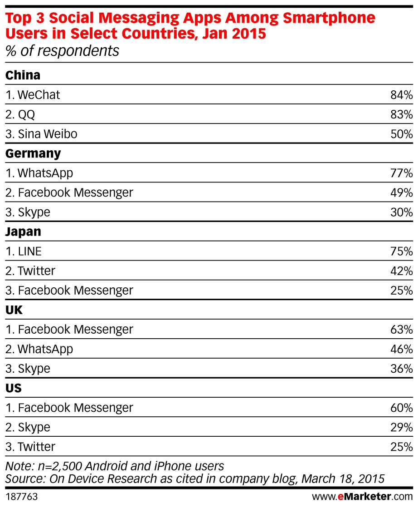

In 2007, when Apple released the iPhone, Jobs made a controversial decision not
to allow Flash on iOS. Given the long history between Adobe and Apple, not to
mention the prevalence of Flash on the 2007-era internet, this was more than a
little shocking. As a result of the flak, Jobs penned an essay [where he wrote
that the most important reason](http://www.apple.com/hotnews/thoughts-on-flash/)
for not allowing Flash on the iPhone was because:

> Flash is a cross platform development tool. It is not Adobe’s goal to help
> developers write the best iPhone, iPod and iPad apps. It is their goal to help
developers write cross platform apps.
> …
> Our motivation is simple — we want to provide the most advanced and innovative
> platform to our developers, and we want them to stand directly on the shoulders
of this platform and create the best apps the world has ever seen. — [Steve
Jobs](http://www.apple.com/hotnews/thoughts-on-flash/)

Today, in the face of a rapid onslaught of bots, designers are faced with
ensuring a high quality experience across a myriad of messaging platforms. Some
argue for consistency across platforms:

> *Users should experience a similar, consistent interaction across platforms with
> your bot, and be able to share these services with multiple users on different
platforms. For instance, if you’re on FB Messenger, you should be able to
coordinate your shopping with users on Kik, WhatsApp, LINE & etc easily without
leaving the Facebook interface. —
[Kip](https://medium.com/chat-bots/why-the-future-of-bots-will-be-multi-platform-67c503afaa7#.nfe3hmg88)

And:

> Does cross platform design become a thing of the past?? Adding functionality is
> as simple as adding a user to your chat — no longer a need to design for
separate platforms. — [The medium is the
message](https://medium.com/chat-bots/the-message-is-the-medium-11e2a4da145c#.6l0ch4xo4)

I see parallels between what happened with apps, and what is to come with bots.
[Jobs put it
eloquently](https://www.taoeffect.com/blog/2010/04/steve-jobs-response-on-section-3-3-1/):

> We’ve been there before, and intermediate layers between the platform and the
> developer ultimately produces sub-standard apps and hinders the progress of the
platform.

Should bots be consistent across platforms, or not? To answer that, let’s see what the major differences between messaging platforms are. From there we can see if there’s some grand unified “theory of everything” for how to approach bot design across platforms.

*****

### Differences between messaging platforms

Currently, the messaging ecosystem is divided between a number of players. You
can think of each of these like its own Operating System. Every Operating System
has its own culture, its own language, its own best practices for facilitating
communication.

> “WeChat is like a fully fledged cityscape where all the electrical and plumbing
> have been installed…developers can come in and build all kinds of unique and
distinctive real estate that assists people as they go about their daily
lives.”   — [We chat about
WeChat](http://www.mslgroup.cn/whitepapers/MSLGROUP_We_Chat_about_WeChat_Dec2013_EN.pdf),
MLS Group

There are three broad areas where platforms differentiate themselves from each
other: technical capabilities, audience, and communication styles.

#### 1) Technical capabilities

Every platform supports a unique subset of technical capabilities.

The most basic, and certainly the most ubiquitous, is SMS. Almost everyone with
a cell phone has SMS, and everyone knows how to text. That ubiquity is nothing
to be scoffed at; it’s hard to find an easier onboarding process than sending a
text.

At the same time, (non-iMessage) SMS lacks some features that would be *really*
nice to have. There’s no delivery receipts, no typing indicators. You can send
text and pictures, but forget about anything like Facebook’s structured
messages. And if your app depends on sending rapid fire messages that arrive in
order, well, you’re in for a [world of
hurt](https://www.twilio.com/help/faq/sms/can-my-sms-messages-arrive-in-order).

<capt>Fat cats on Facebook</capt>

At the other end of the spectrum, Facebook Messenger supports typing indicators
and read receipts, along with structured messages. Messenger also supports
sending pictures, stickers, and audio. Messenger comes with its own limitations,
however, like requiring bots to go through an approval process against
Facebook’s Terms of Service.

The limitations of particular platforms lead to some interesting tradeoff
decisions. If you support both SMS and Facebook Messenger, should you design for
the lowest common denominator (SMS) and build your interactions in text-only? Or
should you offer structured messages to your Facebook customers, and text-only
interactions over SMS? What if you’re building a game, and speed is of the
essence? Are you comfortable putting your SMS customers at a disadvantage? Do
you force SMS customers to only play with other SMS customers?

#### 2) Audience

Every platform brings with it a unique audience, with potentially unique
expectations.

<capt>From [http://www.emarketer.com/](http://www.emarketer.com/)</capt>

Platforms can be skewed by geography. For instance, [WeChat dominates in China,
with 700m
users.](http://www.visionmobile.com/blog/2016/04/messenger-vs-skype-vs-slack-vs-telegram-how-to-spot-the-winners/)
In the US, Facebook Messenger tends to dominate with [60% of the
market](https://contently.com/strategist/2015/06/30/the-state-of-messaging-apps-in-5-charts/).
Appealing to different parts of the world will drastically impact the design of
your app; beyond the language differences, designers need to remain cognizant of
the cultural implications their interactions could provoke.

Platforms are often skewed by age. [60% of Snapchat
users](http://www.statista.com/statistics/326452/snapchat-age-group-usa/) are
under 24; SMS almost certainly skews older. Different age groups will exhibit
different expectations for how to engage with bots.

Race, gender, levels of education, or technical proficiency are all additional
ways platforms can and will differ from one another. For instance, Slack is
known for its highly technical early adopters, who are presumably more
comfortable engaging with bots.

#### 3) Communication Styles

Finally, the same user may adopt drastically different styles of communication
across different platforms.

<capt>Brandon gets it done</capt>

For instance, does the platform support group or solo conversations, or both?
Bots on Slack generally interact with groups, while bots on Facebook Messenger
are (for now) solo. SMS falls somewhere in between. These require fundamentally
different strategies for design, and bots should know whether they’re speaking
to a crowd or not.

Average message length and expected time-to-response are other ways platforms
can differentiate themselves. My conversations over Facebook Messenger tend
towards rapid fire communication, and I find the platform encourages this with
instant delivery and read receipts. On the other hand, email leads to much
longer response times, measured anywhere from minutes to days. Bots can and
should mediate their verbosity and response times as appropriate.

Finally, the types of language used across each platform may also differ.
Certain platforms are present only on mobile, which can lead to typos and a
shorter, more to the point communication style. Or, a user might expect
something closer to natural language.

### Divide and Conquer

Surveying the landscape, it’s clear that providing a best-in-class experience
for a particular platform requires a thorough understanding of that platform’s
limitations and strengths. At the same time, there’s clearly a strong incentive,
both from a branding perspective and from the a resource perspective, in
providing consistent experiences across platforms.

Two conclusions stand out to me: 1) We need a way of separating content from
presentation. 2) Tools used to build bots should allow and encourage designers
to iterate, measure and test cheaply and easily.

#### Separating Content from Presentation

On the web, it’s [common to decouple the business
logic](http://www.programmableweb.com/news/cope-create-once-publish-everywhere/2009/10/13)
(the API) from the view logic (the UI). The server can speak JSON, and the
clients can consume that JSON and display in whatever format is best for the
platform.

A similar technique might come in handy with bots. We could think of the server
as the *content* and the client as the *personality*.

**Content**

Content is the business logic and should be the same across platforms.

Whether you order Seamless via Messenger, via SMS, or via the Seamless app, you
know you’re going to decide what to eat and then you’re going to order it and
then you’re going to eat it. This should be consistent across platforms.

**Personality**

The way we interact with bots — that’s the part that can be unique to a
particular platform. For instance, Poncho on Facebook Messenger is witty, and
that’s part of its charm. However, consider that you’re interacting with Poncho
over SMS. Is it appropriate to send so many messages? What if I’ve got a limited
data plan? Or consider a bot on Slack. Do I want a chatty Cathy bot adding to
the already considerable Firehose of Slack information? Probably not.

While we can strive for a consistent experience when it comes to the *content*,
we should embrace diversity when it comes to the *personality*. Design and build
for a specific platform.

#### Richer Tools for Design

On the web, designers have developed a rich set of conventions and tools for
building best-in-breed experiences. Designers will need similar tools in the bot
world to produce the same, things like:

* A/B Tests
* Detailed analytics
* Prototyping and wireframing tools
* [Software
Heuristics](https://medium.com/chat-bots/usability-heuristics-for-bots-7075132d2c92#.5wcn9dift)
and best practices

The key is that iteration be quick and easy. The faster designers are able to
iterate, the better the bots will be. I’m excited by how much innovation is
happening in this space, and looking forward to further innovation; the faster
and easier it becomes to create a bot, the faster we as designers will be able
to find our way to best practices.

*****

> We’ve been there before, and intermediate layers between the platform and the
> developer ultimately produces sub-standard apps and hinders the progress of the
platform. — [Steve
Jobs](https://www.taoeffect.com/blog/2010/04/steve-jobs-response-on-section-3-3-1/)

Apple was able to [explicitly forbid which
technologies](http://daringfireball.net/2010/04/iphone_agreement_bans_flash_compiler)
were allowed on the iPhone. When violations of messenger platform etiquette
happen, they won’t be because of technology considerations, they’ll be because
bots fail to implement design best practices. As a result, designers will be a
key differentiator between a bot that succeeds and one that fails.

