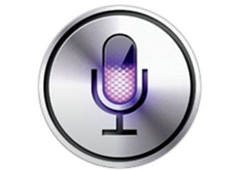

<capt>David Marcus talking ‘bout bots.</capt>

It’s been six months since Facebook launched their support for chatbots on
Messenger. Bots hit a [huge hype
cycle](https://news.ycombinator.com/item?id=11914812), leading even [David
Marcus to
admit](https://www.engadget.com/2016/09/13/facebook-messenger-chief-admits-bot-launch-was-overhyped/)
that bots were a bit overhyped.

Nonetheless, some bots have carved out a strong niche for themselves and
persevered by playing to their strengths. I’m curious to understand what ideal
use cases are for bots, and when they can match or exceed equivalent app or web
experiences.

### Mo’ Apps, Mo’ Problems

[Chatbots can often be thought of as replacements or supplements to existing
apps or
websites](https://chatbotsmagazine.com/how-bots-will-completely-kill-websites-and-mobile-apps-656db8e6fc03).
What are some common gripes around apps or websites?

1.  **Friction**&mdash; Apps need to be downloaded, and websites often suffer from bloat
and long loading times. [A majority of
apps](http://www.emarketer.com/Article/How-Many-Apps-Do-Smartphone-Owners-Use/1013309)
don’t even last a *day*, and users are spending the [majority of their
time](https://techcrunch.com/2015/06/22/consumers-spend-85-of-time-on-smartphones-in-apps-but-only-5-apps-see-heavy-use/)
in just 5 apps. Meanwhile, people are [notoriously unforgiving of slow loading
websites](https://blog.kissmetrics.com/loading-time/), and Google even penalizes
[sites that load too
slowly](https://webmasters.googleblog.com/2010/04/using-site-speed-in-web-search-ranking.html),
but despite all that the [average website weighs in at more than
2mb](https://www.soasta.com/blog/page-bloat-average-web-page-2-mb/).
1.  **Confusing Design**&mdash; Poorly designed apps can be a nightmare to navigate, and
lead to frustrated users. If a team doesn’t have the bandwidth or the expertise
to craft a properly designed experience it can make a product unusable.
1.  **Information Overload**&mdash; Websites can be complicated and suffer from way too
much information. In the interest of trying to appeal to as many people as
possible, the majority of that information is going to be irrelevant or
distracting.

### Bringing a Microphone to a LAN Party

Another way to think about it is: what advantages does a conversational UI bring
to the table? When is natural language a better way of interacting with a
computer than a well-designed GUI?

1.  **Specific and urgent information**&mdash; When a customer needs an answer
immediately, and that question is not easily discoverable, a conversational UI
can offer the most direct path to satisfying that need. Customer service is a
great example of this use case.
1.  **Disparate Information Sources**&mdash; Monitoring different information streams
across domains, and providing combined feedback and facilitating user actions,
can oftentimes be done easier in a bot on the fly. [As Pietro Casella puts
it](https://www.linkedin.com/pulse/5-futuristic-use-cases-bots-business-tech-pietro-casella):
“Multi domain Bots will be Bots that present relevant information from multiple
sources in a combined manner. They wil also be bots that are able to translate
answers into actions on the underlying systems.”
1.  **Basic actions**&mdash; For rote or fairly basic purchases, it can be faster to
interact with a bot. Things like [ordering a
pizza](https://www.messenger.com/t/dominos/) or
[flowers](https://www.messenger.com/t/1800flowers) can often be done faster via
text message than through an app.
1.  **Appealing to a non-tech-savvy audience**&mdash; We shouldn’t ignore the fact that a
whole swath of the world is still acquiring technological literacy. A natural
language interface can often be a more intuitive method of interaction, if the
interaction is well designed. IM interactions [receive some of the highest
customer satisfaction
scores](https://chatbotslife.com/the-half-life-of-knowledge-5f13b3ae3a07#.tavlqrhfs)
compared to email, phone calls and websites.

### Opportunities for Chatbots to Step Up

So with that all, where are the areas chatbots can match or exceed GUIs?

#### A User’s Need is Urgent and/or Specific

[Customer service is probably the flagship use case for a
chatbot](https://chatbotsmagazine.com/how-with-the-help-of-chatbots-customer-service-costs-could-be-reduced-up-to-30-b9266a369945).
Specific requests that are context-specific (location, time-based,
purchase-history, etc.) are good candidates to be offloaded to a chatbot.

Additionally, because downloading an app or navigating to a bloated website are
high friction activities, interacting via text can often be a much more
satisfying experience.

[1–800-Flowers](https://www.messenger.com/t/1800flowers) is a great example of a
purchase interaction that doesn’t need an app.

#### A User is Struggling to Navigate Your App or Website

In a perfect world, every app would be wildly intuitive and users would never be
confused. Obviously that’s not our world.

[Bots can simplify a complicated system by responding directly to a user’s
needs](https://chatbotsmagazine.com/when-do-bots-beat-apps-when-context-and-convenience-matter-most-443c9191bb2b).
Alternatively, chatbots can act as a user’s designated agent, going out and
performing their bidding.

Two great examples of chatbots that navigate tricky systems on the user’s behalf
(and also tie together disparate data sources) are
[DoNotPay](http://www.donotpay.co.uk/signup.php), a chatbot for challenging
parking tickets, and [Truebill](http://m.me/mytruebill), a bot that identifies
and cancels unnecessary subscriptions.

#### The Information You’re Delivering Can Be Personalized

Stefan Kojouharov calls this a “superpower”: the [ability for bots to be
personalized](http://venturebeat.com/2016/10/16/chatbots-have-a-superpower-over-apps/).

> Websites and apps are meant to solve problems for groups, but bots can solve
> problems for individuals.

It feels like this could potentially upend the way we as designers interact with
users. Designing truly unique interactions with users will require new methods
and tools than what we have now, but could unlock far more engaging experiences
than what we have today.

#### A User Wants to Remain Engaged

Proactive notifications could be an opportunity for bots. Being able to reach
out and let a user know something in a personalized or context aware fashion
gives bots a leg up on more naive app push notifications, and being able to
message a user where they already are (for instance, on Facebook messenger or
via SMS) and drop right into the interface is an opportunity to reduce friction.

News bots, like [CNN’s bot](https://www.messenger.com/t/cnn), are great examples
of chatbots that proactively keep the user abreast of developments.

The flipside of this is that when bots inevitably overstep the bounds of good
taste, they’ll be treated as spam and banned. **Teach your chatbots to be good
internet citizens and don’t over-notify.**

#### A User Needs Specific Answers Outside of Business Hours

Before the internet, contacting a business meant waiting until business hours.
Once the internet came along, you could interact with a digital storefront at
all hours of the day. Bots promise to do the same thing to real time
communication with businesses, by making staff available 24/7.

> “On a conversation you expect immediate response. Major advances in real time
> data availability are making the conversation possible.” — [Pietro
Casella](http://[https://www.linkedin.com/pulse/5-futuristic-use-cases-bots-business-tech-pietro-casella])

#### A Designer Needs a Rough and Dirty Prototyping Tool

With little visual design and, increasingly, no need to write a line of code,
bots could be an ideal way to test ideas and assumptions on the fly. No need to
resort to visual mockups, wireframes, or websites, just launch a bot and collect
your insights!

#### A Designer Needs a Tool to Break the Ice During a Group Interaction

Group interactions, especially among strangers or colleagues, acan be staid. A
bot could be a welcome participant for introducing some levity or breaking the
ice.

A great example of this from my personal experience is the [Giphy
chatbot](http://giphy.com/posts/slack-adds-giphy-to-every-chatroom-wut) in
Slack, ubiquitous in most groups I frequent.

> “They hold out the promise of being able to generate more conversation than
> might have otherwise occurred between the humans. To act as conversation
starters/primers. And/or conversational maintainers.” — [Natasha
Lomas](https://techcrunch.com/2016/05/05/a-few-words-on-chatbots/)

### Conclusion

While undoubtedly overhyped, chatbots still have a number of use cases where
they win out over traditional apps or websites. And it feels like we have yet to
see the killer bots (no pun intended) emerge on the platform.
