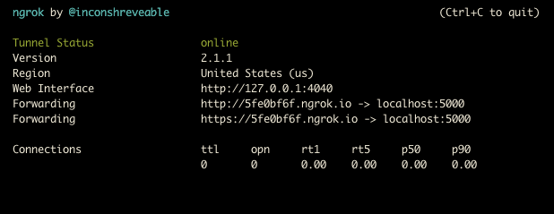

If you watched the [F8 conference](https://www.fbf8.com/) this week you’ll know
that Facebook introduced new APIs for messaging through Facebook Messenger. You
might be asking why you should care. Well I’ll tell you why you should care:
bots are the [hot new
thing](https://medium.com/chris-messina/2016-will-be-the-year-of-conversational-commerce-1586e85e3991#.ybruqcfxt)
and [apps are
extinct](http://www.telegraph.co.uk/technology/2016/03/31/the-end-of-apps-is-here-long-live-chat-bots/)
so get on the bot train or get left in the station.

Hyperbole aside (apps are obviously not dying) bots are legitimately cool and
promise to revolutionize how we interact with services. And it’s a piece of cake
to get one up and running. Let’s create a simple WeatherBot that tells you the
weather in some given location, because you’re a busy person who doesn’t have
the 2 seconds it takes to Google that information.

Full code is up on
[Github](https://github.com/thekevinscott/getting-started-with-facebook-bots),
and a [live version of the bot is here](http://m.me/248054885544417).

**Updated December 13th to reflect latest Facebook updates**

#### Getting Started

Clone the repo to get started:

    git clone 

    cd getting-started-with-facebook-bots

    npm install

*Included is a simple express server, ngrok (a tunneling package that opens our
server to the internet), and a few other bells and whistles to ease our lives.*

Try running the server:

    npm run dev

You’ll see “Hello world” at [http://localhost:5000](http://localhost:5000/). Do
you see it? Gnarly, you’re a pro! Keep going.

#### Ngrok

In a new terminal window, run ngrok:

You’ll see something like:

What this means is that any requests to the Forwarding URLs will hit your
locally running server. Visit the Forwarding URL and you’ll see “Hello world”.
Your local web server is now visible to the entire internet.

*Make a note of the https version of the Forwarding URL; we’ll need it soon.*

Next, fire up a text editor and open up index.js. Change the first line:

    var VERIFY_TOKEN = '<YOUR_VERIFICATION_TOKEN>';

To a super secret token that only you know. We’ll use this token to authenticate
with Facebook in the next step.

*****

#### Facebook

Now it’s time to set up our bot on Facebook. Facebook [has great
documentation](https://developers.facebook.com/docs/messenger-platform/quickstart)
for creating a bot from scratch, which I will summarize here.

First, create a Facebook [page](https://www.facebook.com/pages/create) and
[app](https://developers.facebook.com/apps/). Then, in your app settings, head
to the Messenger tab and look for the *Token Generation* section. Select the
page you created, and Facebook will generate a unique token for you. Copy this
to line 2 of index.js:

    var PAGE_ACCESS_TOKEN = '<YOUR_PAGE_ACCESS_TOKEN>';

Next, below in the *Webhooks *section, click on Edit events.

In the modal that appears:

1.  For Callback URL, enter the Forwarding URL you got from ngrok (the https
version) with an endpoint of /webhook. So, for instance, I used:
**https://5fe0bf6f.ngrok.io/webhook**
1.  For Verify Token, enter the custom token you invented in the first line of your
index.js file.
1.  For Subscription Fields, select everything. After you Verify and Save, you’ll
see a request appear in ngrok and Facebook should indicate verification was
successful.

Finally, select the page you created above; this will subscribe your app to that
page, which means that when someone messages the bot from the page, you’ll get
the notification. HOW COOL IS THAT? Go try it! It’s cool.

When you send a message to WeatherBot, you’ll see WeatherBot echo it back. The
server will also indicate that it received the message.

The relevant code that’s handling the message receiving is here:

    // respond to post calls from facebook
    app.post('/webhook/', function (req, res) {
      var data = req.body;

      // Make sure this is a page subscription
      if (data.object === 'page') {

        // Iterate over each entry - there may be multiple if batched
        data.entry.forEach(function(entry) {
          var pageID = entry.id;
          var timeOfEvent = entry.time;

          // Iterate over each messaging event
          entry.messaging.forEach(function(event) {
            console.log("Success!", event);
          });
        });

        // Assume all went well.
        //
        // You must send back a 200, within 20 seconds, to let us know
        // you've successfully received the callback. Otherwise, the request
        // will time out and we will keep trying to resend.
        res.sendStatus(200);
      }
    });

Sending a text message looks like this:

    var request = require('request');
    function callSendAPI(messageData) {
      request({
        uri: '
    ,
        qs: { access_token: PAGE_ACCESS_TOKEN },
        method: 'POST',
        json: messageData

    }, function (error, response, body) {
        if (!error && response.statusCode == 200) {
          var recipientId = body.recipient_id;
          var messageId = body.message_id;

    console.log("Successfully sent generic message with id %s to recipient %s", 
            messageId, recipientId);
        } else {
          console.error("Unable to send message.");
          //console.error(response);
          console.error(error);
        }
      });  
    }

Great! We’re off and running.

*****

At this point, we’ve got ourselves a functioning bot. However, he / she / it
doesn’t really do anything yet, unless you get a kick out of people echoing your
words back to you, in which case, our work here is done!

For the rest of us, let’s teach our bot some tricks to make it do something
useful.

#### Weather

The bot should respond with the current weather in a particular location. We’ll
use [Yahoo weather](https://developer.yahoo.com/weather/) as our API. The
endpoint we’ll be using is this gnarly-looking URL:

    var weatherEndpoint = ‘https://query.yahooapis.com/v1/public/yql?q=select%20*%20from%20weather.forecast%20where%20woeid%20in%20(select%20woeid%20from%20geo.places(1)%20where%20text%3D%22' + location + ‘%22)&format=json&env=store%3A%2F%2Fdatatables.org%2Falltableswithkeys’;

Replace the POST response (the /webhook listener) with this:

    // respond to post calls from facebook
    app.post('/webhook/', function (req, res) {
      var data = req.body;

    // Make sure this is a page subscription
      if (data.object === 'page') {

    // Iterate over each entry - there may be multiple if batched
        data.entry.forEach(function(entry) {
          var pageID = entry.id;
          var timeOfEvent = entry.time;

    // Iterate over each messaging event
          entry.messaging.forEach(function(event) {
            if (event.message) {
              receivedMessage(event);
            } else {
              console.log("Webhook received unknown event: ", event);
            }
          });
        });

    // Assume all went well.
        //
        // You must send back a 200, within 20 seconds, to let us know
        // you've successfully received the callback. Otherwise, the request
        // will time out and we will keep trying to resend.
        res.sendStatus(200);
      }
    });

    function receivedMessage(event) {
      console.log('incoming event', event);
      var senderID = event.sender.id;
      var recipientID = event.recipient.id;
      var timeOfMessage = event.timestamp;
      var message = event.message;

    console.log(JSON.stringify(message));

    var messageId = message.mid;

    var messageText = message.text;
      var messageAttachments = message.attachments;

    if (messageText) {
        sendTextMessage(senderID, messageText);
      }
    }

    function getWeather(callback, location) {
      var weatherEndpoint = '
     + location + '%22)&format=json&env=store%3A%2F%2Fdatatables.org%2Falltableswithkeys';
      console.log(weatherEndpoint);
      request({
        url: weatherEndpoint,
        json: true
      }, function(error, response, body) {
        try {
          var condition = body.query.results.channel.item.condition;
          callback("Today is " + condition.temp + " and " + condition.text + " in " + location);
        } catch(err) {
          console.error('error caught', err);
          callback("There was an error");
        }
      });
    }

    function sendTextMessage(recipientId, messageText) {
      console.log('incoming message text', messageText);
      getWeather(function(message) {
        var messageData = {
          recipient: {
            id: recipientId
          },
          message: {
            text: message
          }
        };

    callSendAPI(messageData);
      }, messageText);
    }

This code initiates a call to Yahoo’s servers with the incoming message, and
returns the current weather for that location.

*****

#### Conclusion

Gosh, they grow up so fast, don’t they? Feels like just yesterday our baby bot
was just a few twinkling lines of code in our eyes.

At this point you have all the tools you need to build an army of bots to do
your bidding.
