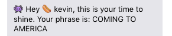
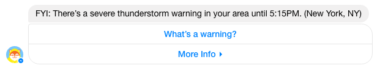
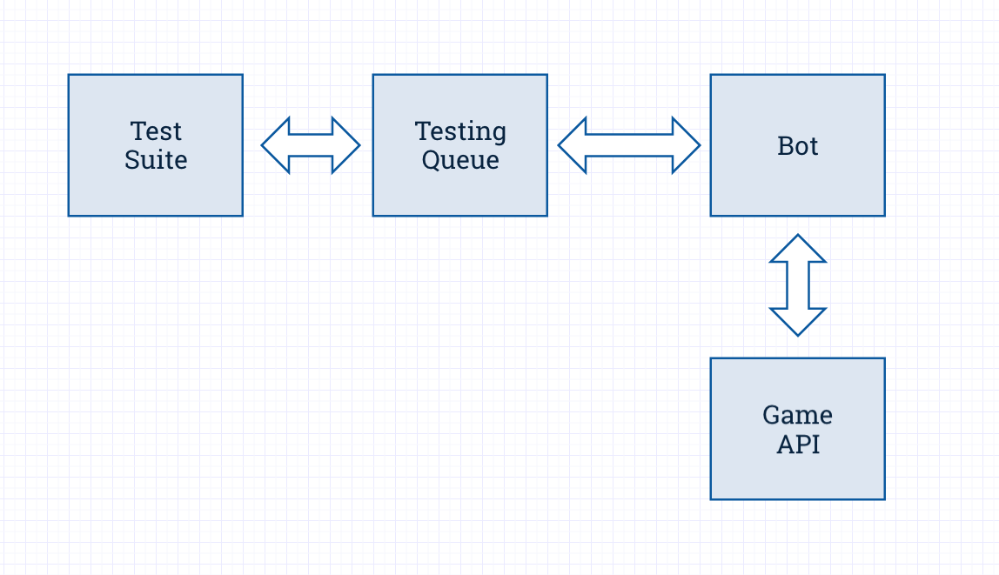

I love tests. I used to abhor them, but I’ve been burned enough times by enough codebases to appreciate a robust testing suite, and its ability to ensure well functioning code and developer sanity.

That’s why, as we developed our scripted bot, Emoji Salad, an Emoji Pictionary
SMS-based chat game, tests were baked in from the start. These tests, and in
particular the integration tests, have been vital throughout development.
They’ve allowed us to iterate faster, cheaper, and with confidence that we’re
not introducing new bugs along the way.

Chatbots bring their own set of challenges to testing. For us, those include,
foremost, testing across environments: integrating third party platforms, like
Facebook Messenger or Telegram, into a test suite is hard without a
service-level separation between message delivery and bot logic. Additionally,
If your platform charges for usage (like Twilio) and you’re running your test
suite on it, testing can quickly send you to the poorhouse. Finally, while
there’s no substitute for human QA, testing that the bot can coordinate across
multiple people is a huge drag; having an automated solution for testing means
you’ll test more often.

### Bots Conspiring Against Your Tests

Some of the challenges we’ve faced while writing tests for our scripted Chatbot
include:

#### Chatbots Can Vary the Things They Say

A well-designed bot [brings some personality to the
table](https://chatbotsmagazine.com/designing-a-chatbots-personality-52dcf1f4df7d),
and a prime component of that is variability in conversation. Though our bot
follows a script, it picks at random from a number of prewritten responses.
Other sources of variability might be messages dependent on time of day, or
location.

#### A Bot Can Say the Wrong Thing in the Right Way

A common scenario in our game is a message like:

Where the original code is:

    👾 Hey %(avatar)s %(nickname)s, this is your time to shine. Your phrase is: %(clue)s

Our Test Suite accepts wildcards for any of the arguments, allowing us to
separate the contents from the container, and test each separately.

#### Bots Initiating Conversations Need Attention, Too

Not all bot communication is initiated by the user. Bots can proactively message
users too. For instance, Poncho sent me a severe weather alert the other day:

#### Bots Might Coordinate Across Multiple Users

A particular challenge for us is QAing functionality across multiple users.

Having a testing suite has made group QA much less painful. In our suite we can
specify the user doing the sending in an array of messages:

    [
     { player: players[0], msg: ‘invite ‘+players[1].number},
     { player: players[1], msg: ‘yes’},
     { player: players[1], msg: players[1].nickname },
     { player: players[1], msg: players[1].avatar },
     { player: players[1], msg: ‘invite ‘+players[2].number},
     { player: players[2], msg: ‘yes’},
     { player: players[2], msg: players[2].nickname }
     ];

#### Isolating Third Party Components

We rely on a semantic API as a backup check for answer submissions (like
matching *Mario Brothers* to *Super Mario Bros*.) We don’t currently have a
great solution for mocking third party components within integration tests.

As we move into more NLP-driven interactions with our bot, this will quickly
become more of a concern. If you’ve got thoughts on good ways to test this,
leave a comment!

### How We Built Our Test Suite

Our Bot is [built on a number of different micro
services](https://chatbotsmagazine.com/we-moved-to-a-services-based-architecture-while-building-our-bot-and-it-is-awesome-e64316d83922),
each one with its own unit tests, while the integration tests sit apart in their
own codebase.

<capt>Our integration testing architecture</capt>

We have a dedicated testing queue that receives messages from the Test Suite,
and captures responses from the Bot. The Test Suite pings the testing queue
periodically for new messages, and each incoming message ID is matched up with
the received message ID.

There’s four types of responses the Test Suite can expect to get back:

1. No response — *for instance, if someone is blacklisted*
2. An invalid
response — *the wrong message entirely*
3. A valid response with invalid
data — *aka, the correct container but the wrong content*
4. A valid response — *any of a number of variations*

The Test Suite will get the response by querying for a specific message ID (the
‘sent’ ID).

For our bot, message variability is typically random, so our testing framework
pulls all possible variations the bot might respond with and checks for the
presence of any of them. If there’s a match, that’s a valid response. For
invalid responses, it’s easy to see from the reported error whether it’s the
data or the container that’s incorrect.

Finally, for messages where we expect no response, we set up a timer to check
that no message matching the sent message was received within a certain timespan
(2 seconds). This timed solution works for us since we only have a handful of
edge cases where we expect no response.
