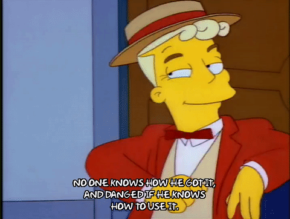

Image classification is the practice of teaching a machine to categorize a set of images into different categories, so that it can categorize images in the future automatically.


You've probably seen image classification at work in your photo app, automatically suggesting friends or locations for tagging. Image classification has a huge range of applications, from medical to self driving cars to satellite imagery; however, it's even used in places you wouldn't expect, like heat maps for fraud detection, or analyzing the Fourier transforms of audio waves.

I recently build an open source tool to quickly train image classification models in your browser, and I'd like to talk about how it works and how to build your own in Javascript. We'll be leveraging transfer learning to perform super fast training in the browser; if you're interested in more of a deep dive into how image training works, check out [Fast.ai's awesome lesson series](https://fast.ai).

For our data, I'm going to build a dataset to recognize whether a person is happy or sad. You could imagine using this in a rich client side photo app, or a stock photo app to automatically categorize and tag photos.

# Demo

Before jumping into code, let's see an example of how to train your own custom image classifier:

1. [Download these images](https://github.com/thekevinscott/dataset-tutorial-for-image-classification/data) (or build your [own dataset to train with](https://github.com/thekevinscott/dataset-tutorial-for-image-classification#)).
2. Upload the folder labeled **train**.
3. Upload the folder labeled **validation**.

<embed border="1" width="340" height="660" src="https://thekevinscott.github.io/ml-classifier-ui/?SHOW_HELP=0&SHOW_DOWNLOAD=0"></embed>
<capt>Alternatively, [you can watch this gif of the thing in action](https://github.com/thekevinscott/ml-classifier-ui/raw/master/example/public/example.gif)</capt>

If all went according to plan, you should see close to 100% scores for each.

## How does the Demo Work?

The goal of any machine learning project is to build a model that successfully predicts novel data; data it hasn't seen before. (It wouldn't do any good to build a model to only recognize data it HAS seen before; you could just hardcode that, no machine learning required!)

In order to do this, you train the model on labeled data - data that has already been identified as either a cat or a dog - and you validate the model's performance on other labeled data *that it hasn't seen before*. (There are other areas of machine learning that don't require labeled data but that's outside this article's scope.)

> Supervised learning reverses this process, solving for m and b, given a set of x’s and y’s. In supervised learning, you start with many particulars — the data — and infer the general equation. And the learning part means you can update the equation as you see more x’s and y’s, changing the slope of the line to better fit the data. The equation almost never identifies the relationship between each x and y with 100% accuracy, but the generalization is powerful because later on you can use it to do algebra on new data.
https://hbr.org/2017/10/how-to-spot-a-machine-learning-opportunity-even-if-you-arent-a-data-scientist

That second set of data - data that it hasn't seen before - serves as a proxy for the real world, with the only difference being that we know what it *should be*, and we can use it to gauge the performance of our model. We call this data our *validation dataset*. (Or Evaluation data?)

The data we use to train our model is predictably called our *training dataset*.

When you trained the model above by dragging the `training` folder in, it output a training score. This indicates how many images the classifier was able to learn to successfully predict.

The second number is the validation number; this indicates how many images were successfully predicted that it *hadn't seen before*. This is the score you want to optimize for. A good rule of thumb to optimize that number is to throw more data at it. Another good approach is to look at the type of data you're supplying; if your training set only contains high resolution, well lit dog photos, but your validation set has pixelated low light photos, you're gonna struggle to realize performance in
the real world.

There's literal books written on how to optimize your machine learning models. You can find some examples here. However, *hopefully* you will get a good score out of the gate, thanks to the wonders of transfer learning.

# Transfer Learning

Traditionally, machine learning is done on the server, with massive GPUs, and is written in Python, or R, or occasionally a more esoteric language. GPUs are able to parallelize massive amounts of calculations over gigabytes of datasets, making it feasible to train in hours what would otherwise take months or days.

However, recently folks have been training models and producing models that are already trained, that can be used for inference (aka, prediction). You'll download JSON files containing the model topology and weights and retrain it on your specific problem.

Transfer Learning is the special sauce that makes machine learning in the browser feasible.

You can use these models straight out of the box, or you can manipulate their final layers to further train them on your specific use case.

The reason this works so well is that many of the fundamental parts of perception carry over to all images. For instance, check out this great image demonstrating low level feature detection:


You can see how the model is beginning to recognize generic features, such as lines, circles, and shapes. Another step up, and it's beginning to recognize more complex shapes like edges and words.


As you get more complex features, we begin to recognize objects that are familiar to us. Since many images share features such as lines and circles (and many share higher level features, like "eye" or "nose") we can just train the final layer to our specific use case, which is much faster and requires less training data than a full train of the whole thing. How much less data? I'm able to get 100% validation scores on as few as a single image per class, though you should probably train with more
example if you can.

<embed border="0" height="315" src="https://www.youtube.com/embed/AgkfIQ4IGaM" frameborder="0" allow="autoplay; encrypted-media" allowfullscreen="1"></embed>

## MobileNet

This article (and the open source library) use [MobileNet](https://github.com/tensorflow/models/blob/master/research/slim/nets/mobilenet_v1.md). MobileNet was produced by Google, and [this guy has a great write up of it](https://hackernoon.com/creating-insanely-fast-image-classifiers-with-mobilenet-in-tensorflow-f030ce0a2991). It's trained on ImageNet, a huge dataset of more than 14 million labeled images belonging to a 1000 different categories.

For this project we'll be using `mobilenet_v1_0.25_224` as our pretrained model. If you download the model and extract it you'll see a number of files:

```
mobilenet_v1_0.25_224.ckpt.data-00000-of-00001
mobilenet_v1_0.25_224.ckpt.index
mobilenet_v1_0.25_224.ckpt.meta
mobilenet_v1_0.25_224.tflite
mobilenet_v1_0.25_224_eval.pbtxt
mobilenet_v1_0.25_224_frozen.pb
mobilenet_v1_0.25_224_info.txt
```

And the beginning of `mobilenet_v1_0.25_224_eval.pbtxt` reads:

```
node {
  name: "input"
  op: "Placeholder"
  attr {
    key: "dtype"
    value {
      type: DT_FLOAT
    }
  }
  attr {
    key: "shape"
    value {
      shape {
        dim {
          size: -1
        }
        dim {
          size: 224
        }
        dim {
          size: 224
        }
        dim {
          size: 3
        }
      }
    }
  }
}
```

From here, we can tell that the first layer of this MobileNet expects a tensor of rank 4 with dimensions `[any, 224, 224, 3]`.

Let's look at an example of how to use MobileNet with Tensorflow.js in your browser. [Clone this repo](https://github.com/thekevinscott/tfjs-image-classifier-example) and run it with:

```
yarn develop
```

In `index.js`, start by importing tensorflowjs:

```
import * as tf from '@tensorflow/tfjs';
```

Then, set up a function to load mobilenet asynchronously. This will return a promise that resolves to the value of the pretrained model.

```
function loadMobilenet() {
  return tf.loadModel('https://storage.googleapis.com/tfjs-models/tfjs/mobilenet_v1_0.25_224/model.json');
}
```

## Setting up a Data Pipeline

With neural nets, a [lot of your time will be spent working with data](https://thekevinscott.com/dealing-with-mnist-image-data-in-tensorflowjs/). Setting up a solid pipeline is crucial to a well-functioning model.

For this model, our data consists of two things:

* The images
* The labels that identify the images

There's a few ways image data is commonly structured:

1) a list of folders, where the folder contains a group of images and the name of the folder is the label
2) all the images in a single folder, where each image has its assoiated label (dog-1, dog-2)
3) the images with their original image name, and a csv or other file with a mapping of label to file

Is there one right way to organize your images? There is not. You will be writing the code to parse the incoming images into data your model can read, so it's up to you! (Heads up - a [lot of the machine learning code you write will be glue code](https://ai.google/research/pubs/pub43146).)

Our data pipeline will look like:

1. Load the data and extract the pixels
2. Crop the image
3. Resize the image
4. Resize the tensor dimensions and translate pixels to floats

Let's get started.

## Building a mechanical guesser

The dataset I provided above uses a flat structure. Import your images with:

```
import drum1 from './data/drum-1.jpg';
import drum2 from './data/drum-2.jpg';
import saxophone1 from './data/saxophone-1.jpg';
import saxophone2 from './data/saxophone-2.jpg';
```

Each of these images will need to have its pixel data turned into Tensors. Browsers provide many convenient tools to load images and read pixels, and Tensorflow.js provides a function to convert an `Image` object into a Tensor. (You can do this in Node too but you'll have to handle the pixel reading yourself).

[What is a tensor?](https://medium.com/@quantumsteinke/whats-the-difference-between-a-matrix-and-a-tensor-4505fbdc576c)

> A tensor is often thought of as a generalized matrix. That is, it could be a 1-D matrix (a vector is actually such a tensor), a 3-D matrix (something like a cube of numbers), even a 0-D matrix (a single number), or a higher dimensional structure that is harder to visualize. The dimension of the tensor is called its rank. &mdash; Steven Steinke

In practice, I've found that you can think of a tensor as a multi-dimensional array, at least when getting start.

So our next step is to write a function that loads an image and returns its pixel value as a 3D tensor. This function returns a `Promise` that resolves to a 3D Tensor, with shape `[width, height, color_channels]`, that represents the pixel data of the image:

```
function loadImage(src) {
  return new Promise((resolve, reject) => {
    const img = new Image();
    img.src = src;
    img.onload = () => resolve(tf.fromPixels(img));
    img.onerror = (err) => reject(err);
  });
}
```

When working with image classification, you often deal with square images. This is not a necessity, and you can build a network that accepts any size resolution. However, standard CNN architectures do expect images be of a fixed size, and as such square images make as much sense as any other ratio. They also give the most flexibility to handle a variety of [data augmentation techniques](https://medium.com/ymedialabs-innovation/data-augmentation-techniques-in-cnn-using-tensorflow-371ae43d5be9).

We determined above that MobileNet expects 224x224 square images, so we'll need to crop our images and resize them. (Cropping to squares can be an optional step; [this paper](https://arxiv.org/abs/1412.1842) discusses the results they got resizing to a non-square, fixed input size. Also, if you're accepting input from users, training on scaled images can help handle oddly sized uploaded images. For our purposes, cropping and resizing to a 224x224 yields good results and is easy to understand.)

So, let's first write a function to crop an image:

```
function cropImage(img) {
  const width = img.shape[0];
  const height = img.shape[1];

  // use the shorter side as the size to which we will crop
  const shorterSide = Math.min(img.shape[0], img.shape[1]);

  // calculate beginning and ending crop points
  const startingHeight = (height - shorterSide) / 2;
  const startingWidth = (width - shorterSide) / 2;
  const endingHeight = startingHeight + shorterSide;
  const endingWidth = startingWidth + shorterSide;

  // return image data cropped to those points
  return img.slice([startingWidth, startingHeight, 0], [endingWidth, endingHeight, 3]);
}
```

Second, let's write a function to resize the image to 224. Lucky for us, Tensorflow.js provides a resize method out of the box:

```
function resizeImage(image) {
  return tf.image.resizeBilinear(image, [224, 224]);
}
```

The final step of our data pipeline is converting the pixels into a format Tensorflow can process.

The data object we're building towards for consumption by our model will be a Tensor of Rank 4 (rank is another word for dimension). Assuming you have 10 training examples, it'll have a shape that is `[10, 224, 224, 3]`. (You don't always need 3 dimensions of color, especially if you're worried about performance; grayscale works for a number of use cases).

In order to build such a tensor, we first need to convert our 3D tensors into 4D tensors, so that `[224, 224, 3]` becomes `[1, 224, 224, 3]`.

We'll then want to turn our pixel data from an integer (0-255) into a floating point number, and then translate that number from a value between 0-255 into a value between -1 and 1. This process is called normalizing your input. [Neural networks using them are generally agnostic to the size](https://stackoverflow.com/questions/4674623/why-do-we-have-to-normalize-the-input-for-an-artificial-neural-network
) of the numbers coming in, but using smaller numbers helps the network train faster. ([Check out the Coursera course on this to learn more](https://www.coursera.org/lecture/deep-neural-network/normalizing-inputs-lXv6U
)).

The function to do that looks like:

```
function batchImage(image) {
  // Expand our tensor to have an additional dimension, whose size is 1
  const batchedImage = image.expandDims(0);

  // Turn pixel data into a float between -1 and 1.
  return batchedImage.toFloat().div(tf.scalar(127)).sub(tf.scalar(1));
}
```

Finally, let's write a function to compose everything so far:

```
function loadAndProcessImage(image) {
  const croppedImage = cropImage(image);
  const resizedImage = resizeImage(croppedImage);
  const batchedImage = batchImage(resizedImage);
  return batchedImage;
}
```

Viola! We've now got a function that transforms an incoming image.

Let's make a prediction with MobileNet and see what comes back. Note the `print` statement - because of the way Tensorflow.js works, calling `console.log` will only return a reference to the tensor, not the actual data of the tensor; call `.print` to get at it's underlying data):

```
loadMobilenet().then(pretrainedModel => {
  loadImage(drum1).then(img => {
    const processedImage = loadAndProcessImage(img);
    console.log(processedImage);
    const prediction = pretrainedModel.predict(processedImage);
    prediction.print();
  });
});
```

In your console, you'll probably see something like:

```Tensor
     [[0.0000273, 5e-7, 4e-7, ..., 0.0001365, 0.0001604, 0.0003134],]
```

If we inspect the shape of this Tensor, we'll see it to be `[1, 1000]`. The model returns a Tensor containing a prediction for every category (also known as a "class") available. Since MobileNet contains 1000 classes, we receive 1000 predictions, each representing the probability that the given image belongs to a given class.

In order to get an actual prediction, we first need to determine the most likely prediction. This bit of code first flattens the tensor to 1 dimension, and then reads the maximum, which corresponds to our most confident prediction:

```
prediction.as1D().argMax().print();
```

This should product:

```Tensor
    541
```

If we [head on over to the ImageNet class definitions](https://gist.github.com/thekevinscott/e6fb765d5125dd3c34f11d2d67b6d49b), we see that `541` corresponds to `drum, membranophone, tympan`, which is exactly the image we used. Awesome!

Congratulations, friend! You're now doing image classification in Javascript. Here's your certificate.

---

Technically, if all you wanted was something that could categorize something into one of a thousand given categories, you could stop right there and call it a day. I imagine many use cases for clientside machine learning will be well served by finding a relevant pretrained model and using it without modification.

However, if your problem is unique enough not to be satisfied by the constraints of your given pretrained model, the next step is to leverage the already trained layers and train it on your specific use case. Let's see how that's done.



# A Personalized, Customized, Your-Very-Own Image Classifier!

To recap: what we'll be doing is using a pretrained model, and just tuning it to our specific problem set to identify whatever.

This would be a good time to talk - at a very high level! - what a neural net *is*.

## What's a Neural Net?

If you peel away the jargon and peer at its cold, code heart, a neural net is just a bunch of transformation functions and a bunch of variables - *weights* - that get subtly manipulated in the direction of correctness over very many iterations.

[There's a great python library that walks you](http://www.wildml.com/2015/09/implementing-a-neural-network-from-scratch/) through building a neural net from scratch. I highly recommend it. There's also lots of courses that go into greater detail.

## But How Do They WORK?

Ok, ok, let's talk about how a neural net learns. Let's say you're starting from absolute scratch.

The network is randomly initialized with some set of weights, based on some architecture you define. It will run your incoming images - translated into a 4 dimensional tensor - through the model, and the net will make a prediction for each incoming image. These predictions will be wrong. (Unless they're not, in which case, RUN).

We measure the difference between the predictions it made - which, remember, were wrong - and the actual labels the images had. We refer to this difference as the "loss". 

Once you know your loss, you can begin to improve, in a process called "back propagation". Back propagation determines the direction in which things get better, through a process called gradient descent, and then modifies the weights in that direction based on a number - also called a hyperparameter - that is the learning rate. This is usually a very small number.

Side note: if you know the direction that things get better, why not move all the weights in that direction? Answer: Because you don't know how far to move them. You only know the direction, not the magnitude.

To compensate for these small steps, we run the training many many times over.

Each cycle through your entire image set is called an epoch.

[How many epochs should you run for? Until it's good, or it's clear it's not working, or you run out of time.](https://towardsdatascience.com/epoch-vs-iterations-vs-batch-size-4dfb9c7ce9c9)


*We want to shuffle the images so that it doesn't learn the order of pixels and try to predict on that.*

## Show me the Code!

Let's walk through how you would take a pretrained model and customize it for our particular use case.

First, we discussed how to translate images in the previous section. Let's turn our attention to our labels. Labels will need to be turned into numbers. So for instance, you could wind up with:

```
raspberry - 0
blueberry - 1
strawberry - 2
```

There's a problem here, and that problem is that this can imply a relationship between these numbers (in the literature, these would be known as "ordinal" values; aka, they have some order). For instance, the network could learn to assume that something halfway between a raspberry and a strawberry is a blueberry, something we know is incorrect. Or that a strawberry is the best berry.

You can use a process called "one hot encoding" to get around this. The data will become:

```
raspberry  - [1, 0, 0]
blueberry  - [0, 1, 0]
strawberry - [0, 0, 1]
```

[Here's an article explaining this](https://hackernoon.com/what-is-one-hot-encoding-why-and-when-do-you-have-to-use-it-e3c6186d008f).
Here's another: https://machinelearningmastery.com/why-one-hot-encode-data-in-machine-learning/

Some code demonstrating this is:

```
const oneHot = (label, classes) => {
  return tf.oneHot(tf.tensor1d([label === 'drum' ? 0 : 1]).toInt(), classes);
};

const classes = 2;

const tfLabels = labels.slice(1).reduce((data, label) => {
  return data.concat(oneHot(label, classes));
}, oneHot(labels[0], classes));
```

The reason we do this instead of 0, 1, and 2, is because of *x*.

So you've got an array (also known as a tensor) of labels corresponding to your images, and you've got an array of images. You'll then need to convert that rich data into data the model can understand, which is numbers.

Let's then build our incoming data streams, `xs` and `ys`. Calling your data "x" and "y" is [something of a convention in the machine learning world](https://datascience.stackexchange.com/questions/17598/why-are-variables-of-train-and-test-data-defined-using-the-capital-letter-in-py), and originally comes from its mathematical origins. You're free to call it whatever you want.

https://machinelearningmastery.com/data-terminology-in-machine-learning/

```
const addData = (tensors: tf.Tensor[]): tf.Tensor => {
  const data = tf.keep(tensors[0]);
  return tensors.slice(1).reduce((data: tf.Tensor, tensor: tf.Tensor) => tf.tidy(() => {
    const newData = tf.keep(data.concat(tensor, 0));
    data.dispose();
    return newData;
  }), data);
};
```

From there, let's go back to our pretrained model and see how to pop on a new layer:

```
function createCustomModel() {
  return loadMobileNet().then(mobilenet => {
    const layer = mobilenet.getLayer('conv_pw_13_relu');
    return tf.model({
      inputs: [mobilenet.inputs[0]],
      outputs: layer.output,
    });
  });
}
```

Why that particular layer? Why those particular inputs? What is the topology of that model? Why that output?

*Note* - this is using the above model to activate an image. Figure out how to pop a layer onto it*

Then, let's train it with:

```
  const classes = 3;
  const model = tf.sequential({
    layers: [
      tf.layers.flatten({inputShape: [7, 7, 256]}),
      tf.layers.dense({
        units: 100,
        activation: 'relu',
        kernelInitializer: 'varianceScaling',
        useBias: true
      }),
      tf.layers.dense({
        units: classes,
        kernelInitializer: 'varianceScaling',
        useBias: false,
        activation: 'softmax'
      })
    ]
  });

  const optimizer = tf.train.adam(0.0001);

  model.compile({
    optimizer,
    loss: 'categoricalCrossentropy',
    metrics: ['accuracy'],
  });

  const history = await model.fit(
    xs,
    ys,
    {
      ...params,
      epochs: 20,
      callback: () => {
        console.log(history, loss);
      },
    },
  );
```

You can run this, and you should see it train and console out a bunch of stuff. Loss should drop towards 0, and history should give you a bunch of other information.

You can then validate it on some of your other images using many of the same functions for your data pipeline, but calling `predict` instead:

```
exampel code showing how to load validation images
call predict
```

Finally, we'll again need to convert the prediction into a class, with:

```
fofof
```

Congratulations! You're done!

# Conclusion

To recap, you have learned the basics of how a neural net works, how to set up a data pipeline for loading and transforming images, and how to train your net and translate numerical predictions into human readable strings. Good job!

It's important to also note that training on images from scratch is a more intense process that we didn't really touch on here. You would almost certainly want to avoid training from scratch in a browser, because it would take months, and nobody's got time for that. However, if you're in Node, it's absolutely viable to do so.
