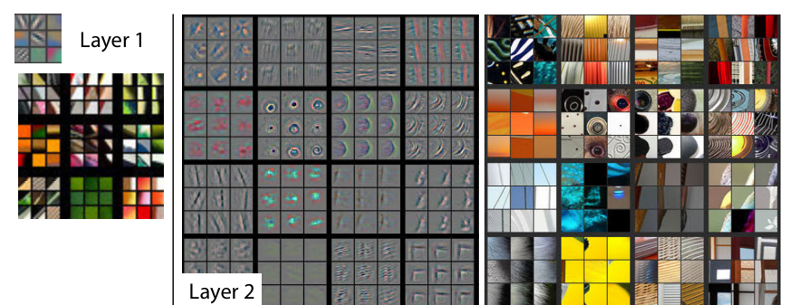
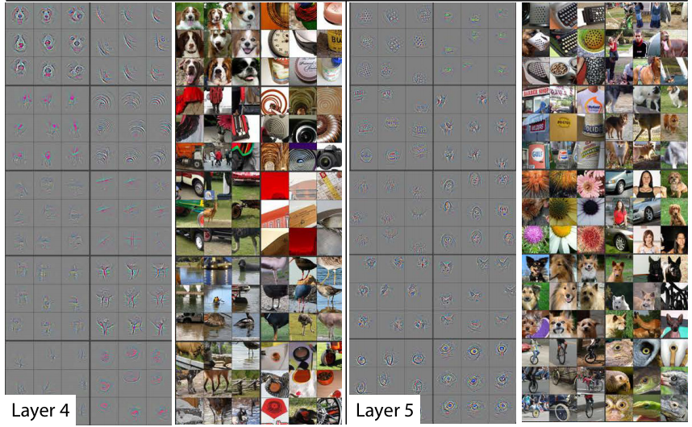
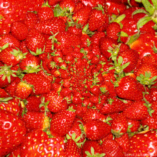

Machine Learning has a reputation for demanding lots of data and powerful GPU computations. This leads many people to believe that building custom machine learning models for their specific dataset is impractical without a large investment of time and resources. In fact, you can leverage Transfer Learning on the web to train an accurate image classifier in less than a minute with just a few labeled images.

# What's Image Classification Used For?

Teaching a machine to classify images has a wide range of practical applications. You may have seen image classification at work in your photos app, automatically suggesting friends or locations for tagging. Image Classification can be used to [recognize cancer cells](https://www.kaggle.com/c/data-science-bowl-2017), to [recognize ships in satelitte imagery](https://www.kaggle.com/c/airbus-ship-detection), or to [automatically classify images on Yelp](https://www.kaggle.com/c/yelp-restaurant-photo-classification). It can even be used beyond the realm of images, analyzing heat maps of user activity for potential fraud, or Fourier transforms of audio waves.

I recently [released an open source tool](https://thekevinscott.github.io/ml-classifier-ui) to quickly train image classification models in your browser. Here's how it works:


Embedded below is a live demo of the tool you can use. [I've put together a dataset for testing here](https://github.com/thekevinscott/dataset-tutorial-for-image-classification/data<Paste>) (or feel free to build your own). The dataset has 10 images I downloaded from each of the three most popular searches on [pexels.com](https://pexels.com) : Mobile", "Wood", and "Notebook".

Drag the **train** folder into the drop zone, and once the model is trained, upload the **validation** folder to see how well your model can classify novel images.

<embed border="1" width="340" height="660" src="https://thekevinscott.github.io/ml-classifier-ui/?SHOW_HELP=0&SHOW_DOWNLOAD=0"></embed>

## How does this work?

Transfer Learning is the special sauce that makes it possible to train extremely accurate models in your browser in a fraction of the time. Models are trained on large corpuses of data, and saved as pretrained models. Those pretrained models' final layers can then be tuned to your specific use case.

This works particularly well in the realm of computer vision, because so many features of images are generalizable. Rob Fergus and Matthew Zeiler [demonstrate in their paper](https://arxiv.org/abs/1311.2901) the featured learned at the early stages of their model:



The model is beginning to recognize generic features, including lines, circles, and shapes, that are applicable to any set of images. After a few more layers, it's able to recognize more complex shapes like edges and words:



The vast majority of images share general features such as lines and circles. Many share higher level features, things like an "eye" or a "nose". This allows you to reuse the existing training that's already been done, and tune just the last few layers on your specific dataset, which is faster and requires less data than training from scratch.

How much less data? **It depends**. How different your data is from your pre-trained model, how complex or variable your data is, and other factors can all play into your accuracy. With the example above I got to 100% accuracy with 30 images. For something like dogs and cats, just a handful of images is enough to get good results. [Adrian G has put together a more rigorous analysis on his blog](https://medium.com/@bingobee01/how-much-data-to-you-need-ba834d074f3a).

So, it depends on your dataset, but it's probably less than you think.

<embed border="0" height="315" src="https://www.youtube.com/embed/AgkfIQ4IGaM" frameborder="0" allow="autoplay; encrypted-media" allowfullscreen="1"></embed>

# Show me the Code!

Next, we'll look at how to import and tune a pretrained model in Javascript. We'll tune [MobileNet](https://github.com/tensorflow/models/blob/master/research/slim/nets/mobilenet_v1.md), a pretrained model produced by Google.

> MobileNets are a class of convolutional neural network designed by researches at Google. They are coined “mobile-first” in that they’re architected from the ground up to be resource-friendly and run quickly, right on your phone. &mdash; [Matt Harvey](https://hackernoon.com/creating-insanely-fast-image-classifiers-with-mobilenet-in-tensorflow-f030ce0a2991)

MobileNet is trained on a huge corpus of images called [ImageNet](http://www.image-net.org/), containing over 14 million labeled images belonging to a 1000 different categories. If you download `mobilenet_v1_0.25_224`, you'll see a structure of files like:

```
mobilenet_v1_0.25_224.ckpt.data-00000-of-00001
mobilenet_v1_0.25_224.ckpt.index
mobilenet_v1_0.25_224.ckpt.meta
mobilenet_v1_0.25_224.tflite
mobilenet_v1_0.25_224_eval.pbtxt
mobilenet_v1_0.25_224_frozen.pb
mobilenet_v1_0.25_224_info.txt
```

Within `mobilenet_v1_0.25_224_eval.pbtxt`, note the `shape` attribute:

```
  attr {
    key: "shape"
    value {
      shape {
        dim {
          size: -1
        }
        dim {
          size: 224
        }
        dim {
          size: 224
        }
        dim {
          size: 3
        }
      }
    }
  }
```

This tells us that the first layer of this MobileNet expects to receive a Tensor of Rank 4 with dimensions `[any, 224, 224, 3]`. (If you're wondering what a Tensor is, [check out this article first](/tensors-in-javascript/).)

## Importing and Setup

[I've set up a repo with the necessary packages](https://github.com/thekevinscott/dataset-tutorial-for-image-classification) to get you going. Clone it and follow the readme instructions to install the packages and run it. In `index.js`, import Tensorflow.js with:

```
import * as tf from '@tensorflow/tfjs';
```

Tensorflow.js provides a function to load a pretrained model asynchronously. We'll use this to load MobileNet:

```
function loadMobilenet() {
  return tf.loadModel('https://storage.googleapis.com/tfjs-models/tfjs/mobilenet_v1_0.25_224/model.json');
}
```

## Data Pipelines

At the heart of your machine learning model is data. Building a solid pipeline for processing your data is crucial for success; often, a [majority of your time will be spent working with your data pipeline](https://thekevinscott.com/dealing-with-mnist-image-data-in-tensorflowjs/).

> It may be surprising to the academic community to know that only a tiny fraction of the code in many machine learning systems is actually doing “machine learning”. When we recognize that a mature system might end up being (at most) 5% machine learning code and (at least) 95% glue code, reimplementation rather than reuse of a clumsy API looks like a much better strategy. &mdash; [D. Sculley et all](https://ai.google/research/pubs/pub43146)

There's a few common ways you'll see image data structured:

1) A list of folders containing images, where the folder name is the label
2) Images in a single folder, with images named by label (`dog-1`, `dog-2`)
3) Images in a single folder, and a csv or other file with a mapping of label to file

There's no right way to organize your images. Choose whatever format makes sense for you and your team. This dataset is organized by folder.


Our data processing pipeline will consist of four parts:

1. Load the image (and turn it into a tensor)
2. Crop the image
3. Resize the image
4. Translate the Tensor into an appropriate input format

### 1. Loading the Image

Since our machine learning model expects [Tensors](/tensors-in-javascript/), the first step is to load the image and translate its pixel data into a Tensor. Browsers provide many convenient tools to load images and read pixels, and Tensorflow.js provides a function to convert an `Image` object into a Tensor. (If you're in Node, you'll have to handle this yourself). This function will take a `src` URL of the image, load the image, and returns a promise resolving with a 3D Tensor of shape `[width, height, color_channels]`:

```
function loadImage(src) {
  return new Promise((resolve, reject) => {
    const img = new Image();
    img.src = src;
    img.onload = () => resolve(tf.fromPixels(img));
    img.onerror = (err) => reject(err);
  });
}
```

### 2. Cropping the Image

Many classifiers expect square images. This is not a strict requirement; if you build your own model you can specify any size resolution you want. However, standard CNN architectures expect that images be of a **fixed size**. Given this necessity, many pretrained models accept squares, in order to support the widest variety of image ratios. (Squares also provide flexibility for handling a variety of [data augmentation techniques](https://medium.com/ymedialabs-innovation/data-augmentation-techniques-in-cnn-using-tensorflow-371ae43d5be9)).

We determined above that MobileNet expects 224x224 square images, so we'll need to first crop our images. We do that by chopping off the edges of the longer side:

```
function cropImage(img) {
  const width = img.shape[0];
  const height = img.shape[1];

  // use the shorter side as the size to which we will crop
  const shorterSide = Math.min(img.shape[0], img.shape[1]);

  // calculate beginning and ending crop points
  const startingHeight = (height - shorterSide) / 2;
  const startingWidth = (width - shorterSide) / 2;
  const endingHeight = startingHeight + shorterSide;
  const endingWidth = startingWidth + shorterSide;

  // return image data cropped to those points
  return img.slice([startingWidth, startingHeight, 0], [endingWidth, endingHeight, 3]);
}
```

### 3. Resizing the image

Now that our image is square, we can resize it to 224x224. This part is easy: Tensorflow.js provides a resize method out of the box:

```
function resizeImage(image) {
  return tf.image.resizeBilinear(image, [224, 224]);
}
```

### 4. Translate the Tensor

Recall that our model expects an input object of the shape `[any, 224, 224, 3]`. This is known as a Tensor of Rank 4. This dimension refers to the number of training examples. If you have 10 training examples, that would be `[10, 224, 224, 3]`.

We also want our pixel data as a floating point number between -1 and 1, instead of integer data between 0 and 255, a process called normalization. While [neural networks are generally agnostic to the size](https://stackoverflow.com/questions/4674623/why-do-we-have-to-normalize-the-input-for-an-artificial-neural-network
) of the numbers coming in, using smaller numbers can help the network train faster.

We can build a function that expands our Tensor and translates the integers into floats with:

```
function batchImage(image) {
  // Expand our tensor to have an additional dimension, whose size is 1
  const batchedImage = image.expandDims(0);

  // Turn pixel data into a float between -1 and 1.
  return batchedImage.toFloat().div(tf.scalar(127)).sub(tf.scalar(1));
}
```

### The Final Pipeline

Putting all the above functions together into a single function, we get:

```
function loadAndProcessImage(image) {
  const croppedImage = cropImage(image);
  const resizedImage = resizeImage(croppedImage);
  const batchedImage = batchImage(resizedImage);
  return batchedImage;
}
```

We can now use this function to test that our data pipeline is set up correctly. We'll import an image whose label is known (a drum) and see if the prediction matches the expected label:


```
import drum from './data/pretrained-model-data/drum.jpg';
loadMobilenet().then(pretrainedModel => {
  loadImage(drum).then(img => {
    const processedImage = loadAndProcessImage(img);
    const prediction = pretrainedModel.predict(processedImage);

    // Because of the way Tensorflow.js works, you must call print on a Tensor instead of console.log.
    prediction.print();
  });
});
```

You should see something like:

```Tensor
     [[0.0000273, 5e-7, 4e-7, ..., 0.0001365, 0.0001604, 0.0003134],]
```

If we inspect the shape of this Tensor, we'll see it to be `[1, 1000]`. MobileNet returns a Tensor containing a prediction for every category, and since MobileNet has learned 1000 classes, we receive 1000 predictions, each representing the probability that the given image belongs to a given class.

In order to get an actual prediction, we need to determine the most likely prediction. We flatten the tensor to 1 dimension and get the max value, which corresponds to our most confident prediction:

```
prediction.as1D().argMax().print();
```

This should produce:

```Tensor
    541
```

In the repo you'll find [a copy of the ImageNet class definitions in JSON format](https://github.com/thekevinscott/dataset-tutorial-for-image-classification/blob/master/imagenet_labels.json). You can import that JSON file to translate the numeric prediction into an actual string:

```
import labels from './imagenet_labels.json';

loadMobilenet().then(pretrainedModel => {
  ...
  const labelPrediction = prediction.as1D().argMax().dataSync()[0];
  console.log(`
    Numeric prediction is ${labelPrediction}
    The predicted label is ${labels[labelPrediction]}
    The actual label is drum, membranophone, tympan
  `);
});
```

You should see that `541` corresponds to `drum, membranophone, tympan`, which is the category our image comes from. At this point you have a working pipeline and the ability to leverage MobileNet to predict ImageNet images.

Now let's look at how to tune MobileNet on your specific dataset.

## Training The Model


We want to build a model that successfully predicts **novel data**; data it hasn't seen before.

To do this, you first train the model on labeled data - data that has already been identified - and you validate the model's performance on other labeled data *it hasn't seen before*.

> Supervised learning reverses this process, solving for m and b, given a set of x’s and y’s. In supervised learning, you start with many particulars — the data — and infer the general equation. And the learning part means you can update the equation as you see more x’s and y’s, changing the slope of the line to better fit the data. The equation almost never identifies the relationship between each x and y with 100% accuracy, but the generalization is powerful because later on you can use it to do algebra on new data. &mdash; [Kathryn Hume](https://hbr.org/2017/10/how-to-spot-a-machine-learning-opportunity-even-if-you-arent-a-data-scientist)

When you trained the model above by dragging the `training` folder in, the model produced a training score. This indicates how many images the classifier was able to learn to successfully predict out of the training set. The second number it produced indicated how many images it could predict that it *hadn't seen before*. This second score is the one you want to optimize for (well, you want to optimize for both, but the latter number is more applicable to novel data).

We're going to train on the **colors** dataset. In the repo, you'll find a folder `data/colors` that contains:

```
validation/
  blue/
    blue-3.png
  red/
    red-3.png
training/
  blue/
    blue-1.png
    blue-2.png
  red/
    red-1.png
    red-2.png
```

Building machine learning models, I've found that *code-related* errors - a missing variable, an inability to compile - are fairly straight forward to fix, whereas *training* errors - the labels were in an incorrect order, or the images were being cropped incorrectly - are devilish to debug. Testing exhaustively and setting up sanity test cases can help save you a few gray hairs.

The `data/colors` folder provides a list of solid red and blue colors that are guaranteed to be easy to train with. We'll use these to train our model and ensure that our machine learning code learns correctly, before attempting with a more complicated dataset.

```
import blue1 from '../data/colors/training/blue/blue-1.png';
import blue2 from '../data/colors/training/blue/blue-2.png';
import blue3 from '../data/colors/validation/blue/blue-3.png';
import red1 from '../data/colors/training/red/red-1.png';
import red2 from '../data/colors/training/red/red-2.png';
import red3 from '../data/colors/validation/red/red-3.png';

const training = [
  blue1,
  blue2,
  red1,
  red2,
];

// labels should match the positions of their associated images
const labels = [
  'blue',
  'blue',
  'red',
  'red',
];
```

When we previously loaded MobileNet, we used the model without any modifications. When training, we want to use a subset of its layers - specifically, we want to ignore the final layers that produce the one-of-1000 classification. You can inspect the structure of a pretrained model with `.summary()`:

```
loadMobilenet().then(mobilenet => {
  mobilenet.summary();
});
```

In your console should be the model output, and near the end you should see something like:

```
conv_dw_13_bn (BatchNormaliz [null,7,7,256]            1024      
_________________________________________________________________
conv_dw_13_relu (Activation) [null,7,7,256]            0         
_________________________________________________________________
conv_pw_13 (Conv2D)          [null,7,7,256]            65536     
_________________________________________________________________
conv_pw_13_bn (BatchNormaliz [null,7,7,256]            1024      
_________________________________________________________________
conv_pw_13_relu (Activation) [null,7,7,256]            0         
_________________________________________________________________
global_average_pooling2d_1 ( [null,256]                0         
_________________________________________________________________
reshape_1 (Reshape)          [null,1,1,256]            0         
_________________________________________________________________
dropout (Dropout)            [null,1,1,256]            0         
_________________________________________________________________
conv_preds (Conv2D)          [null,1,1,1000]           257000    
_________________________________________________________________
act_softmax (Activation)     [null,1,1,1000]           0         
_________________________________________________________________
reshape_2 (Reshape)          [null,1000]               0         
=================================================================
Total params: 475544
Trainable params: 470072
Non-trainable params: 5472
_________________________________________________________________
```

What we're looking for is the final `Activation` layer that is not `softmax` ([`softmax` is the activation](https://en.wikipedia.org/wiki/Softmax_function) used to boil the predictions down to one of a thousand categories). That layer is `conv_pw_13_relu`. We return a pretrained model that includes everything up to that activation layer:

```
function buildPretrainedModel() {
  return loadMobilenet().then(mobilenet => {
    const layer = mobilenet.getLayer('conv_pw_13_relu');
    return tf.model({
      inputs: mobilenet.inputs,
      outputs: layer.output,
    });
  });
}
```

Let's write a function to loop through an array of images and return a Promise that resolves when they load.

```
function loadImages(images, pretrainedModel) {
  let promise = Promise.resolve();
  for (let i = 0; i < images.length; i++) {
    const image = images[i];
    promise = promise.then(data => {
      return loadImage(image).then(loadedImage => {
        // Note the use of `tf.tidy` and `.dispose()`. These are two memory management
        // functions that Tensorflow.js exposes.
        // https://js.tensorflow.org/tutorials/core-concepts.html
        //
        // Handling memory management is crucial for building a performant machine learning
        // model in a browser.
        return tf.tidy(() => {
          const processedImage = loadAndProcessImage(loadedImage, pretrainedModel);
          if (data) {
            const newData = data.concat(processedImage);
            data.dispose();
            return newData;
          }

          return tf.keep(processedImage);
        });
      });
    });
  }

  return promise;
}
```

We build a sequential promise that iterates over each image and processes it. Alternatively, you can use `Promise.all` to load images in parallel, but be aware of UI performance if you do that.

Putting those functions together, we get:

```
buildPretrainedModel().then(pretrainedModel => {
  loadImages(training, pretrainedModel).then(xs => {
    xs.print();
  })
});
```

Calling your data "x" and "y" is [a convention in the machine learning world](https://datascience.stackexchange.com/questions/17598/why-are-variables-of-train-and-test-data-defined-using-the-capital-letter-in-py), carrying over from its mathematical origins. You can call your variables whatever you want, but I find it useful to stick to the conventions where I can.

### Labels

Next, you'll need to convert your labels into numeric form. However, it's not as simple as assigning a number to each category. To demonstrate, let's say you're classifying three categories of fruit:

```
raspberry - 0
blueberry - 1
strawberry - 2
```

Denoting numbers like this can imply a relationship where one does not exist, since these numbers are considered *ordinal* values; they imply some order in the data. Real world consequences of this might be that the network decides that a blueberry is something that is halfway between a raspberry and a strawberry, or that a strawberry is the "best" of the berries.



To prevent these incorrect assumptions we use a process called "one hot encoding", resulting in data that looks like:

```
raspberry  - [1, 0, 0]
blueberry  - [0, 1, 0]
strawberry - [0, 0, 1]
```

(Two great articles that go into more depth on one hot encoding are [here](https://hackernoon.com/what-is-one-hot-encoding-why-and-when-do-you-have-to-use-it-e3c6186d008f) and [here](https://machinelearningmastery.com/why-one-hot-encode-data-in-machine-learning/).) We can leverage Tensorflow.js's built in `oneHot` functions to translate our labels:

```
function oneHot(labelIndex, classLength) {
  return tf.tidy(() => tf.oneHot(tf.tensor1d([labelIndex]).toInt(), classLength));
};
```

This function takes a particular number (`labelIndex`, a number that corresponds to a label) and translates it to a one hot encoding, given some number of classes (`classLength`). We can use the function with the following bit of code, that first builds a mapping of numbers-to-labels off the incoming array of labels, and then builds a Tensor containing those one-hot encoded labels:

```
function getLabelsAsObject(labels) {
  let labelObject = {};
  for (let i = 0; i < labels.length; i++) {
    const label = labels[i];
    if (labelObject[label] === undefined) {
      // only assign it if we haven't seen it before
      labelObject[label] = Object.keys(labelObject).length;
    }
  }
  return labelObject;
}

function addLabels(labels) {
  return tf.tidy(() => {
    const classes = getLabelsAsObject(labels);
    const classLength = Object.keys(classes).length;

    let ys;
    for (let i = 0; i < labels.length; i++) {
      const label = labels[i];
      const labelIndex = classes[label];
      const y = oneHot(labelIndex, classLength);
      if (i === 0) {
        ys = y;
      } else {
        ys = ys.concat(y, 0);
      }
    }
    return ys;
  });
};
```

Now that we have our data, we can build our model. You are welcome to innovate at this stage, but I find that building on others' conventions tends to produce a good enough model in most cases. We'll look to the [Webcam Tensorflow.js example](https://github.com/tensorflow/tfjs-examples/tree/master/webcam-transfer-learning) for a well structured transfer learning model we'll reuse largely verbatim.

Things worth highlighting are that the first layer matches the output shape of our pretrained model, and the final `softmax` layer corresponds to the number of labels, defined as `numberOfClasses`. 100 units on the second layer is arbitrary, and you can absolutely experiment with changing this number for your particular use case.

```
function getModel(numberOfClasses) {
  const model = tf.sequential({
    layers: [
      tf.layers.flatten({inputShape: [7, 7, 256]}),
      tf.layers.dense({
        units: 100,
        activation: 'relu',
        kernelInitializer: 'varianceScaling',
        useBias: true
      }),
      tf.layers.dense({
        units: numberOfClasses,
        kernelInitializer: 'varianceScaling',
        useBias: false,
        activation: 'softmax'
      })
    ],
  });

  model.compile({
    optimizer: tf.train.adam(0.0001),
    loss: 'categoricalCrossentropy',
    metrics: ['accuracy'],
  });

  return model;
}
```

Here are various links if you want to go into a little more depth on the neural networks' internal parts:

* [`tf.sequential`](https://js.tensorflow.org/api/0.12.0/#sequential)
* [`tf.layers.flatten`](https://js.tensorflow.org/api/0.12.0/#layers.flatten)
* [`tf.layers.dense`](https://js.tensorflow.org/api/0.12.0/#layers.dense)
* [the activation `relu`](https://www.kaggle.com/dansbecker/rectified-linear-units-relu-in-deep-learning)
* [`adam` optimizer](https://machinelearningmastery.com/adam-optimization-algorithm-for-deep-learning/)
* [`categoricalCrossentropy` loss](https://keras.io/losses/)

The final step is actually train the model, which we do by calling `.fit()` on the model. We shuffle our training images so the model doesn't learn to rely on the order of the incoming training data, and we train for 20 epochs. (An epoch denotes one cycle through your entire training set.)

```
function makePrediction(pretrainedModel, image, expectedLabel) {
  loadImage(image).then(loadedImage => {
    return loadAndProcessImage(loadedImage, pretrainedModel);
  }).then(loadedImage => {
    console.log('Expected Label', expectedLabel);
    console.log('Predicted Label', predict(model, loadedImage));
    loadedImage.dispose();
  });
}

buildPretrainedModel().then(pretrainedModel => {
  loadImages(training, pretrainedModel).then(xs => {
    const ys = addLabels(labels);

    const model = getModel(2);

    model.fit(xs, ys, {
      epochs: 20,
      shuffle: true,
    }).then(history => {
      // make predictions
      makePrediction(pretrainedModel, blue3, "0");
      makePrediction(pretrainedModel, red3, "1");
    });
  });
});
```

How many epochs should you run for?

> Unfortunately, there is no right answer to this question. The answer is different for different datasets but you can say that the numbers of epochs is related to how diverse your data is &mdash; [Sagar Sharma](https://towardsdatascience.com/epoch-vs-iterations-vs-batch-size-4dfb9c7ce9c9)

Basically, you can run it until it's good, or or it's clear it's not working, or you run out of time.

You should see 100% accuracy in the training above. Try modifying the code to work on the [Pexels dataset](https://github.com/thekevinscott/dataset-tutorial-for-image-classification/tree/master/data/pexel-images). I found in my testing that my accuracy numbers fall a little bit with this more complex dataset.

---

In summary, it's cheap and fast to build on top of a pretrained model and get a classifier that is pretty darn accurate.

When coding machine learning, be careful to test your code at each section of the process and validate with data you know works. It pays to set up a stable and reusable data pipeline early in your process, since so much of your time is spent working with your data.

Finally, if you're interested in learning more about training CNNs from scratch, a great place to start is [Fast.ai](https://fastai.com)'s tutorials for hackers. It's built in Python but you can translate the ideas in Node.js if you want to stay in Javascript.
