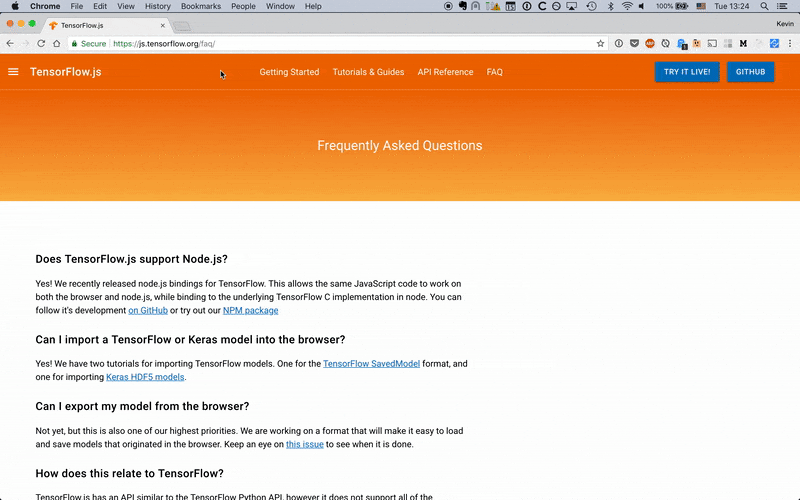
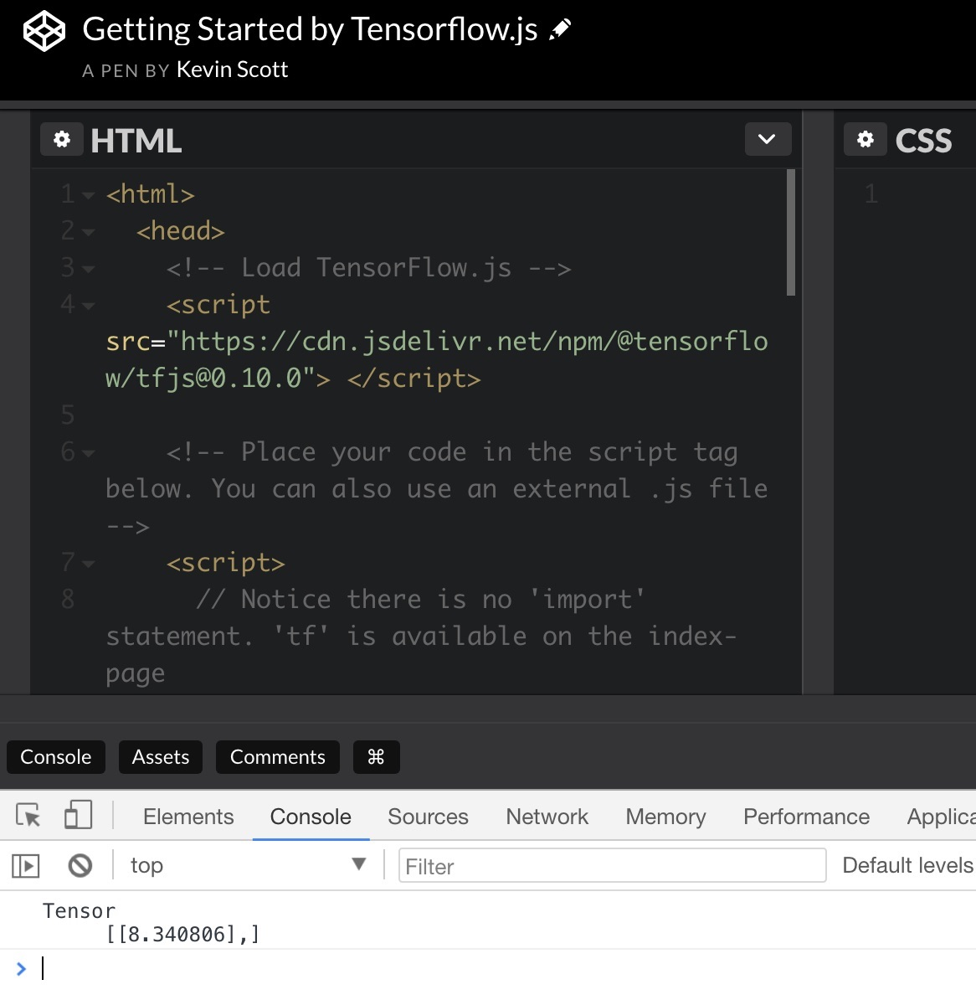

Up until fairly recently, just getting started writing your first line of machine learning code required a hefty upfront investment in time and money. For example, just last year [I built my own PC specifically for machine learning](/deep-learning-cryptocurrency-pc-1-hardware/). I researched the parts and assembled it myself. Just doing that cost me around $1600 and 30 hours of setup time, and I'm still trying to wrangle the computer's configuration, libraries, and make it work with various frameworks.

The good news is that getting started with machine learning today has never been easier. In fact, if you're reading this it means you already have the tools you need to dive right in. **You can now learn the machine learning [framework Tensorflow right in your browser, using Javascript.](/reasons-for-machine-learning-in-the-browser/)**

On the software side there were an equally daunting number of tools to master before I could even get the most basic examples running: Jupyter notebooks, numpy, scikit, pandas.

I come from the Javascript world, and I like it. If I could have gotten started with Machine Learning by starting with Javascript, I would have jumped at the chance. Today, that's possible.

# Tensorflow.js


Google [released Tensorflow.js](https://www.youtube.com/watch?v=OmofOvMApTU) at the Google I/O 2018. There are [some huge use cases for why it makes sense to run machine learning in a browser](/reasons-for-machine-learning-in-the-browser/). In addition, it's a great opportunity to use Javascript to explore machine learning concepts without having to install a thing.

If you're new to Javascript or it's been a while since you've written any front-end code, some of the recent changes in the Javascript ecosystem might throw you for a loop. I'll list the basics of modern Javascript you need to get the Tensorflow.js examples running, and start exploring machine learning.

# Setup Tutorial
Let me repeat something: **all you need to run Tensorflow.js is your web browser**. It's easy to lose sight amongst all the talk of transpilers, bundlers, and packagers, but all you need is a web browser to run Tensorflow.js. The code you develop locally is the same code you'll be able to ship to your users to run on their browsers.

Let's see three quick ways to get the Hello World example working without installing anything. I'll be using the [Getting Started code](https://js.tensorflow.org/#getting-started) from the Tensorflow.js documentation.

## `Getting Started` with your Browser Console

Every modern web browser ships with some sort of interactive Javascript Console built in. I use Chrome, which includes a Javascript Console you can open with "View > Developer > Javascript Console".



This Javascript Console lets you write Javascript and execute it immediately. We'll use this to run the Getting Started example from the [Tensorflow.js docs](https://js.tensorflow.org/#getting-started).

First, you'll need to include the Tensorflow.js Javascript file. A hosted version of the file is available via the [Content Delivery Network (CDN)](https://www.webopedia.com/TERM/C/CDN.html) below. A quick way to include an external `.js` file via the console is:

```
var script = document.createElement('script');
script.src = "https://cdn.jsdelivr.net/npm/@tensorflow/tfjs@0.10.0";
document.getElementsByTagName('head')[0].appendChild(script);
```

Copy and paste this into your Javascript Console and you'll have a copy of Tensorflow saved as the variable `tf`. (If you type `tf` in your console, you'll see a reference to it.) You can then copy and paste the rest of the Getting Started example (the Javascript between the second `<script>` tag) by pasting it directly into your console.

## Getting Started with a Javascript hosting platform

An alternative approach is to use an online Javascript hosting platform. Three popular ones are [CodePen](https://codepen.io/), [JSFiddle](https://jsfiddle.net/), and [JSBin](https://jsbin.com/). These platforms can automatically include scripts for you and take care of transpiling your code in the browser, which makes getting started a cinch.

You can view [the following example on Codepen](https://codepen.io/thekevinscott/pen/aGapZL) to see an implementation working. Make sure to open your browser console, as explained above, to see the output.



## Getting Started locally

Finally, a third option for getting Tensorflow.js working involves saving the code as an `.html` file and opening it locally on your computer. And you don't need a web server to do this!

Copy the html code into a file, and open it in your web browser. For instance, if you save the file onto your desktop and you're on a Mac, you might open it in your browser with the following URL:

`file:///Users/YOURNAME/Desktop/sample.html`

It is important to note that viewing `html` files this way introduces limitations, including issues with referencing relative links, handling ajax calls and security, among other things. But it's a quick and easy way to get something running in your browser.

# The Modern Javascript Development Workflow

Hopefully by this point, you can see how easy it is to get something basic to show up in your browser. If you begin looking at the Tensorflow.js examples, you might be thinking

* how do I organize my files?
* how do I manage third party libraries in my code?
* what's with these syntax errors?

As soon as you move beyond the basic Hello World example above and into some of the other examples, you'll begin to run into syntax issues and organization issues, and that's where a strong Javascript pipeline will be your best friend.

## A little bit of Javascript history

As our expectations for web apps has grown over the past decade, the front-end ecosystem has exploded in complexity. Javascript in particular has matured a lot as a programming language, adopting a number of forward-thinking changes to the language while continuing to support one of the largest userbases of any programming language.

New changes to the language spec are referenced with acronyms like `ES5`, `ES6`, `ES2015`, `E2016`. `ES` stands for `ECMAScript` and [Javascript is based on this standard](https://benmccormick.org/2015/09/14/es5-es6-es2016-es-next-whats-going-on-with-Javascript-versioning/). `5` and `6` were traditionally used to refer to versions of the standard, but nowadays years are used for additional clarity.

[Modern browser support for ES6 is spotty](http://kangax.github.io/compat-table/es6/). Some cutting edge or proposed features are not yet supported, and older browsers (in particular IE) will never support the latest spec. Because of this instability, if you want to reach the widest audience possible you use something called a [bundler or transpiler](https://dev.to/kayis/4-Javascript-bundlers-2g4b), which is a piece of software that converts your Javascript code written with modern conveniences into a version with wide-spread adoption (ES5 is widely supported and is generally a good target).

Many of the Tensorflow.js examples make use of new syntax that is not yet widely supported in browsers and requires transpiling. I'll explain the syntax first and then explain how to get them working.

### `import` and `export`

`import` and `export` are two bits of syntax recently introduced into Javascript for importing modules. The saga of Javascript modules is [long and winding](https://ponyfoo.com/articles/brief-history-of-modularity), but the [community has largely settled on `import` over `require`](https://insights.untapt.com/webpack-import-require-and-you-3fd7f5ea93c0). Unfortunately, as of May 2018 `import` is not supported by any browsers, so to use it you need to use a transpiler.

In the Getting Started docs, you'll see an example of `import` upfront:

```
import * as tf from '@tensorflow/tfjs';
```

This is basically the same as:

```
var tf = require('@tensorflow/tfjs');
```

You also might see something like:

```
import { util, tensor2d } from '@tensorflow/tfjs';
```

Whose equivalent using `require` is:

```
var tf = require("@tensorflow/tfjs");
var util = tf.util;
var tensor2d = tf.tensor2d
```

### `async` and `await`

Javascript has traditionally been used heavily with UIs, which perform a lot of asynchronous actions. There have been three broad patterns for handling asynchronous code over the years: [callbacks, promises, and async/await](https://medium.com/@stevekonves/three-Javascript-async-patterns-1d2e7094860a
).

`async`/`await` provides a way of defining asynchronous functions in a synchronous way. [Many of the Tensorflow.js examples](https://js.tensorflow.org/tutorials/webcam-transfer-learning.html) make use this `async` / `await` syntax.

Here's two versions of the same code, the first written with `async`/`await`, the second using promises:

```
// With async/await
async function loadMobilenet() {
  const mobilenet = await tf.loadModel(
      'https://storage.googleapis.com/tfjs-models/tfjs/mobilenet_v1_0.25_224/model.json');

  // Return a model that outputs an internal activation.
  const layer = mobilenet.getLayer('conv_pw_13_relu');
  return tf.model({inputs: model.inputs, outputs: layer.output});
});
```

```
// With promises
function loadMobilenet() {
  return tf.loadModel('https://storage.googleapis.com/tfjs-models/tfjs/mobilenet_v1_0.25_224/model.json').then(function (mobilenet) {
    // Return a model that outputs an internal activation.
    const layer = mobilenet.getLayer('conv_pw_13_relu');
    return tf.model({inputs: model.inputs, outputs: layer.output});
  });
});
```

* * *

Both of these language features - `import`/`export` and `async`/`await` - make writing Javascript more pleasant. Let's next see the tools we need to use them in our own code.

## Javascript Tooling

On the Getting Started docs, you'll see:

> **Note**: Because we use ES2017 syntax (such as `import`), this workflow assumes you are using a bundler/transpiler to convert your code to something the browser understands. See our examples to see how we use Parcel to build our code. However you are free to use any build tool that you prefer.

Let's talk about build tools.

### Bundlers


Bundlers have taken on the role of conductor of the orchestra of growing front-end codebases. A bundler is a program that takes your Javascript code and "bundles" it up into a compatible file for the browser. Bundlers will also transpile code (convert ES2018 code to ES5, along with other dialects like React or Typescript, using something like [`babel`](https://babeljs.io/)), set up "hot reloading" to refresh the browser with code changes without reloading the page, and many other things to make front-end development better.

[Grunt](https://gruntjs.com/) and [Gulp](http://gulpjs.com/) used to be popular bundlers but have recently fallen out of favor to [`webpack`](https://webpack.js.org/). Other bundlers include [`parcel`](https://parceljs.org/) and [`rollup`](https://rollupjs.org/guide/en). The Tensorflow.js examples use `parcel`.

### Package managers
Often, when encountering a Javascript library, you'll see installation instructions like `yarn add @tensorflow/tfjs` or `npm install @tensorflow/tfjs`.

[`yarn`](https://yarnpkg.com/en/) and [`npm`](https://www.npmjs.com/) are both package managers. They're command line tools used to install and keep track of your third party Javascript dependencies.

`yarn` and `npm` are pretty similar and the decision of which one to use is largely up to personal preference (though you'll find plenty of holy wars online if you're into that sort of thing).

Either one will save your dependencies into a `package.json` file which should be checked into your git repository. This file will enable other developers to quickly install all the necessary dependencies for your project and get things running quickly.

* * *

To get all these goodies, the first step is to install `npm` or `yarn`, along with `Node.js`. Once those are in place, you can follow the instructions on any of the Tensorflow.js examples and they should work out of the box. Usually, getting set up with a new front-end project using these tools is a one step process.

Again, you don't need any of these tools to work with these examples, but using them makes things so much easier. If you intend to do any sort of serious Javascript development, I would encourage you to play with these tools, along with other popular Javascript tools like [React](https://reactjs.org/) and [Typescript](https://www.typescriptlang.org://www.typescriptlang.org/), which make handling larger codebases much better.
