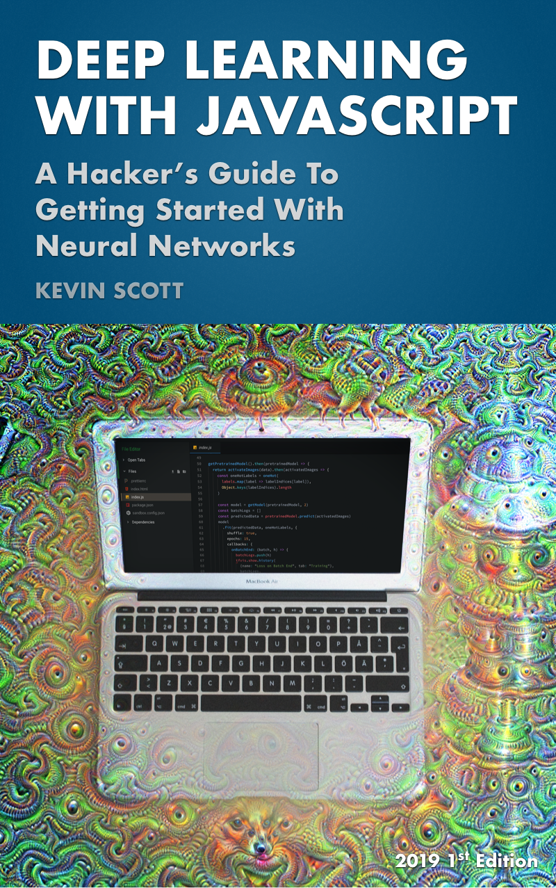

I've just published my new book, <strong><a href="https://dljsbook.com">Deep Learning With Javascript</a></strong>.

<a href="https://dljsbook.com">You can purchase a copy here.</a>

I wanted a book like this one when I began studying Deep Learning. I’m a hacker at heart, and I learn by doing.

Most books on Deep Learning assume strong mathematics or statistics backgrounds. Traditionally this hasn’t been a problem, because anyone looking to enter the field would be expected to tackle problems that required these sorts of backgrounds.

Today, facilitated by better hardware, better frameworks, and new discoveries in research, that’s starting to change. We’re seeing a whole new range of use cases emerge that are relevant to programmers, designers, writers, artists, and poets. Over the next few years I believe Neural Networks will be incorporated across all software domains, no matter the industry.

The goal of this book is to demystify Neural Networks and prepare you for that future, through hacking and through using them in projects you’d use in the real world.

Enjoy!

- Kevin
