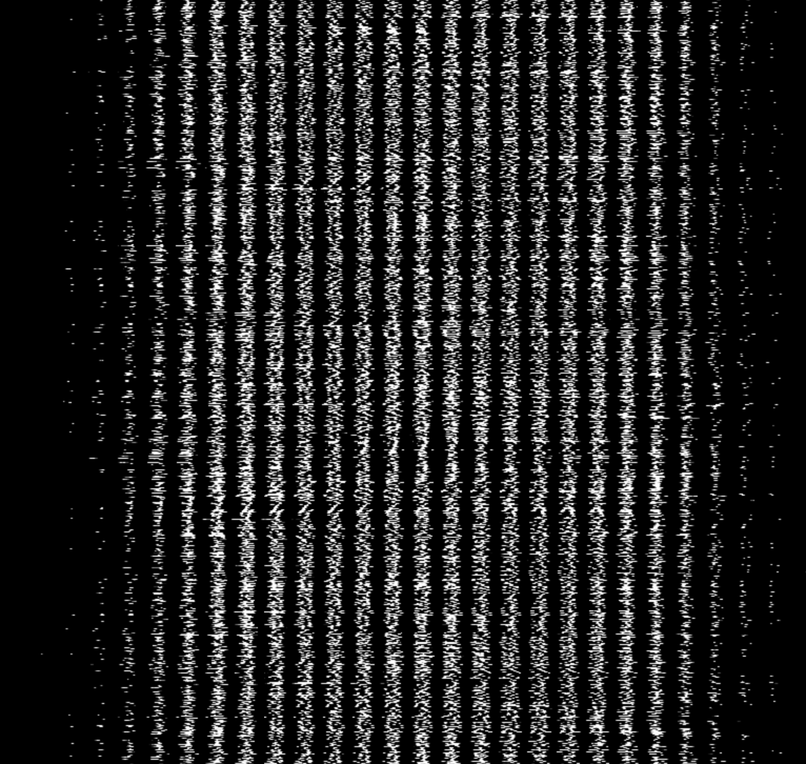

> There's the joke that 80 percent of data science is cleaning the data and 20 percent is complaining about cleaning the data ... data cleaning is a much higher proportion of data science than an outsider would expect. Actually training models is typically a relatively small proportion (less than 10 percent) of what a machine learner or data scientist does. - [Anthony Goldbloom, CEO of
> Kaggle](https://www.theverge.com/2017/11/1/16589246/machine-learning-data-science-dirty-data-kaggle-survey-2017)

A lot of the time in data science is spent manipulating the data. Understanding it, slicing it, visualizing it, looking at it in different ways, and engineering new features. I wrote [an article about that here](/common-patterns-for-analyzing-data/). So it's crucial to have a strong handle on how to manipulate data in Javascript if you're going to be doing Machine Learning in Javascript.

This article will take the [MNIST example for Tensorflow.js](https://github.com/tensorflow/tfjs-examples/blob/master/mnist/data.js) and walk through the code handling the data loading.

*It's important to caveat that this is the version of Tensorflow.js x. Nikhil states the data loading functions will be changing, so stay tuned.*

# MNIST example

[Here's a link to the TFJS example on MNIST](https://github.com/tensorflow/tfjs-examples/blob/master/mnist/data.js). Let's go through the data file line by line.

```javascript
18 import * as tf from '@tensorflow/tfjs';
19
20 const IMAGE_SIZE = 784;
21 const NUM_CLASSES = 10;
22 const NUM_DATASET_ELEMENTS = 65000;
23
24 const NUM_TRAIN_ELEMENTS = 55000;
25 const NUM_TEST_ELEMENTS = NUM_DATASET_ELEMENTS - NUM_TRAIN_ELEMENTS;
26
27 const MNIST_IMAGES_SPRITE_PATH =
28     'https://storage.googleapis.com/learnjs-data/model-builder/mnist_images.png';
29 const MNIST_LABELS_PATH =
30     'https://storage.googleapis.com/learnjs-data/model-builder/mnist_labels_uint8';`
```

First [the code imports tensorflow (make sure you're transpiling your code!)](/tensorflowjs-hello-world/), and establish some constants, including:

* `IMAGE_SIZE` - the size of an image (width and height of 28x28 = 784)
* `NUM_CLASSES` - number of label categories (a number can be 0-9, so there's 10 classes)
* `NUM_DATASET_ELEMENTS` - number of images total (65,000)
* `NUM_TRAIN_ELEMENTS` - number of training images (55,000)
* `NUM_TEST_ELEMENTS` - number of test images (10,000, aka the remainder)
* `MNIST_IMAGES_SPRITE_PATH` & `MNIST_LABELS_PATH` - paths to the images and the labels

The images are concatenated into one huge image which looks like:



### `MnistData`
Next up is `MnistData`, a class that exposes the following functions:

* `load` - responsible for asynchronously loading the image and label data
* `nextTrainBatch` - load the next training batch
* `nextTestBatch` - load the next test batch
* `nextBatch` - a generic function to return the next batch, depending on whether it is in the training set or test set

This article will only step through the `load` function.

### `load`
```javascript
44 async load() {
45   // Make a request for the MNIST sprited image.
46   const img = new Image();
47   const canvas = document.createElement('canvas');
48   const ctx = canvas.getContext('2d');
```

`async` [is a relatively new language feature in Javascript](/tensorflowjs-hello-world/#async-and-await) for which you will need a transpiler.

The `Image` object is a native DOM function that represents an image in memory, and it provides callbacks for when the image is loaded along with access to the image attributes. `canvas` is another DOM element that provides easy access to pixel arrays and processing via way of `context`.

Since both of these are DOM elements, if you're working in Node.js (or a Web Worker) you won't have access to these elements. For an alternative approach see below.

### `imgRequest`
```javascript
49 const imgRequest = new Promise((resolve, reject) => {
50   img.crossOrigin = '';
51   img.onload = () => {
52     img.width = img.naturalWidth;
53     img.height = img.naturalHeight;
```

The code initializes a new promise that will be resolved once the image is loaded successfully. (This example does not explicitly handle the error state.)

`crossOrigin` is an `img` attribute that allows for the loading of images across domains, and gets around CORS issues when interacting with the DOM. `naturalWidth` and `naturalHeight` refer to the original dimensions of the loaded image, and serve to enforce that the image's size is correct when performing calculations.

```javascript
55     const datasetBytesBuffer =
56     new ArrayBuffer(NUM_DATASET_ELEMENTS * IMAGE_SIZE * 4);
57
58     const chunkSize = 5000;
59     canvas.width = img.width;
60     canvas.height = chunkSize;
```
The code initializes a new buffer to contain every pixel of every image. It multiplies the total number of images by the size of each image by the number of channels (4).

I *think* that `chunkSize` is used to prevent the UI from loading too much data into memory at once, though I'm not 100% sure.

```javascript
62     for (let i = 0; i < NUM_DATASET_ELEMENTS / chunkSize; i++) {
63       const datasetBytesView = new Float32Array(
64         datasetBytesBuffer, i * IMAGE_SIZE * chunkSize * 4,
65         IMAGE_SIZE * chunkSize);
66       ctx.drawImage(
67         img, 0, i * chunkSize, img.width, chunkSize, 0, 0, img.width,
68         chunkSize);
69
70       const imageData = ctx.getImageData(0, 0, canvas.width, canvas.height);
```

This code loops through every image in the sprite and initialize a new `TypedArray` for that iteration; then, the context image gets a chunk of the image drawn. Finally, that drawn image is turned into image data using context's [`getImageData` function](https://developer.mozilla.org/en-US/docs/Web/API/CanvasRenderingContext2D/getImageData), which returns an object representing pixels.

```javascript
72       for (let j = 0; j < imageData.data.length / 4; j++) {
73         // All channels hold an equal value since the image is grayscale, so
74         // just read the red channel.
75         datasetBytesView[j] = imageData.data[j * 4] / 255;
76       }
77     }
```

We loop through the pixels, and divide by 255 (the maximum possible value of a pixel) to clamp the values between 0 and 1. Only the red channel is necessary, since its a grayscale image.

```javascript
78     this.datasetImages = new Float32Array(datasetBytesBuffer);
79
80     resolve();
81   };
82   img.src = MNIST_IMAGES_SPRITE_PATH;
83 });
```

This is the line that takes the buffer, and recasts it into a new `TypedArray` that holds our pixel data. Finally, the promise resolves, and that last line (setting the `src`) actually kicks off the image loading for the whole thing.

One thing that confused me at first was the behavior of `TypedArray`s in relation to their underlying data buffers. You might see in the above code that blah blah blah. When creating `datasetBytesView` above, that's a view; the underlying data is being written to the buffer. That's why it looks like the variable is getting discarded but it actually persists.

## Fetching image data outside of the DOM

If you're in the DOM, you should use the DOM. The browser (through `canvas`) takes care of figuring out the format of images and translating buffer data into pixels. But what should you do outside of the DOM?

`fetch` provides a mechanism, `response.arrayBuffer`, that gives you access to a file's underlying buffer. We can use this to read the bytes manually, avoiding the DOM entirely:

```javascript
const imgRequest = fetch(MNIST_IMAGES_SPRITE_PATH).then(resp => resp.arrayBuffer()).then(buffer => {
  return new Promise(resolve => {
    const reader = new PNGReader(buffer);
    return reader.parse((err, png) => {
      const pixels = Float32Array.from(png.pixels).map(pixel => {
        return pixel / 255;
      });
      this.datasetImages = pixels;
      resolve();
    });
  });
});
```

What this will do is fetch the image and return an array buffer. At first I tried to parse this myself, which is an exercise in masochism. [Here's information on how to read an array buffer for a png.](http://www.libpng.org/pub/png/spec/1.2/PNG-Structure.html). I elected to use this library instead, which reads a png buffer and [gives you back a pixel array.](https://github.com/arian/pngjs)

This should work outside of the DOM environment but only for pngs. I imagine there are other buffer parsing libraries out there or you could write your own. The TFJS team says they're working on data improvements so I wouldn't get too attached to this but it's good to know what's going on under the hood.

## A word on Typed Arrays

A history of JS typed arrays.

Typed Arrays are a relatively new feature in the world of Javascript. They were introduced because of X. You need them when workin with WEbGL which Tensorflow does.

I found it useful to go through a refresher on these bad boys, since they're so at the core of all this stuff.

Information on typed arrays: https://www.html5rocks.com/en/tutorials/webgl/typed_arrays/

https://blog.codingbox.io/exploring-javascript-typed-arrays-c8fd4f8bd24f

https://www.html5rocks.com/en/tutorials/webgl/typed_arrays/

http://2ality.com/2015/09/typed-arrays.html

https://hacks.mozilla.org/2017/01/typedarray-or-dataview-understanding-byte-order/


