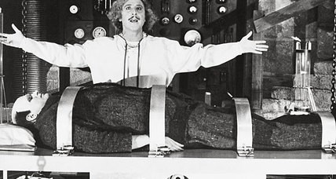

Among the buzzwords in the tech world of 2017, two tower above the rest: **deep
learning** and **cryptocurrencies**. It seems that everyone wants to learn more
about these things. And guess what — so do I! So much so that I'm building my
own computer in order to facilitate that learning.

What follows are my notes-to-self as I build a computer to learn about deep
learning and cryptocurrency mining. In this installment we'll just discuss
building the hardware. If you'd like to hear about configuring the OS, getting
started with crypto mining, or getting started with deep learning algorithms,
drop me your email below and I'll keep you in the loop.

*****

Some quick definitions, for those unfamiliar:

> A **cryptocurrency** … is a [digital
> asset](https://en.wikipedia.org/wiki/Digital_asset) designed to work as a
[medium of exchange](https://en.wikipedia.org/wiki/Medium_of_exchange) using
[cryptography](https://en.wikipedia.org/wiki/Cryptography) to secure the
transactions and to control the creation of additional units of the currency. —
[Wikipedia](https://en.wikipedia.org/wiki/Cryptocurrency)

> **Machine learning** is the subfield of [computer
> science](https://en.wikipedia.org/wiki/Computer_science) that, according to
[Arthur Samuel](https://en.wikipedia.org/wiki/Arthur_Samuel), gives “computers
the ability to learn without being explicitly programmed.” — also
[Wikipedia](https://en.wikipedia.org/wiki/Machine_learning)

> **Deep learning** … is part of a broader family of [machine
> learning](https://en.wikipedia.org/wiki/Machine_learning) methods based on
[learning data
representations](https://en.wikipedia.org/wiki/Learning_representation), as
opposed to task-specific algorithms. —
[Wikipedia](https://en.wikipedia.org/wiki/Deep_learning)

*****

Why build a PC to learn this stuff? It's important to note that you don't have
to. Your laptop is capable of running the same software, but the performance
you‘ll get out of a dedicated GPU is miles beyond what your laptop's CPU can
deliver. You'll spend more money replacing your worn-out laptop than you'll make
mining cryptocurrencies, and anything beyond basic deep learning training will
take forever.

## GPUs

GPUs are specialized chips for processing data in parallel. Originally developed
to power intensive graphics (like in video games), more recently their
architecture has been discovered to be a perfect fit for the short, repetitive
and parallelizable tasks at the heart of both machine learning and
cryptocurrency mining.

## The cloud

You can rent GPUs in the cloud, for instance, [with
AWS](https://aws.amazon.com/about-aws/whats-new/2016/09/introducing-amazon-ec2-p2-instances-the-largest-gpu-powered-virtual-machine-in-the-cloud/).
Unfortunately they're expensive and it's a much better deal to run things
locally. (This will probably change in the future).

So it makes economic and temporal sense to run these things locally.

# Hardware

I haven't built a computer from scratch in over 20 years. I bought a Mac in 2004
and haven't looked back since. I was lucky enough to have a good friend with
some experience who was able to guide me in the right direction.

## Picking a GPU

The most important question: Which GPU to purchase?

[Tim Dettmers has a fantastic in-depth
article](http://timdettmers.com/2017/04/09/which-gpu-for-deep-learning/)
comparing a number of GPUs out on the market. Go read his article if you want a
truly exhaustive look at the costs and benefits of available GPUs.

He writes:

> NVIDIA's standard libraries made it very easy to establish the first deep
> learning libraries in CUDA, while there were no such powerful standard libraries
for AMD's OpenCL. Right now, there are just no good deep learning libraries for
AMD cards — so NVIDIA it is.

I'd heard this sentiment from others. It seems that if you want to do machine
learning, you're best off going with NVIDIA.

I ended up picking a pair of GTX 970s, which was primarily a budget decision
(this is a hobby, after all). There's lots available on eBay.

## The rest of the parts

A number of folks have written about their experiences building deep
learning-capable machines, and they were invaluable for helping me figure out
what parts to buy:

https://medium.com/towards-data-science/building-your-own-deep-learning-box-47b918aea1eb

https://medium.com/@acrosson/building-a-deep-learning-box-d17d97e2905c

https://www.oreilly.com/learning/build-a-super-fast-deep-learning-machine-for-under-1000

As these articles point you, make sure to enter your components into
[pcpartpicker.com](https://pcpartpicker.com/) before purchasing, to ensure
components work together. I failed to do this, and as you'll read below, this
necessitated a trip back to the Amazon store a second time.

The parts!

# Shopping List

Here's what I bought (*affiliate links*):

* Motherboard: [Gigabyte
GA-Z170X](https://www.amazon.com/gp/product/B012N6ESTC/ref=as_li_tl?ie=UTF8&camp=1789&creative=9325&creativeASIN=B012N6ESTC&linkCode=as2&tag=theoryincorpo-20&linkId=d41ae2f81f2541aef2deccbb45e833bf)
* CPU: [Intel Core i5 6600K 3.50
GHz](https://www.amazon.com/gp/product/B012M8M7TY/ref=as_li_tl?ie=UTF8&camp=1789&creative=9325&creativeASIN=B012M8M7TY&linkCode=as2&tag=theoryincorpo-20&linkId=9f1372b58ef093b59173144815d494fd)
* RAM: [Corsair Vengeance
16GB](https://www.amazon.com/gp/product/B01HKF450S/ref=as_li_tl?ie=UTF8&camp=1789&creative=9325&creativeASIN=B01HKF450S&linkCode=as2&tag=theoryincorpo-20&linkId=68496b76cc73a6eaaee01e222fee703e)
* PSU: [EVGA SuperNova
750W](https://www.amazon.com/gp/product/B00K85X2A2/ref=as_li_tl?ie=UTF8&camp=1789&creative=9325&creativeASIN=B00K85X2A2&linkCode=as2&tag=theoryincorpo-20&linkId=32845692521e8b74f6bda127b2e82917)
* Hard Drive: [Samsung 960
1TB](https://www.amazon.com/gp/product/B01LXS4TY6/ref=as_li_tl?ie=UTF8&camp=1789&creative=9325&creativeASIN=B01LXS4TY6&linkCode=as2&tag=theoryincorpo-20&linkId=ada0a1fc170f85869054605fbab24684)
* CPU Cooler: [Cooler Master
Hyper](https://www.amazon.com/gp/product/B005O65JXI/ref=as_li_tl?ie=UTF8&camp=1789&creative=9325&creativeASIN=B005O65JXI&linkCode=as2&tag=theoryincorpo-20&linkId=c0c8d938f6267fdd4e2f3047319003ae)
* Case (first attempt): [AeroCool
Aero300](https://www.amazon.com/gp/product/B0716715R1/ref=as_li_tl?ie=UTF8&camp=1789&creative=9325&creativeASIN=B0716715R1&linkCode=as2&tag=theoryincorpo-20&linkId=5f5509b9f3f463d9abf46d3666410bfb)
* Case (second attempt): [Corsair Carbide Series
270R](https://www.amazon.com/gp/product/B01M3Y5FJ2/ref=as_li_tl?ie=UTF8&camp=1789&creative=9325&creativeASIN=B01M3Y5FJ2&linkCode=as2&tag=theoryincorpo-20&linkId=7d67eab5133134d5ed151de4dbd5f984)
* Wifi adapter: this [exceptionally tiny wifi USB
adapter](https://www.amazon.com/gp/product/B003MTTJOY/ref=as_li_tl?ie=UTF8&camp=1789&creative=9325&creativeASIN=B003MTTJOY&linkCode=as2&tag=theoryincorpo-20&linkId=2755d7e0d0a7f51bd3798ac05f5cdfa5)
came in handy (and continues to) as I struggle with ethernet issues

## PSU

The PSU is the power supply that runs the whole rig.

There's three types of PSUs: modular, non-modular and semi-modular. Modular PSUs
have cables you can disconnect, whereas non-modulars have cables that are
attached. Semi-modular PSUs usually have the CPU and motherboard cables attached
and the rest pluggable.

I bought a modular 750W PSU. In my limited experience of one, modular PSUs need
some additional clearance behind them to accommodate their cables. The original
case I bought, AeroCool, lacked enough space behind the PSU to fit the cables,
necessitating a second trip to the Amazon store. A visit to [pcpartpicker.com](https://pcpartpicker.com/) would have alerted me beforehand. Lesson learned!

To determine what kind of wattage you need, add up all your parts' wattage
needs. Pay particular attention to the GPUs' needs, and give yourself some extra
breathing room. I'm not sure what happens if you run out of wattage but I would
guess it sucks.

First step out of the box is to make sure the PSU turns on and power is being
delivered. And in my case, all systems were go!

[Here's a great video I watched about installing a
PSU](https://www.youtube.com/watch?v=2h_NYl4DRF4&index=1&list=PLxvB6AORmso4SILfs3sj8vYCohM-RnwcD),
and if you happen to buy an EVGA PSU, here's [EVGA's specific
tutorial](https://www.youtube.com/watch?v=rucfmsGjPow&list=PLxvB6AORmso4SILfs3sj8vYCohM-RnwcD&index=2).

## Motherboard & CPU

For machine and deep learning applications, the CPU is less important than the
GPUs, who do most of the heavy lifting. You need a CPU that'll accommodate the
GPUs, and [it should have as many cores as the
GPUs](https://www.quora.com/Which-hardware-components-CPU-RAM-GC-etc-are-needed-for-a-machine-learning-deep-learning-home-PC-computer-to-run-fast).

For the motherboard, go with one that supports PCIe 3.0. If you're planning to
go up to 4 GPUs make sure your motherboard supports that (you'll also probably
want a stronger PSU and some serious cooling — I elected to use only 2 GPUs).

Here's a photo of the motherboard:

Ain't it a beaut?

The first step is to install the CPU. [I followed this video on installing a
CPU.](https://www.youtube.com/watch?v=1w6UZNeGgXU&index=3&list=PLxvB6AORmso4SILfs3sj8vYCohM-RnwcD)
I was surprised by how easy it is; the thing just clicks into place!

This time, with more CPU!

*Side note:* The eagle-eyed reader may observe me assembling this on a carpet.
Don't be me. Carpets cause static electricity and **static electricity is bad
for electronics**. Soon after this photo was taken I quickly realized the error
of my ways and migrated to a non-carpeted floor and became obsessive about
touching metal objects for the remainder of the build out.

## Thermal Paste

Not having done this in over 20 years, this was a completely new thing to me.

CPUs require a paste be applied in order to dispel heat. Here's a video on
applying [thermal
paste](https://www.youtube.com/watch?v=-hNgFNH7zhQ&list=PLxvB6AORmso4SILfs3sj8vYCohM-RnwcD&index=5).
The narrator's pasting technique is 🔥.

## CPU Cooler

The CPU Cooler sits on top of the CPU and sucks the heat out to be dispelled via
a fan. It looks super cool, and it was fun to install too! [Here's the video I
followed to install
it](https://www.youtube.com/watch?v=XLlrqzwxJig&index=4&list=PLxvB6AORmso4SILfs3sj8vYCohM-RnwcD).

And here it is, looking so snazzy:

So cool, Cooler Master Hyper

## RAM

Ram is a cinch to install. Here's a [video that'll show you
how](https://www.youtube.com/watch?v=O5WMyYrEq1Y&list=PLxvB6AORmso4SILfs3sj8vYCohM-RnwcD&index=7).

## Hard Drive

I bought an M.2 hard drive, which my limited experience indicates is the easiest
hard drive to install (*note: I did not attempt to install other types of hard
drives*). [Here's a video demonstrating how to install
it](https://www.youtube.com/watch?v=XmvNQvFxKcs&index=10&list=PLxvB6AORmso4SILfs3sj8vYCohM-RnwcD).
It basically snaps right onto the motherboard and you're done.

*Side note:* I actually installed the GPUs before installing the hard drive, and
had to remove those GPUs to get it in as the M.2 sits underneath them (at least,
on this particular motherboard). So if you have an M.2, do this step before the
GPUs.

## GPUs

Finally, here come the racehorses!

[Here's a video on installing
GPUs](https://www.youtube.com/watch?v=Yinrkn4TvnU&list=PLxvB6AORmso4SILfs3sj8vYCohM-RnwcD&index=8).
It's pretty straightforward: you line the chips up with the PCI-e connectors,
pop one of the tabs, and push (softly — you don't want to force it) until the
tab clicks back into place.

Here's a before shot of the empty PCI slots:

And with the GPUs installed:

## Putting it in the case

The last step is to get the motherboard into the case and seal it up.

[Here's a video walking through how to install into a
case.](https://www.youtube.com/watch?v=iTkGuioG5RU&list=PLxvB6AORmso4SILfs3sj8vYCohM-RnwcD&index=9)
I suspect every case is different and you're better off searching for your
particular build, but c'est la vie. You'll have to connect the case's cables to
the motherboard's, and for that you will need to refer to the respective manuals
for instructions.

*****

With everything assembled, all that was left was to hit the power button on the
PSU. I felt a little like Dr. Frankenstein hovering over his monster. Would the
beast wake up?

I flipped the PSU. The machine did not turn on. I spent five minutes freaking
out thinking I had fried some circuitry or installed something wrong.

I then realized the case also has an on switch. So I turned that on.

And the beast awoke!

At this point I had a functioning machine, and it was into the land of software
(and a nice cold beer). I'll save that for next time.

If you want to hear about my travails configuring the BIOS, installing Linux,
and actually tackling the crypto mining and deep learning setups, drop your
email below and I'll let you know when I publish those.
