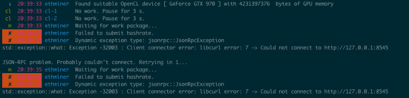
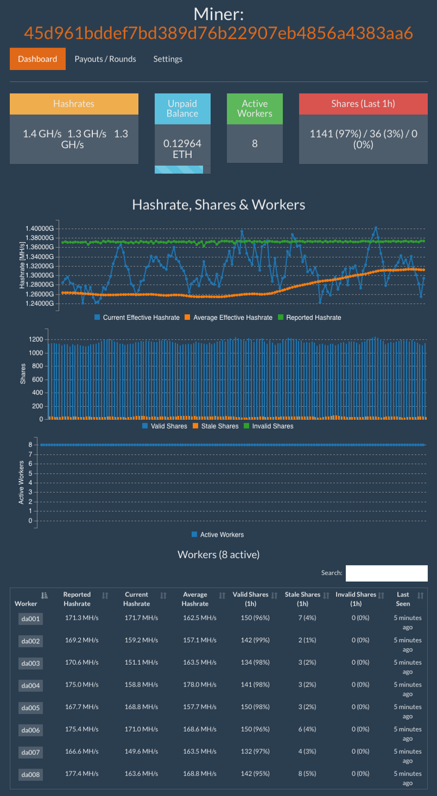
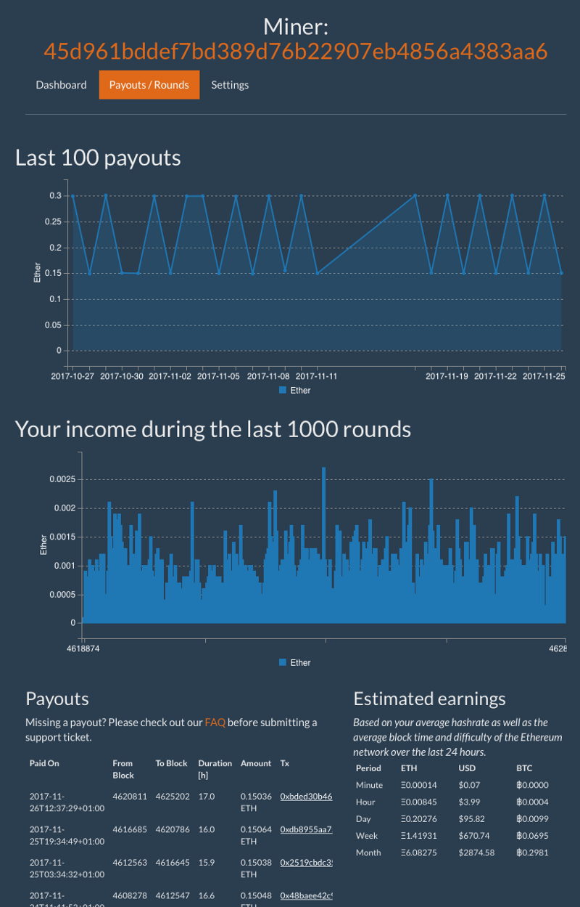

Among the buzzwords in the tech world of 2017, two tower above the rest: **deep
learning** and **cryptocurrencies**. It seems that everyone I know (in tech)
wants to learn these things. And guess what — so do I! So much so that I'm
building my own computer in order to facilitate that learning.

What follows are my notes-to-self as I build a computer to learn about deep
learning and cryptocurrency mining. In the previous installments we discussed
[assembling the
hardware](https://medium.com/@thekevinscott/noobs-guide-to-custom-computer-for-cryptocurrency-and-deep-learning-7caa255adfaf)
and [installing the
OS](https://medium.com/@thekevinscott/noobs-guide-to-building-a-deep-learning-cryptocurrency-pc-2-the-os-39dd20bd9b21).
In this installment I'll talk about how to set up a cryptocurrency miner and
connect to a pool.

<iframe style="height:400px;width:100%;max-width:800px;margin:30px auto;" src="https://upscri.be/96fcab/?as_embed"></iframe>

To recap, in case you're just getting started with this series: my goal in
purchasing and building my own PC was to have hardware on hand to run machine
learning algorithms on, and bring myself up to speed on the exciting advances
happening in AI. But in between running training algorithms, my computer (and
it's hungry hungry GPUs) will sit fallow. We can't have that!

When I'm not running the computer over training data, I want to have it mining.
Even if it's making only a a little profit, it's still better than nothing.

# Cryptocurrencies

Your first instinct when getting into mining might be to try and mine bitcoin.
This would almost certainly be a mistake.

Bitcoin today is mined primarly via [ASICS
hardware](https://www.buybitcoinworldwide.com/mining/hardware/), equipment
specialized for mining bitcoins and other cryptocurrencies (but mostly
bitcoins). Unless your goal in life is to mine bitcoins — and I suppose there's
nothing wrong with that — ASICS hardware is not a good investment. And without
ASICS hardware, it's hard to compete with the other miners.

There are cryptocurrencies especially [designed to prevent mining via
specialized hardware, called scrypt
coins](https://www.coindesk.com/scrypt-miners-cryptocurrency-arms-race/):

> One of the biggest differences between scrypt and SHA-256 is that the former
> relies heavily on computing resources aside from the processing unit itself,
particularly memory. Conversely, SHA-256 doesn't. This makes it difficult for
scrypt-based systems to scale up and use lots of computing power, because they
would have to use a proportional amount of memory, and that is expensive. —
[Danny Bradbury,
Coindesk](https://www.coindesk.com/scrypt-miners-cryptocurrency-arms-race/)

While more specialized hardware is beginning to come to market, you're probably
safe picking one of these scrypt currencies to mine. Ethereum is a good choice,
so that's what I'm going to start with.

# The tools

To get started mining, you need
[ethereum](https://github.com/ethereum/go-ethereum), a
[miner](https://github.com/ethereum-mining/ethminer), and a **wallet** to send
the mined coins to.

First, enable the ethereum repository:

    sudo add-apt-repository -y ppa:ethereum/ethereum
    sudo apt-get update

Then, install ethereum:

    sudo apt-get install ethereum

Next, you need to install the miner, `ethminer`. (There are other miners as
well, like qtMiner, cudaminer, eth-proxy). You can either install via `apt-get`
or from source; because I'm a masochist I chose the latter.

Head on over to the [releases
page](https://github.com/ethereum-mining/ethminer/releases) and download the
most recent release:

    wget 
    tar xvzf ethminer-0.12.0-Linux.tar.gz

And then try running `ethminer`. You should see something like:

This is good! It's working, it just needs to be configured with options.

Finally, the **wallet**. There's lots of wallets available, with Mist being the
officially supported version. You don't actually need your wallet to be local;
it can be hosted anywhere, including on an exchange like Coinbase.

# Pools

Mining cryptocurrencies is kind of like a bunch of people in a field of
haystacks looking for needles. Every so often somebody gets lucky and finds one,
shouts it out to the world, and makes a chunk of money, and then the process
repeats.

This is all well and good for that lucky finder, but — especially nowadays, when
you're [competing against industrial-strength mining
operations](https://qz.com/1055126/photos-china-has-one-of-worlds-largest-bitcoin-mines/)
— the chances of you solving a particular cryptographic puzzle first are slim to
nil. If you're a small fry like me, you're better off joining a mining pool.

A mining pool allows a group of miners' computers to join forces and work on
earning cryptocurrency as a team. When a new coin is mined, the profits will be
shared with the contributors based on the amount of computing power they put in.

https://www.buybitcoinworldwide.com/ethereum/mining-pools/

## ethermine

The first pool I joined was [ethpool](http://ethpool.org/), and I subsequently
switched to [ethermine](https://ethermine.org/) (which appears to be running the
same code? it's unclear) as their payout scheme was more predictable.

To start up mining, I ran:

    ./ethminer --farm-recheck 200 --cuda-parallel-hash 8 --cuda-grid-size 1024 --cuda-streams 16 --cuda-block-size 128 -G -S us1.ethermine.org:4444 -FS eu1.ethermine.org:4444 -O <My_Ethereum_Address>.<My_RigName>

Here's the definitions for each option:

* `farm-recheck` — *<n> Leave n ms between checks for changed work (default: 500).
When using stratum, use a high value (i.e. 2000) to get more stable hashrate
output*
* `cuda-parallel-hash` —** ***Define how many hashes to calculate in a kernel, can
be scaled to achieve better performance. Default=4*
* `cuda-block-size` — *Set the CUDA block work size. Default is 128*
* `cuda-grid-size` — *Set the CUDA grid size. Default is 8192*
* `cuda-streams`— *Set the number of CUDA streams. Default is 2*

My understanding of `farm-recheck` is, it's an for [option to set how often the
program checks](https://forum.ethereum.org/discussion/5379/mining-parameters)
for new work to work through. The lower you set it, the lower the chances of
working on stale blocks, but set it too low and you might see instability in the
hashing output.

*The other options I'm not 100% familiar with, and so I just went with the
defaults. Feel free to leave a comment if you have a plain english explanation
of them.*

Finally, you'll pick the servers to connect to — I chose `us1`and `eu1` — and
finally put in your wallet address and a name to identify your mining computer.
You may need to open up the ports `4444` on your machine to allow connections.

*If you're having trouble with ethminer, there's an active *[Gitter
room](https://gitter.im/ethereum-mining/ethminer)* as well.*

Once you start mining, you can go to your miner page and check out your stats.
For instance, the [dashboard view
shows](https://ethermine.org/miners/45d961bddef7bd389d76b22907eb4856a4383aa6):

Which gives you a nice overview of your stats, and also a rough estimate of your payouts:

## Tuning

Once you've got your rig mining, you may want to squeeze out every ounce of
processing power. If so, here's a few links to point you in the right direction!

### The awesome wiki article at `/r/EtherMining`:

https://www.reddit.com/r/EtherMining/wiki/index

### A conversation on overclocking:

https://bitcointalk.org/index.php?topic=1712831.0

### A few articles about tweaking miners:

https://robekworld.com/hash-rate-improvement-with-nvidia-asus-1060-1070-gpu-for-ether-like-mining-gpu-tweak-ii-e3cde220812f

http://www.legitreviews.com/geforce-gtx-1070-ethereum-mining-small-tweaks-great-hashrate-low-power_195451

http://cryptomining-blog.com/7341-how-to-squeeze-some-extra-performance-mining-ethereum-on-nvidia/

### How about writing your own miner?

https://www.reddit.com/r/ethereum/comments/7caqpb/a_tiny_miner_i_wrote_to_understand_how_mining/?sh=f25cfa84&st=J9W5B865&utm_content=title&utm_medium=post_embed&utm_name=ef770faa323446d0909650522f22e37a&utm_source=embedly&utm_term=7caqpb

And that's what you need to get a mining rig set up! Piece of cake, right? The
good news is once it's set up you can just sort of let it run without touching
it. Just make sure nobody trips over the power cable.

The final installment of this series will be about getting some basic AI
learning algorithms running on the hardware. If you want to hear about those,
drop your email below and I'll let you know when I publish it!

<iframe style="height:400px;width:100%;max-width:800px;margin:30px auto;" src="https://upscri.be/96fcab/?as_embed"></iframe>
