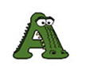

Parsing emoji in Javascript is… not easy.

My friends and I built Emoji Salad, an Emoji Pictionary game played via SMS. Our
backend is built in Node.js, and core game functionality requires parsing
strings that contain emoji.

This article is a collection of the research I did while getting up to speed on
emoji in Javascript. First, a quick dive into the inner workings of Unicode,
followed by how emoji in particular are represented in JavaScript. Finally,
let’s walk through writing a regular expression designed to handle all manner of
emoji, heavily inspired by [lodash’s implementation of
split](https://github.com/lodash/lodash/blob/4.16.6/lodash.js).

[If your eyes glaze over like mine did while reading this, I put all the code
into an npm library you can find
here.](https://www.npmjs.com/package/emoji-tree)

*****

### A digression into Unicode

The terms you want to digest are the following:

* **Code point** — [A numerical representation of a specific Unicode
character](https://mathiasbynens.be/notes/javascript-escapes).
* **Character Code**— Another name for a code point.
* **Code Unit**— An encoding of a code point, measured in bits. Javascript uses
UTF-16.
* **Decimal**— A way to represent code points in base 10.
* **Hexadecimal** — A way to represent code points in base 16.

Let’s demonstrate with an example. Take as our specimen, the letter **A**.

</img>

The letter **A** is represented by the code point 65 (in decimal), or 41 (in
hexadecimal).

<gist src=''></gist>

[codePointAt](https://developer.mozilla.org/en-US/docs/Web/JavaScript/Reference/Global_Objects/String/codePointAt)
and
[fromCodePoint](https://developer.mozilla.org/en-US/docs/Web/JavaScript/Reference/Global_Objects/String/fromCodePoint)
are new methods introduced in ES2015 that can handle unicode characters whose
UTF-16 encoding is greater than 16 bits, which includes emojis. Use these
instead of **charCodeAt**, which doesn’t handle emoji correctly.

Here’s an example of using these methods, courtesy of
[xahlee.info](http://xahlee.info/js/js_unicode_code_point.html):

    console.log(
        "😸".charCodeAt(0)
    ); // prints 55357, WRONG!

    console.log(
        "😸".codePointAt(0)
    ); // prints 128568, correct

I will be using hexadecimal representations (**\u0041**) from now on, because
our future regex will be built that way. A few things to note about hexadecimal
representation in Javascript:

#### All hexadecimal code points must be 4 characters.

If the character code is less than 4 characters, it must be left padded with
zeros.

    // This is invalid
    \u41

    // This is valid
    \u0041

#### All hexadecimal code points are case insensitive.

    // these are equivalent
    "\uD83D"
    "\ud83d"

#### They can be notated in two forms

In Javascript, hexadecimal can be represented in two ways: **\u0041** and
**0x0041**. Jump into your browser console and you’ll see the following are
equivalent:

    String.fromCodePoint(0x0041);
    > 'A'

    '\u0041';
    > 'A'

### Back to Emojis

Originally, the range of code points was 16 bits, which encompassed the English
alphabet (now known as the Basic Multilingual Plane). Now, in addition to that
original range, there are [16 more
planes](https://en.wikipedia.org/wiki/Plane_(Unicode)) (17 total) to choose
from.

The rest of the planes beyond the BMP are referred to as the “astral planes”,
which include emoji. Emoji live on Plane 1, the Supplementary Multilingual
Plane.

</img>

What do you think the following will produce?

    "😀".length

**If you said 1, you are mistaken my friend! The correct answer is 2.**

In Javascript, [a string is a sequence of 16-bit code
points](http://www.2ality.com/2013/09/javascript-unicode.html). Since emoji are
encoded above the BMP, it means that they are represented by a pair of code
points, also known as a surrogate pair.

So for instance, **0x1F600**, which is 😀, is represented by:

    "\uD83D\uDE00"

(The first pair is called the **lead surrogate**, and the latter the **tail
surrogate**.)

Go ahead and copy that surrogate pair into your browser, and you’ll see 😀.
Javascript interprets this pair of characters as having a length of 2. That’s
why you can’t just do something like:

    "abc😀".split('')
    >["a", "b", "c", "�", "�"]

So, how do we get the surrogate pair? [There’s a great explanation
here](http://www.2ality.com/2013/09/javascript-unicode.html), and here’s a gist
illustrating going from emoji to decimal to surrogate pair and back again:

Because of these limitations within Javascript, in order to parse strings
containing emoji, we need some fancy footwork.

### Writing a regular expression

Luckily, the internet is awash in smarter folks than I. The
[lodash](https://github.com/lodash/lodash/blob/4.16.6/lodash.js) library has
produced a rock solid emoji regular expression. Is is:

    (?:[\u2700-\u27bf]|(?:\ud83c[\udde6-\uddff]){2}|[\ud800-\udbff][\udc00-\udfff])[\ufe0e\ufe0f]?(?:[\u0300-\u036f\ufe20-\ufe23\u20d0-\u20f0]|\ud83c[\udffb-\udfff])?(?:\u200d(?:[^\ud800-\udfff]|(?:\ud83c[\udde6-\uddff]){2}|[\ud800-\udbff][\udc00-\udfff])[\ufe0e\ufe0f]?(?:[\u0300-\u036f\ufe20-\ufe23\u20d0-\u20f0]|\ud83c[\udffb-\udfff])?)*

Woof, that’s a monster! Still, we’re enterprising programmers, we’re not afraid
of a little regex, right? Let’s reverse engineer this.

From the [Wikipedia emoji
entry](https://en.wikipedia.org/wiki/Emoji#Unicode_blocks), there’s a couple
ranges of emoji (many of which have unassigned values, presumably for future
emoji):

* [Dingbats](https://en.wikipedia.org/wiki/Dingbat#Unicode) (U+2700 to U+27BF, 33
out of 192 of which are emoji)
* [Miscellaneous Symbols and
Pictographs](https://en.wikipedia.org/wiki/Miscellaneous_Symbols_and_Pictographs)
(U+1F300 to U+1F5FF, 637 of 768 of which are emoji)
* [Supplemental Symbols and
Pictographs](https://en.wikipedia.org/wiki/Supplemental_Symbols_and_Pictographs)
(U+1F900 to U+1F9FF, 80 out of 82 of which are emoji)
* [Emoticons](https://en.wikipedia.org/wiki/Emoticons_(Unicode_block)) (U+1F600 to
U+1F64F)
* [Transport and Map
Symbols](https://en.wikipedia.org/wiki/Transport_and_Map_Symbols) (U+1F680 to
U+1F6FF, 92 out of 103 of which are emoji)
* [Miscellaneous Symbols](https://en.wikipedia.org/wiki/Miscellaneous_Symbols)
(U+2600 to U+26FF, 77 out of 256 of which are emoji)

To make this easier, I’m assuming anything in those ranges is emoji. Our
audience uses the English alphabet over SMS, so tough luck if I trawl up any
other unsuspecting characters.

#### Dingbats

They range from U+2700 to U+27BF, so the regular expression for that looks like:

    [\u2700-\u27bf]

    /[\u2700-\u27bf]/.test('
    ')
    > true

#### **Miscellaneous Symbols and Pictographs**

These range from U+1F300 to U+1F5FF, with the following surrogate pairs:

    toUTF16(0x1F300)
    > "\uD83C\uDF00"

    toUTF16(0x1F5FF)
    > "\uD83D\uDDFF"

The regex for this range, from lodash’s implementation, is:

    [\ud800-\udbff][\udc00-\udfff]

    /[\ud800-\udbff][\udc00-\udfff]/.test(String.fromCodePoint(0x1F5FF))
    > true

    /[\ud800-\udbff][\udc00-\udfff]/.test(String.fromCodePoint(0x1F300))
    > true

#### **Supplemental Symbols and Pictographs**

From U+1F900 to U+1F9FF, with the following surrogate pairs:

    toUTF16(0x1F910)
    > "\uD83E\uDD10"

    toUTF16(0x1F9C0)
    > "\uD83E\uDDC0"

We can reuse the same regex as above:

    /[\ud800-\udbff][\udc00-\udfff]/.test(String.fromCodePoint(0x1F910))
    > true

    /[\ud800-\udbff][\udc00-\udfff]/.test(String.fromCodePoint(0x1F9C0))
    > true

#### Emoticons

From U+1F600 to U+1F64F, with surrogate pairs:

    toUTF16(0x1F600)
    > "\uD83D\uDE00"

    toUTF16(0x1F64F)
    > "\uD83D\uDE4F"

Also covered by that same regex:

    /[\ud800-\udbff][\udc00-\udfff]/.test(String.fromCodePoint(0x1F600))
    > true

    /[\ud800-\udbff][\udc00-\udfff]/.test(String.fromCodePoint(0x1F64F))
    > true

#### **Transport and Map Symbols**

Includes U+1F680 to U+1F6FF, with surrogate pairs:

    toUTF16(0x1F680)
    > "\uD83D\uDE80"

    toUTF16(0x1F6FF)
    > "\uD83D\uDEFF"

Also covered by that same regex:

    /[\ud800-\udbff][\udc00-\udfff]/.test(String.fromCodePoint(0x1F680))
    > true

    /[\ud800-\udbff][\udc00-\udfff]/.test(String.fromCodePoint(0x1F6FF))
    > true

#### **Miscellaneous Symbols**

Includes U+2600 to U+26FF, with surrogate pairs:

    toUTF16(0x2600)
    > "\u2600"

    toUTF16(0x26FF)
    > "\u26FF"

We can write a regex for this like so:

    /[\u2600-\u26FF]/

    /[\u2600-\u26FF]/.test(String.fromCodePoint(0x2600))
    > true

    /[\u2600-\u26FF]/.test(String.fromCodePoint(0x26FF))
    > true

#### lodash’s mysterious other regex

There’s another section in the beginning of that original lodash regex we
haven’t looked at yet:

    (?:\ud83c[\udde6-\uddff]){2}

If we examine what those characters represent, we get:

    "\ud83c\udde6"
    > "🇦"

    "\ud83c\uddff"
    > "🇿"

Holy camoley, what the heck are those? I’ll tell you what those are: those are
the [regional indicator symbol
letters](https://en.wikipedia.org/wiki/Regional_Indicator_Symbol)
[A](http://emojipedia.org/regional-indicator-symbol-letter-a/)-[Z](http://emojipedia.org/regional-indicator-symbol-letter-z/).
These are used to create flags for various countries. For instance:

    "\ud83c\uddfa"
    > "🇺"

    "\ud83c\uddf8"
    > "🇸"

    // when combining "u" + "s":
    "\ud83c\uddfa" + "\ud83c\uddf8"
    > "🇺🇸"

So that’s a good section to keep around. **The regex so far is:**

    (?:[\u2700-\u27bf]|(?:\ud83c[\udde6-\uddff]){2}|[\ud800-\udbff][\udc00-\udfff])

### Let’s test it out

I’m relying on [Emoji-data’s
json](https://raw.githubusercontent.com/iamcal/emoji-data/master/emoji.json) to
provide a library of every emoji. When we run this regular expression against
that list, we get 746 matches, 99 misses. Let’s go through the misses:

#### Keycaps

There are [12 keycap
emojis](https://en.wikipedia.org/wiki/Basic_Latin_(Unicode_block))
([#️⃣️](http://emojipedia.org/keycap-number-sign/),
[*️⃣](http://emojipedia.org/keycap-asterisk/) and
[0️⃣️](http://emojipedia.org/keycap-digit-zero/)–[9️⃣️](http://emojipedia.org/keycap-digit-nine/)),
which look like:

    "\u0030\uFE0F\u20E3"
    > "0️⃣️"

    "\u0039\uFE0F\u20E3"
    > "9️⃣"

    "\u0023\uFE0F\u20E3"
    > "#️⃣"

    "\u002A\uFE0F\u20E3" 
    > "*️⃣"

(That middle “\uFE0F’ is optional, by the way.)

These are covered by the following:

    /[\u0023-\u0039]\ufe0f?\u20e3/

    /[\u0023-\u0039]\ufe0f?\u20e3/.test("\u0023\uFE0F\u20E3")
    > true

    /[\u0023-\u0039]\ufe0f?\u20e3/.test("\u0039\u20E3")
    > true

#### **Other Miscellaneous Emoji**

Towards the bottom of the [Unicode Block Emoji
entry](https://en.wikipedia.org/wiki/Emoji#Unicode_blocks) on Wikipedia is the
following:

> Additional emoji can be found in the following Unicode blocks:
> [Arrows](https://en.wikipedia.org/wiki/Arrows_(Unicode_block)) (8 codepoints
considered emoji), [Basic
Latin](https://en.wikipedia.org/wiki/Basic_Latin_(Unicode_block)) (12), [CJK
Symbols and
Punctuation](https://en.wikipedia.org/wiki/CJK_Symbols_and_Punctuation) (2),
[Enclosed Alphanumeric
Supplement](https://en.wikipedia.org/wiki/Enclosed_Alphanumeric_Supplement)(41),
[Enclosed Alphanumerics](https://en.wikipedia.org/wiki/Enclosed_Alphanumerics)
(1), [Enclosed CJK Letters and
Months](https://en.wikipedia.org/wiki/Enclosed_CJK_Letters_and_Months) (2),
[Enclosed Ideographic
Supplement](https://en.wikipedia.org/wiki/Enclosed_Ideographic_Supplement) (15),
[General Punctuation](https://en.wikipedia.org/wiki/General_Punctuation) (2),
[Geometric Shapes](https://en.wikipedia.org/wiki/Geometric_Shapes) (8), [Latin-1
Supplement](https://en.wikipedia.org/wiki/Latin-1_Supplement_(Unicode_block))
(2), [Letterlike Symbols](https://en.wikipedia.org/wiki/Letterlike_Symbols) (2),
[Mahjong Tiles](https://en.wikipedia.org/wiki/Mahjong_Tiles_(Unicode_block))
(1), [Miscellaneous Symbols and
Arrows](https://en.wikipedia.org/wiki/Miscellaneous_Symbols_and_Arrows) (7),
[Miscellaneous Technical](https://en.wikipedia.org/wiki/Miscellaneous_Technical)
(18), [Playing Cards](https://en.wikipedia.org/wiki/Playing_cards_in_Unicode)
(1), and [Supplemental
Arrows-B](https://en.wikipedia.org/wiki/Supplemental_Arrows-B) (2).

Why the heck are these other random emoji scattered around like detritus? I
believe the reason is: “because of history”. But I don’t really know. If you
know, leave a comment and educate us all!

I won’t go through these one by one. [You can look in my Github repo for a
breakdown of the regex for each
block.](https://github.com/thekevinscott/emoji-tree/blob/master/lib/emojiRegex.js)
Suffice to say the regex that covers all these pesky buggers is:

    [\u0023-\u0039]\ufe0f?\u20e3|\u3299|\u3297|\u303d|\u3030|\u24c2|\ud83c[\udd70-\udd71]|\ud83c[\udd7e-\udd7f]|\ud83c\udd8e|\ud83c[\udd91-\udd9a]|\ud83c[\udde6-\uddff]|[\ud83c[\ude01-\ude02]|\ud83c\ude1a|\ud83c\ude2f|[\ud83c[\ude32-\ude3a]|[\ud83c[\ude50-\ude51]|\u203c|\u2049|[\u25aa-\u25ab]|\u25b6|\u25c0|[\u25fb-\u25fe]|\u00a9|\u00ae|\u2122|\u2139|\ud83c\udc04|[\u2600-\u26FF]|\u2b05|\u2b06|\u2b07|\u2b1b|\u2b1c|\u2b50|\u2b55|\u231a|\u231b|\u2328|\u23cf|[\u23e9-\u23f3]|[\u23f8-\u23fa]|\ud83c\udccf|\u2934|\u2935|[\u2190-\u21ff]

### Conclusion

Which means that… drum roll… the final regex for parsing emojis is:

    (?:[\u2700-\u27bf]|(?:\ud83c[\udde6-\uddff]){2}|[\ud800-\udbff][\udc00-\udfff]|[\u0023-\u0039]\ufe0f?\u20e3|\u3299|\u3297|\u303d|\u3030|\u24c2|\ud83c[\udd70-\udd71]|\ud83c[\udd7e-\udd7f]|\ud83c\udd8e|\ud83c[\udd91-\udd9a]|\ud83c[\udde6-\uddff]|[\ud83c[\ude01-\ude02]|\ud83c\ude1a|\ud83c\ude2f|[\ud83c[\ude32-\ude3a]|[\ud83c[\ude50-\ude51]|\u203c|\u2049|[\u25aa-\u25ab]|\u25b6|\u25c0|[\u25fb-\u25fe]|\u00a9|\u00ae|\u2122|\u2139|\ud83c\udc04|[\u2600-\u26FF]|\u2b05|\u2b06|\u2b07|\u2b1b|\u2b1c|\u2b50|\u2b55|\u231a|\u231b|\u2328|\u23cf|[\u23e9-\u23f3]|[\u23f8-\u23fa]|\ud83c\udccf|\u2934|\u2935|[\u2190-\u21ff])

Hopefully that dispells some of the confusion around parsing emoji.
