Kaggle is a website for doing data science competitions. / It's a good idea to understand the data you're working with before trying to jump in and build a deep learning model.

Usually the process is something like:

1. initial data analysis
2. data clean up, hypotheses
3. building the model
4. submissions, rinse repeat

That first step - the data analysis, or EDA - is what I want to look at today.

_While running through a Kaggle competition I felt the EDA (Exploratory Data Analysis) was super helpful. I wanted to get a sense for what different types of EDAs looked like across domains._

I want to see if there's any similarities or differences between the various approaches people take to data analysis.

> Data Scientists spend [the] vast majority of their time by [doing] data preparation, not model optimization. - [Lorinc](https://www.kaggle.com/lorinc/feature-extraction-from-images)

I looked specifically at EDA as well as feature engineering. The difference between the two is blurry so I included both. I stopped before getting into models or any sort of actual machine / deep learning.

[What is feature engineering?](https://www.quora.com/Does-deep-learning-reduce-the-importance-of-feature-engineering)

---

# Methodology

I chose three domains from which to select competitions for examination:

* Structured data competitions
* NLP (natural language) competitions
* Image or visual competitions

I chose these three because they each featured lots of popular competitions to choose from. [Fast.ai](https://fast.ai) focuses on teaching these three domains along with recommendation engines (for which I didn't find many competitions on Kaggle).

NLP datasets, and to a lesser extent image datasets, often feature additional structured data, but in those cases I'm choosing to focus specifically on the unique properties of the data analysis (specifically text analysis and image analysis).

<aside>When sorting by team entries on Kaggle, structured data competitions tend to be by far the most represented. Jeremy Howard discusses there not being a lot of scientific literature on those types of problems.</aside>

For each of these domains, I chose two competitions that had already closed, based roughly on how many teams had submitted for it. I then did a search for EDA-specific kernels within the competition, and chose three kernels that were highly rated or well commented.

I chose the following competitions:

Structured: Titanic, and House Prices
NLP: Toxic, and Spooky.
Images: Leaves and Lung cancer

# Findings

For structured data, EDAs seem to follow similar formats. For instnace, all the Titanic EDas are almost identical in their analyses. Houses prices less so, but still follow the same general thrust - looking for correlations between different variables.

NLP EDAs share some similarities, but there's also a bit more variability in the approach. In particulr, with feature negineering.

Finally, images are all over the map. Really creative approaches to data analysis.

The titanic EDAs tend to be well written and thoroughly documented. As the datasets become more esoteric or specialized, the amount of introductory analysis and explanation decreases, while the amount of deep or specialized analysis increases. This makes sense. Titanic is a well studied, well trod problem that everyone goes through, whereas many fewer people probably have the background to thoroughly analyze something like DICOM cancer images (let alone the time!)

## Structured Data Competitions

Structured data problems tend to come with one or more spreadsheets containing training and test data.

The spreadsheets may contain categorical variables (colors, like "green", "red", and "blue"), continuous variables (ages, like "4", "15", and "67") and ordinal variables (educational level, like "elementary", "high school", "college"). Often you'll see all three types of variables present.

The training spreadsheet has a target column that you're effectively trying to solve for (and that column will be missing in the test data). As a result, much of the exploratory data ananlysis tends to focus on discovering potential correlations between the target variable and the rest of the data.

The competitions I chose to analyze were the [Titanic](https://www.kaggle.com/c/titanic) competition and the [House Prices](https://www.kaggle.com/c/house-prices-advanced-regression-techniques/data) competition.

## [Titanic](https://www.kaggle.com/c/titanic)

Titanic is a popular beginners' competition with a rolling leaderboard. Lots of folks on Kaggle tend to start with Titanic.

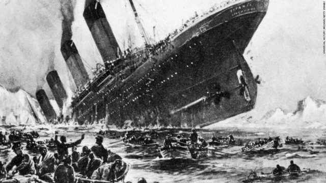

<small>[viaggioroutard](https://www.flickr.com/photos/viaggioroutard/32746842734/in/photolist-RTJ8sN-7reGoc-7rdfgb-7reqrP-7rhfiJ-b4aUUF-bv64XJ-91NeZE-q2mfUz-eFvcpv-VMircS-pzVRNe-dF1MGZ-WCozhj-95TEWr-gkyMjV-75JPMM-7r8VAM-7r8K54-7ricVq-7rcJaC-7r8WZP-7rcUuc-7rgRJC-7rgFnC-oktnFk-7rdZK1-7rhNjL-adsXVC-7rcKPj-4YLEGK-7rhHQs-7r8TaB-7r8SoZ-e5wPAJ-8xv5oh-bvPFMY-7r8V3n-4YTM15-axQxWs-d1iAyQ-918Vc6-2gmvHf-8RCNJR-4YLEBM-b4aUXr-usDiD-c8Yp5o-22nLofY-okatX)</small>

From the competition:

> The sinking of the RMS Titanic is one of the most infamous shipwrecks in history. On April 15, 1912, during her maiden voyage, the Titanic sank after colliding with an iceberg, killing 1502 out of 2224 passengers and crew. This sensational tragedy shocked the international community and led to better safety regulations for ships.<br /><br /> One of the reasons that the shipwreck led to such loss of life was that there were not enough lifeboats for the passengers and crew. Although there was some element of luck involved in surviving the sinking, some groups of people were more likely to survive than others, such as women, children, and the upper-class.<br /><br />In this challenge, we ask you to complete the analysis of what sorts of people were likely to survive. In particular, we ask you to apply the tools of machine learning to predict which passengers survived the tragedy.

Perhaps because it's the intro challenge, [there's tons of EDAs](https://www.kaggle.com/c/titanic/kernels?sortBy=relevance&group=everyone&search=eda&page=1&pageSize=20&competitionId=3136). And because this is rolling, I think over time these disappear. Is that true?

I picked a number at random that were highly rated / had a number of comments. I did not look at final score.

I looked at three EDA kernals: [ash316](https://www.kaggle.com/ash316/eda-to-prediction-dietanic), [dejavu23](https://www.kaggle.com/dejavu23/titanic-survival-for-beginners-eda-to-ml), and [jkokatjuhha](https://www.kaggle.com/jkokatjuhha/in-depth-visualisations-simple-methods).

Some other good EDAs I didn't have a chance to analyze belong to [astandrik](https://www.kaggle.com/astandrik/journey-from-statistics-eda-to-prediction), [stephaniestallworth](https://www.kaggle.com/stephaniestallworth/titanic-eda-classification-end-to-end), [kueipo](https://www.kaggle.com/kueipo/super-guide-eda-of-titanic-updated-tree-digraph), [neviadomski](https://www.kaggle.com/neviadomski/titanic-data-exploration-starter), [headsortails](https://www.kaggle.com/headsortails/pytanic), and [omarelgabry](https://www.kaggle.com/omarelgabry/a-journey-through-titanic).

## Intros

All three EDAs start by looking at raw metrics from the test file, including examining a couple of sample rows and getting some descriptive information like types of columns and means and medians.

Handling null or missing values is a crucial step in data preparation. ash handles this right at the start, while the other two look at missing values in feature engineering.

ash argues against assigning a random number to fill in missing ages:

> As we had seen earlier, the Age feature has 177 null values. To replace these NaN values, we can assign them the mean age of the dataset.
>
> But the problem is, there were many people with many different ages. We just cant assign a 4 year kid with the mean age that is 29 years. Is there any way to find out what age-band does the passenger lie??
>
> Bingo!!!!, we can check the Name feature. Looking upon the feature, we can see that the names have a salutation like Mr or Mrs. Thus we can assign the mean values of Mr and Mrs to the respective groups." - ash

```## Assigning the NaN Values with the Ceil values of the mean ages
data.loc[(data.Age.isnull())&(data.Initial=='Mr'),'Age']=33
data.loc[(data.Age.isnull())&(data.Initial=='Mrs'),'Age']=36
data.loc[(data.Age.isnull())&(data.Initial=='Master'),'Age']=5
data.loc[(data.Age.isnull())&(data.Initial=='Miss'),'Age']=22
data.loc[(data.Age.isnull())&(data.Initial=='Other'),'Age']=46
```

So ash interleaves feature engineering as part of the pure data analysis.

## Visualizations

All three EDAs rely heavily on visualizations to get a bird's eye view of the data and potential correlations.

The charts used include `factorplot`s, `crosstab`s, bar and pie charts, violin plots, and more.

All three visualize with some nice charts about how many total survivors there were.

Each author seems to take the phrase "women and children first" to heart; gender and age of the passengers features heavily in their initial conclusions. All three authors also examine income background, as indicated by the price of the ticket (`Pclass`).

> The number of men on the ship is lot more than the number of women. Still the number of women saved is almost twice the number of males saved. The survival rates for a women on the ship is around 75% while that for men in around 18-19%. - ash

jkok charts survival against each of the different variables and draws some high level conclusions:

> * Sex: Survival chances of women are higher.
> * Pclass: Having a first class ticket is beneficial for the survival.
> * SibSp and Parch: middle size families had higher survival rate than the people who travelled alone or big families. The reasoning might be that alone people would want to sacrifice themselves to help others. Regarding the big families I would explain that it is hard to manage the whole family and therefore people would search for the family members insetad of getting on the boat.
> * Embarked C has a higher survival rate. It would be interesting to see if, for instance, the majority of Pclass 1 went on board in embarked C.

jkok also does a lot with KDE - Kernel density estimation - which I was not familiar with. https://en.wikipedia.org/wiki/Kernel_density_estimation

ash316 later draws his own conclusions:

> Sex: The chance of survival for women is high as compared to men.
> Pclass:There is a visible trend that being a 1st class passenger gives you better chances of survival. The survival rate for Pclass3 is very low. For women, the chance of survival from Pclass1 is almost 1 and is high too for those from Pclass2. Money Wins!!!.
> Age: Children less than 5-10 years do have a high chance of survival. Passengers between age group 15 to 35 died a lot.
> Embarked: This is a very interesting feature. The chances of survival at C looks to be better than even though the majority of Pclass1 passengers got up at S. Passengers at Q were all from Pclass3.
> Parch+SibSp: Having 1-2 siblings,spouse on board or 1-3 Parents shows a greater chance of probablity rather than being alone or having a large family travelling with you.

dejavu crosstabs 4 variables, and submits models with accuracy at each step which is a nice touch.

jkok throws up a stacked chart - She draws a stacked chart which is kinda cool, showing pclass and embarked. Get a sense of what kind of passenger each port is.

---- feature engineering ----

Up front, jkok engineers a feature to pull out cabin letter.
https://www.kaggleusercontent.com/kf/1797224/eyJhbGciOiJkaXIiLCJlbmMiOiJBMTI4Q0JDLUhTMjU2In0..T2scx-QLtjKUqKBpw1UXKg.wOa9wN-GVL2_4CckgLCHEB-YYnuYkhbzhmAWoSVM5toUe7FD0l7NUDvliEfg3_fGmGMtVmD7v-LtfwNtdJBX6as02EP_my0uxBwuKiwgIbubrmg-7CkcgSC9VP-X7Wz5aOJ9OvK_hbmn6rJQSeWcxw.Q5qCz4zo6YPJOEC0pGgtmw/__results___files/__results___43_2.png

There's perhaps only so many ways you can slice and dice this data. There's more variability when it comes to feature engineering.

dejavu chooses to bin age to 8 buckets. bins the fare to 12 bins.

ash chooses to build a `SibSip` - whether an individual is alone or with family (either spouse or siblings):

> The barplot and factorplot shows that if a passenger is alone onboard with no siblings, he have 34.5% survival rate. The graph roughly decreases if the number of siblings increase. This makes sense. That is, if I have a family on board, I will try to save them instead of saving myself first. Surprisingly the survival for families with 5-8 members is 0%. The reason may be Pclass??
> The reason is Pclass. The crosstab shows that Person with SibSp>3 were all in Pclass3. It is imminent that all the large families in Pclass3(>3) died."

ash looks at fare and min, max, and average. bins into 4 bins for fares.

ash bins age into 5 bins. ash also creates features "family_size" and "alone". Finally, he drops a number of irrelevant features:

> Name--> We don't need name feature as it cannot be converted into any categorical value.
> Age--> We have the Age_band feature, so no need of this.
> Ticket--> It is any random string that cannot be categorised.
> Fare--> We have the Fare_cat feature, so unneeded
> Cabin--> A lot of NaN values and also many passengers have multiple cabins. So this is a useless feature.
> Fare_Range--> We have the fare_cat feature.
> PassengerId--> Cannot be categorised."

jkok suggests a feature for "child" or "adult".

jkok handles null values in the feature engineering part of her notebook.
Embarked: fill embarked with a major class
Pclass: because there is only one missing value in Fare we will fill it with a median of the corresponding Pclass
Age: There are several imputing techniques, we will use the random number from the range mean +- std

```
ages = np.concatenate((test['Age'].dropna(), train['Age'].dropna()), axis=0)
std_ages = ages.std()
mean_ages = ages.mean()
train_nas = np.isnan(train["Age"])
test_nas = np.isnan(test["Age"])
np.random.seed(122)
impute_age_train  = np.random.randint(mean_ages - std_ages, mean_ages + std_ages, size = train_nas.sum())
impute_age_test  = np.random.randint(mean_ages - std_ages, mean_ages + std_ages, size = test_nas.sum())
train["Age"][train_nas] = impute_age_train
test["Age"][test_nas] = impute_age_test
ages_imputed = np.concatenate((test["Age"],train["Age"]), axis = 0)
```

Check if we disrupted the distribution somehow.
https://www.kaggleusercontent.com/kf/1797224/eyJhbGciOiJkaXIiLCJlbmMiOiJBMTI4Q0JDLUhTMjU2In0..T2scx-QLtjKUqKBpw1UXKg.wOa9wN-GVL2_4CckgLCHEB-YYnuYkhbzhmAWoSVM5toUe7FD0l7NUDvliEfg3_fGmGMtVmD7v-LtfwNtdJBX6as02EP_my0uxBwuKiwgIbubrmg-7CkcgSC9VP-X7Wz5aOJ9OvK_hbmn6rJQSeWcxw.Q5qCz4zo6YPJOEC0pGgtmw/__results___files/__results___59_0.png

## Takeaways

Everyone looks at the head, and describes the data frame. 2nd guy draws some conclusions from it. 2nd guy also looks at the test head.

First guy looks at the total null values. 3rd does that at the end.

Everyone starts with looking at the breakdown of survivors, and then the breakdown of survivors by gender. Cross tabs, factor plots, and violin plots are all popular. Look for correlations among the data.

3rd has some prettier graphs.

Feature engineering begins to diverge a bit more. Age binning can differ, as can title and fare binning. Only 3rd does child / adult.

Also, imputation differs. First recommends looking at existing data to predict imputation values. 3rd checks the disruption using a kde plot which seems really smart.

# House Prices


https://www.flickr.com/photos/120360673@N04/13855784355/in/photolist-n7ovXH-gjrMhS-eDwNQx-fFyccW-eDCzpL-fQDNaP-cA4RYd-cA4MtL-cA4HuL-fKnTsf-cA4LzU-ssvhf2-fKnAV9-daEeEz-gtpvp8-cA4R5o-cA4XQ7-cA4NSA-g2hXow-cA4SQw-eDBSFb-9eW1ng-g2j9Z5-cA4xwN-fFyJkx-9EzH9a-UD524Z-gttD2c-v9HAST-R7GoBF-v9KGVk-irUqRZ-koMrNT-fKv1e1-cA4UCE-ggDSAS-cA4C4A-gi21pE-cA4wdd-qmiDzR-rSUbew-gnDV6V-gjucTQ-fK7FS6-fK7bD6-duD885-fKbUqP-ggrui7-DUB1dh-dsvoVH

Next up, I looked at the [House Prices](https://www.kaggle.com/c/house-prices-advanced-regression-techniques) competition. House Prices features many more variables, including categorical, ordinal and continuous features, some of which are relevant and other which are not.

> With 79 explanatory variables describing (almost) every aspect of residential homes in Ames, Iowa, this competition challenges you to predict the final price of each home.

So it's similar in kind to Titanic but considerably more complicated. Let's see how our contestants do.

I chose the following EDAs: [pmarcelino](https://www.kaggle.com/pmarcelino/comprehensive-data-exploration-with-python), [xchmiao](https://www.kaggle.com/xchmiao/detailed-data-exploration-in-python), and [caicell](https://www.kaggle.com/caicell/fun-python-eda-step-by-step).

Other Kernels I didn't examine: [skirmer](https://www.kaggle.com/skirmer/fun-with-real-estate-data), [dgawlik](https://www.kaggle.com/dgawlik/house-prices-eda), [shaoyingzhang](https://www.kaggle.com/shaoyingzhang/data-exploration-and-prediction-of-house-price), [yassineghouzam](https://www.kaggle.com/yassineghouzam/eda-introduction-to-ensemble-regression)
[notaapple](https://www.kaggle.com/notaapple/detailed-exploratory-data-analysis-using-r), and [tannercarbonati](https://www.kaggle.com/tannercarbonati/detailed-data-analysis-ensemble-modeling).

## Intro and Visualizations

xchmiao and pmarcelino spend some time investigating the initial data like we saw in Titanic. She plots the sale price in a histogram and does a heatmap of the features. pmarcelino plots the SalePrice and concludes that it:

> Deviate from the normal distribution.
> Have appreciable positive skewness.
> Show peakedness.

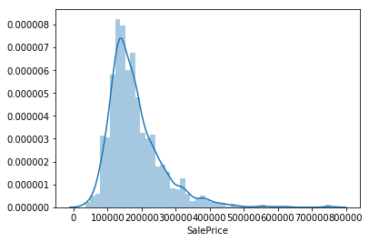 He also gets skewness and kurtosis, I guess there are important things to know.

pmarcelino tries to use his noggin to smartly analyze what kinds of features exist. He uses a fairly subjective analysis to decide which variables are important, and looks at the correlations between these subjective choices and the sale price. Later on in his kernel, he uses a heatmap to jump right in. Then he zooms in and looks at the variables with the highest correlation.

caicell graphs various columns against hte sale price. It's not clear to me how he chooses which variables to look at. Seems like he's just using his noggin - bathroom? basement? etc. outside exist or not? season?

xchmiao lists numerical features descending by their correlation with `SalePrice`, which is cool because it makes sense ot me how you'd use this to quickly pull out interesting features. But she notes that some of those features are highly correlated with each other.

xchmiao scatter plots a few columns and looks at categorical features relying on a number of different charts and graphs. Basically, she's plotting a ton of features against the sale price in different ways.

## Missing data

caicell jumps right in by looking at missing values and outliers. He's pretty aggressive about culling missing values, with the exception of `LotFrontage` which he imputes with linear regression.

pmarcelino waits until after he looks for correlations to tackle missing data. He asks two good rhetorical questions:

> How prevalent is the missing data?
> Is missing data random or does it have a pattern?

> The answer to these questions is important for practical reasons because missing data can imply a reduction of the sample size. This can prevent us from proceeding with the analysis. Moreover, from a substantive perspective, we need to ensure that the missing data process is not biased and hidding an inconvenient truth.

To address these, pmarcelino plots total and percent of missing cells, and chooses to delete columns where 15% or more cells contain missing data. Again, the author lies on somewhat subjective, somewhat objective logic to justify removing the cells:

> The point is: will we miss this data? I don't think so. None of these variables seem to be very important, since most of them are not aspects in which we think about when buying a house (maybe that's the reason why data is missing?). Moreover, looking closer at the variables, we could say that variables like 'PoolQC', 'MiscFeature' and 'FireplaceQu' are strong candidates for outliers, so we'll be happy to delete them.

In summary, pmarcelino either removes columns with missing data, removes rows (where there's only one missing variables). He does not impute any variables.

pmarcelino establishes a heuristic for tackling outliers:

> The primary concern here is to establish a threshold that defines an observation as an outlier. To do so, we'll standardize the data. In this context, data standardization means converting data values to have mean of 0 and a standard deviation of 1.

He concludes that there's nothing to worry from a stastical standpoint, but after returning to visual inspections of the data, deletes a few single data points he finds questionable.

## Data transformations / feature engineering

caicell then does data transformation in a way that I do not understand. He also looks at the skewness and kurtosis of the data, and does a Wilxoc-rank Sum test which I don't know. Finally, he ends with a very pretty 3d plot.

pmarcelino says:

> According to Hair et al. (2013), four assumptions should be tested:
>
> Normality - When we talk about normality what we mean is that the data should look like a normal distribution. This is important because several statistic tests rely on this (e.g. t-statistics). In this exercise we'll just check univariate normality for 'SalePrice' (which is a limited approach). Remember that univariate normality doesn't ensure multivariate normality (which is what we would like to have), but it helps. Another detail to take into account is that in big samples (>200 observations) normality is not such an issue. However, if we solve normality, we avoid a lot of other problems (e.g. heteroscedacity) so that's the main reason why we are doing this analysis.
>
> Homoscedasticity - I just hope I wrote it right. Homoscedasticity refers to the 'assumption that dependent variable(s) exhibit equal levels of variance across the range of predictor variable(s)' (Hair et al., 2013). Homoscedasticity is desirable because we want the error term to be the same across all values of the independent variables.
>
> Linearity- The most common way to assess linearity is to examine scatter plots and search for linear patterns. If patterns are not linear, it would be worthwhile to explore data transformations. However, we'll not get into this because most of the scatter plots we've seen appear to have linear relationships.
>
> Absence of correlated errors - Correlated errors, like the definition suggests, happen when one error is correlated to another. For instance, if one positive error makes a negative error systematically, it means that there's a relationship between these variables. This occurs often in time series, where some patterns are time related. We'll also not get into this. However, if you detect something, try to add a variable that can explain the effect you're getting. That's the most common solution for correlated errors.

pmarcelino then spends the rest of his notebook normalizing data, which in turn tends to resolve the other 3 things.

# Natural Language competitions

Natural Language, or NLP, competitions, offer up full English sentences for analysis. While the data types are similar to the structured data competitions - text - the tools available for analyzing natural language tend to more specialized, resulting in potentially different methods for analysis.

I chose the [Toxic competition](https://www.kaggle.com/c/jigsaw-toxic-comment-classification-challenge) and the [Spooky Author competition](https://www.kaggle.com/c/spooky-author-identification) for analysis.

# Toxic


<div class="caption">by <a href="https://www.flickr.com/photos/navaneethkn/7975953800/in/photolist-d9NRbQ-dEZp2L-dQinfV-8ZqMDd-GyaoHJ-oGKC67-5Kj4pp-8YybhA-8Yva5t-7Xh81B-oEZ6w8-4G19MZ-cm3zDf-3c7z32-GXuYz-oyayD-96qUSC-6UYVbr-bjWoro-duyWt-7jD4Nc-6KNazu-op1rhC-DY1c6F-bYNV7U-byHgQ3-cmFxgG-cm3zEC-8m74XJ-oZEcpA-9Kd3gM-7t1H1q-m9ZbHK-9r7F3j-r3kU-8ZPcAU-8RLfw5-TsHmuW-98S9zG-8Mzx2B-c6ZoZ9-7Bpck-8bnj49-4AJUnS-vag3VE-7Bp97-jeiiRG-bHbYQa-dJQMhT-N7SSSy">navaneethkn</a></div>

_Warning: some of these comments might burn your eyeballs._

> Discussing things you care about can be difficult. The threat of abuse and harassment online means that many people stop expressing themselves and give up on seeking different opinions. ... In this competition, you’re challenged to build a multi-headed model that’s capable of detecting different types of of toxicity like threats, obscenity, insults, and identity-based hate better than Perspective’s current models. You’ll be using a dataset of comments from Wikipedia’s talk page edits.

I chose to analyze EDAs from [jagangupta](https://www.kaggle.com/jagangupta/stop-the-s-toxic-comments-eda), [](https://www.kaggle.com/rhodiumbeng/classifying-multi-label-comments-0-9741-lb), and [fcostartistican](https://www.kaggle.com/fcostartistican/don-t-mess-with-my-mothjer). Other EDAs I didn't analyze include [ambarish](https://www.kaggle.com/ambarish/toxic-comments-eda-and-xgb-modelling), [clinma](https://www.kaggle.com/clinma/eda-toxic-comment-classification-challenge), and [mamamot](https://www.kaggle.com/mamamot/finding-most-toxic-words).

## Digging in

Rhodium starts by describing the dataset. He finds no msising values and concludes that there must be many clean comments, based on the distribution. Looks at the total rows per category.

jagan describes and looks at the dataset, and looks for missing values along with the distribution across categories:

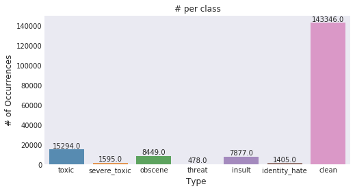

He writes:

> The toxicity is not evenly spread out across classes. Hence we might face class imbalance problems

He also notes that, based on the distribution of the data, some comments can be multi label. He also graphs how many words have multiple labels.

fcostartistican is the first notebook I've seen in R (the rest have been done in Python).

fco starts his notebook off by throwing any words "lacking meaning" (words like "and" or "the"). He then groups the words to find their average score per category. He uses a biplot to find out in which way each word is offensive. (I won't reproduce the chart here but it's pretty cool - you can see the original here). He concludes:

> From the biplot most of the words are organized as expected, with some exceptions, fat is associated to identity hate, which is surprissing because is the only non-race word on the bottom of the chart, there are some generic offensive words in the middle of the chart, meaning that they can be used for any awful purposes, other ones as die are exclusively associated to threat which make total sense some others as a$$ (sorry I feel uncomfortable writing it as it appear on the data) is associated with threat, on the middle left of the chart there are some unrecognizable words, which are shown using the code

fco then digs into the question of whether there's a correlation between typos and toxicity. There is!

> Is there actually a difference? Apparently there is, and surprisingly, mother when is misspelled is never related to hate or threat, but when it is properly spelled there are some hate and threat comments that have the word mother in it ... Is it that people tend to write more carefully when they are threating somebody or when they hate it?

As he digs further, he finds that in many cases, toxic comments would be made up of the same phrase, copy and pasted multiple times. He reran his analysis and rendered a new biplot and discovered a new set of correlations between words and categories. Again not linking but you can find it.

> Here there are some new words the ones that can be highlited are gay used mainly on threat comments and hate. Some general mild words as mother, hell, piece, stupid, idiot and shut are used for any toxic general purpose, meantime any derivative of the f-word is used in toxic and obscene comments. Also from the biplot is possible to realize that toxic and insult are similar and the least aggressive ones, while hate and threat are the most serious ones.

## Visualizations

Rhodium does a histogram of character length. Does a heatmap between the categories and discovers that some labels are highly correlated: if a comment is judged to be an insult, there's a 74% chance it's also obscene. Good to know!

jagan also does a heatmap, and then a crosstab. He observes:

> A Severe toxic comment is always toxic
> Other classes seem to be a subset of toxic barring a few exceptions

jagan puts together some word clouds.

## Feature engineering / clean up

Rhodium lowercases his text, manually turns contractions into things, manually cleans punctuation,

Rhodium vectorizes the text as well. Not sure what this means.

jagan has a few ideas:

" Feature engineering:
I've broadly classified my feature engineering ideas into the following three groups

Direct features:
Features which are a directly due to words/content.We would be exploring the following techniques

Word frequency features
Count features
Bigrams
Trigrams
Vector distance mapping of words (Eg: Word2Vec)
Sentiment scores
Indirect features:
Some more experimental features.

count of sentences
count of words
count of unique words
count of letters
count of punctuations
count of uppercase words/letters
count of stop words
Avg length of each word
Leaky features:
From the example, we know that the comments contain identifier information (eg: IP, username,etc.). We can create features out of them but, it will certainly lead to overfitting to this specific Wikipedia use-case.

toxic IP scores
toxic users"

Plots various features against toxicity to look for correlations. He discovers that spammers are more toxic! Thanks.

Interesting count based features:

Direct features:
1)Count based features(for unigrams):
Lets create some features based on frequency distribution of the words. Initially lets consider taking words one at a time (ie) Unigrams

Python's SKlearn provides 3 ways of creating count features.All three of them first create a vocabulary(dictionary) of words and then create a sparse matrix of word counts for the words in the sentence that are present in the dictionary. A brief description of them:

CountVectorizer
Creates a matrix with frequency counts of each word in the text corpus
TF-IDF Vectorizer
TF - Term Frequency -- Count of the words(Terms) in the text corpus (same of Count Vect)
IDF - Inverse Document Frequency -- Penalizes words that are too frequent. We can think of this as regularization
HashingVectorizer
Creates a hashmap(word to number mapping based on hashing technique) instead of a dictionary for vocabulary
This enables it to be more scalable and faster for larger text coprus
Can be parallelized across multiple threads
Using TF-IDF here. Note: Using the concatenated dataframe "merge" which contains both text from train and test dataset to ensure that the vocabulary that we create does not missout on the words that are unique to testset.

jagan plots top words per class using TF_IDF. What is TF_IDF? He then does the same with bigrams.

# Spooky Author

<aside>
The EDAs I chose for analysis were <a href="https://www.kaggle.com/arthurtok/spooky-nlp-and-topic-modelling-tutorial">Spooky NLP and Topic Modelling Tutorial</a> by <a href="https://www.kaggle.com/arthurtok">Anisotropic</a>, <a href="https://www.kaggle.com/ambarish/tutorial-detailed-spooky-fun-eda-and-modelling">Tutorial Detailed Spooky Fun EDA and Modelling</a> by <a href="https://www.kaggle.com/ambarish">Bukun</a>, and <a href="https://www.kaggle.com/headsortails/treemap-house-of-horror-spooky-eda-lda-features">Treemap House of Horror Spooky EDA LDA Features</a> by <a href="https://www.kaggle.com/headsortails">Heads or Tails</a>.

Other kernels I found include <a href="https://www.kaggle.com/bsivavenu/lsa-model-on-spooky-author-data">LSA Model on Spooky Author Data</a> by <a href="https://www.kaggle.com/bsivavenu">bshivaani</a>, <a href="https://www.kaggle.com/anuragmaravi/eda-spooky-author-identification">EDA Spooky Author Identification</a> by <a href="https://www.kaggle.com/anuragmaravi">Anurag Maravi</a>, <a href="https://www.kaggle.com/sandpiturtle/eda-fe-nb-xgb">EDA FE NB XGB</a> by <a href="https://www.kaggle.com/sandpiturtle">Nikita Pokidyshev</a>, <a href="https://www.kaggle.com/lemur78/classification-4-models-and-simple-eda">Classification 4 Models and Simple Ed</a> by <a href="https://www.kaggle.com/lemur78">lemur</a>, and <a href="https://www.kaggle.com/kanav0183/spooky-halloween-eda-lb-0-6">Spooky Halloween EDA LB</a> by <a href="https://www.kaggle.com/kanav0183">kanavanand</a>.
</aside>

[Spooky Author Identification](https://www.kaggle.com/c/spooky-author-identification).


<div class="caption">by <a href="https://www.flickr.com/photos/gaelvaroquaux/29632530995/in/photolist-M9wt5P-97P7tg-4vzLRF-61r11U-Zt2GHV-cY8aNJ-cY7ZgL-UXxYV9-b4qibP-4tm3wK-7haukg-2JiX6D-cVsp9-cY7XLU-4eeRFT-8PsYcb-cY7X8j-5jUhKv-jVRzRb-97Sb5A-7aBbJH-dZNRw2-smkRf-gxqQt3-aqqb74-gxs9eF-62dAE-FnZJs-62dXh-ZWp8CL-DpiJqc-WuwzSK-FnXvG-Ef1yLk-7omXUv-r5iPPD-pDGN7f-61hnvE-FnZKU-FnXv1-n28gM8-quLHEs-iAsBz-WBEwee-5z3uaW-pEQPCo-efPVZU-YbEZgy-dVfyAo-nHKteU">Gael Varoquaux</a></div>

The Spooky Author Identification Competition provided snippets of text from three horror-themed authors - Edgar Allan Poe, HP Lovecraft, or Mary Wollstonecraft Shelley - and asked participants to build a model capable of predicting which writer authored a particular bit of text.

What's interesting about this dataset is its simplicity; there's very little unstructured data accompanying the text, other than author. As a result, all the EDAs focused solely on different approaches to parsing and analyzing language.

## Digging In

Each author begins by examining the dataset, picking out a few rows, and plotting the number of stories per author. Bukun also looks at word lengths per author, while Anisotropic plots a bar graph of overall word counts:


> Notice anything odd about the words that appear in this word frequency plot? Do these words actually tell us much about the themes and concepts that Mary Shelley wants to portray to the reader in her stories? These words are all so commonly occuring words which you could find just anywhere else. Not just in spooky stories and novels by our three authors but also in newspapers, kid book, religious texts - really almost every other english text. Therefore we must find some way to preprocess our dataset first to strip out all these commonly occurring words which do not bring much to the table. - Anisotropic

Heads or Tails also checks to see if there are missing values (there are none).

Each author builds word clouds showing a most frequent words largest.

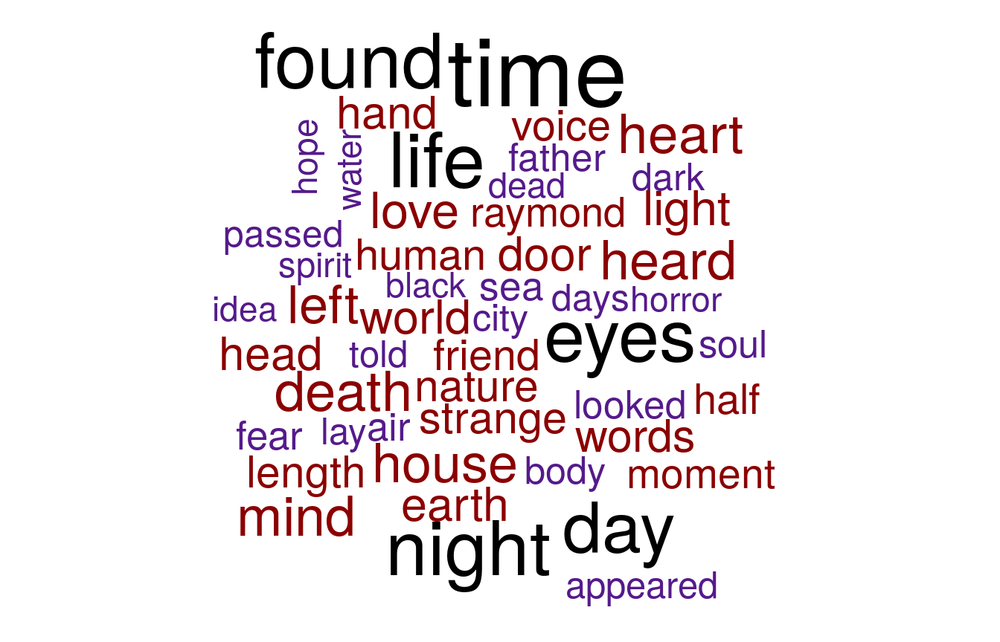
<div class="caption">Heads or Tails builds a word cloud of the 50 most common words</div>

Heads or Tails also plots overall sentences, sentence, and word length per author, and discovers subtle but present differences between the authors.

## Word and Sentence Analysis

Anisotropic and Bukun discuss tokenization, and removing stop word:

> The work at this stage attempts to reduce as many different variations of similar words into a single term ( different branches all reduced to single word stem). Therefore if we have "running", "runs" and "run", you would really want these three distinct words to collapse into just the word "run". (However of course you lose granularity of the past, present or future tense). &mdash; Anisotropic

After the tokenization, stop word removal and lemmatization, Anisotropic rebuilds the graph of top 50 words:

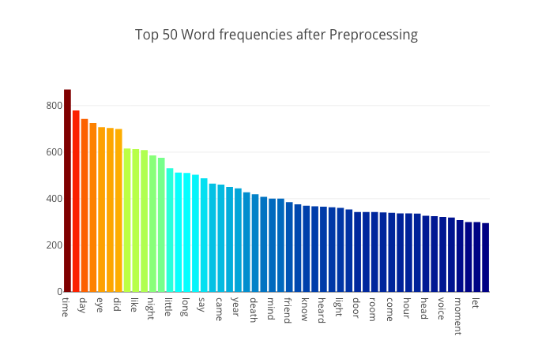

Bukun, meanwhile, plots his top 10 words overall and by author, finding a different set (with the exception of "time"):

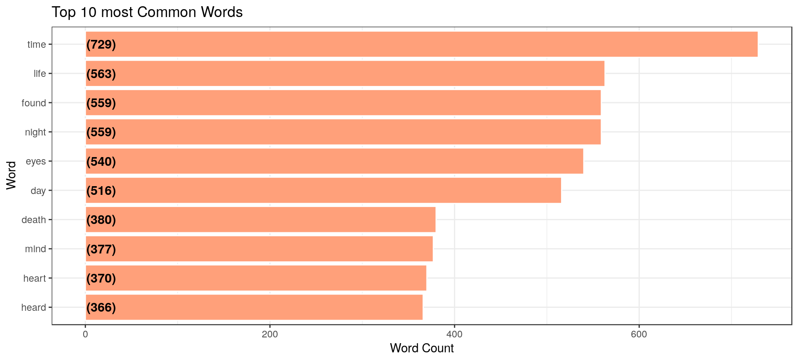

Heads or Tails does this as well, additionally looking at top words by author, after tokenization and stemming.

Bukun and Heads or Tails both then use something called TF-IDF to to find the most "important" words for a particular author:

> TF stands for term frequency; essentially how often a word appears in the text. This is what we measured above. A list of stop-words can be used to filter out frequent words that likely have no impact on the question we want to answer (e.g. “and” or “the”). However, using stop words might not always be an elegant approach. IDF to the rescue. IDF means inverse document frequency. Here, we give more emphasis to words that are rare within a collection of documents (which in our case means the entire text data.) Both measures can be combined into TF-IDF, a heuristic index telling us how frequent a word is in a certain context (here: a certain author) within the context of a larger document (here: all authors). You can understand it as a normalisation of the relativ text frequency by the overall document frequency. This will lead to words standing out that are characteristic for a specific author, which is pretty much what we want to achieve in order build a prediction model. - Heads or Tails

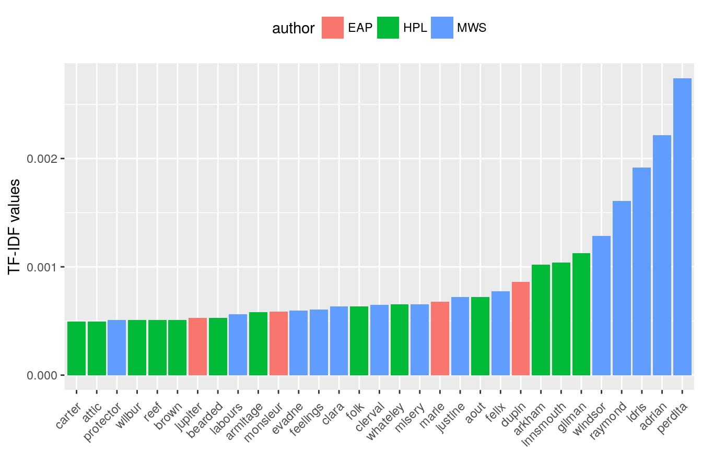
<div class="caption">Heads or Tails plots the most significant words by author in a bit of a different chart</div>

Bukun also looks at top bigrams and trigrams, which are two and three word collections. Heads or Tails also does a TF-IDF on the bigrams and trigrams and plots the word relationships.
also does a word relationship using the bigrams. does that per author. also does all that for trigrams.

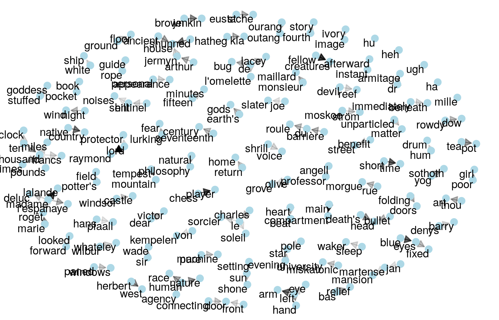
<div class="caption">Heads or Tails plots the word relationships for bigrams</div>

Bukun and Heads or Tails then perform a sentiment analysis. Both look at overall negativity per author.

Bukun uses something called "NRC Sentiment lexicon" to examine the amount of "Fear", "Surprise", and "Joy" in each snippet of text, and visualizes the sentiment of various authors using word clouds, tables, bar charts.

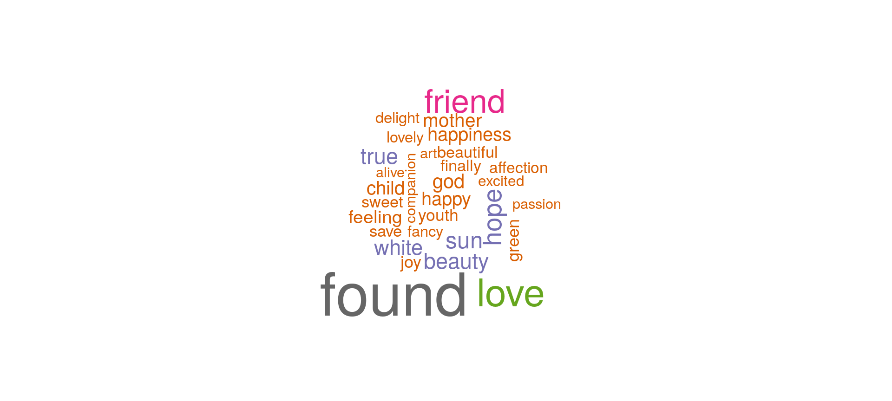
<div class="caption">Bukun plots a word cloud for words matching Joy</div>

# Feature engineering

Bukun suggests a number of possible features to add, including number of commas, semicolons, colons, blanks, words with capitals or beginning with capitals, and graphs each one. There do appear to be some correlations for some authors against some of these features.

Heads or Tails notes that:

> We have already noticed that our three authors can be identified by the names of their most prominent characters; with Mary Shelley writing about “Raymond” or Lovecraft about “Herbert West”. But what about names in general? Are some authors more likely to use names under certain circumstances? After sentence or character length this is one of our first feature-engineering ideas on our quest for knowledge

From this insight, Heads or Tails relies on the `babynames` package, featuring a list of most popular names per a given year, to add an additional feature to the data.

Bukun and Heads or Tails both look at the gender pronoun breakdown between authors, and Heads or Tails also looks at sentence topics, starting word per author, and last word per author, number of unique words, fraction of distinct words per sentence, dialogue markers and alliteration (which is a cool idea!)

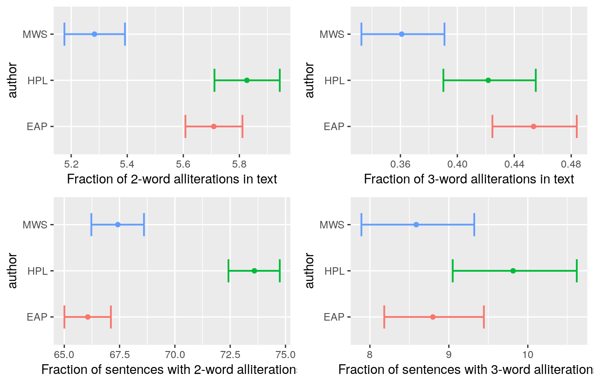
<div class="headsortails_alliteration.png">heads or tails plots various measurements of alliteration by author</div>

Heads or Tails ends his kernel with an alluvian plot showcasing feature interaction:


<div class="caption">Heads or Tails' alluvian plot showcasing feature interaction</div>

# Images

So far, the competitions have been purely text-based (language, strings or numbers). The last two competitions I examined were primarily image-based. I chose to look at the [lung cancer competition](https://www.kaggle.com/c/data-science-bowl-2017/), and the [leaf classification competition](https://www.kaggle.com/c/leaf-classification/).

Lung cancer is very domain specific and features additional structured data. Leaves do not.

# Leaves
<aside>
The EDAs I chose for analysis were <a href="https://www.kaggle.com/lorinc/feature-extraction-from-images">Feature Extraction From Images</a> by <a href="https://www.kaggle.com/lorinc">lorinc</a>, <a href="https://www.kaggle.com/selfishgene/visualizing-pca-with-leaf-dataset">Visualizing PCA with Leaf Dataset</a> by <a href="https://www.kaggle.com/selfishgene">selfishgene</a>, and <a href="https://www.kaggle.com/josealberto/fast-image-exploration">Fast Image Exploration</a> by <a href="https://www.kaggle.com/josealberto">Jose Alberto</a>.

Other kernels I liked were <a href="https://www.kaggle.com/selfishgene/visualizing-k-means-with-leaf-dataset">Visualizing K Means with Leaf Dataset</a>, also by <a href="https://www.kaggle.com/selfishgene">selfishgene</a>, and <a href="https://www.kaggle.com/bhuvaneshwaran/leaf-classification">Leaf Classification</a> by <a href="https://www.kaggle.com/bhuvaneshwaran">Bhuvaneshwaran K</a>.
</aside>

> The dataset consists approximately 1,584 images of leaf specimens (16 samples each of 99 species) which have been converted to binary black leaves against white backgrounds. Three sets of features are also provided per image: a shape contiguous descriptor, an interior texture histogram, and a fine-scale margin histogram.

# Digging In

A good first step is to look at the images of the leaves, which two of the EDAs do.


<div class="caption">selfishgene examines the leaf specimens</div>

Jose plots the various species, and notes that there are 10 images per species. He also looks at the similarity of leaves, within a category, to each other:

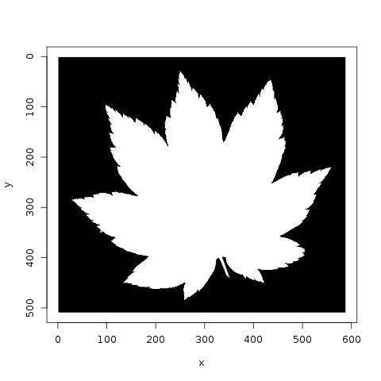
<div class="caption">Jose compares leaves within a category</div>

Meanwhile, lorinc jumps straight into analysis, locating the center of each leaf and applying edge detection. lorinc also converts the outline of the leaf into polar coordinates, in order to more effectively measure the center of the leaf:

> Later we might want to switch to another measure of centrality, based on how efficient this center is, when we generate a time-series from the shape, using the distance between the edge and the center. One way to do that is just measure the (Euclidean) distance between the center and the edge... but there is a better way - we project the Cartesian coordinates into Polar coordinates.

selfishgene chooses to look at the variance direction of the images, writing "Each image can be though of as a different "direction" in the high dimensional image space":

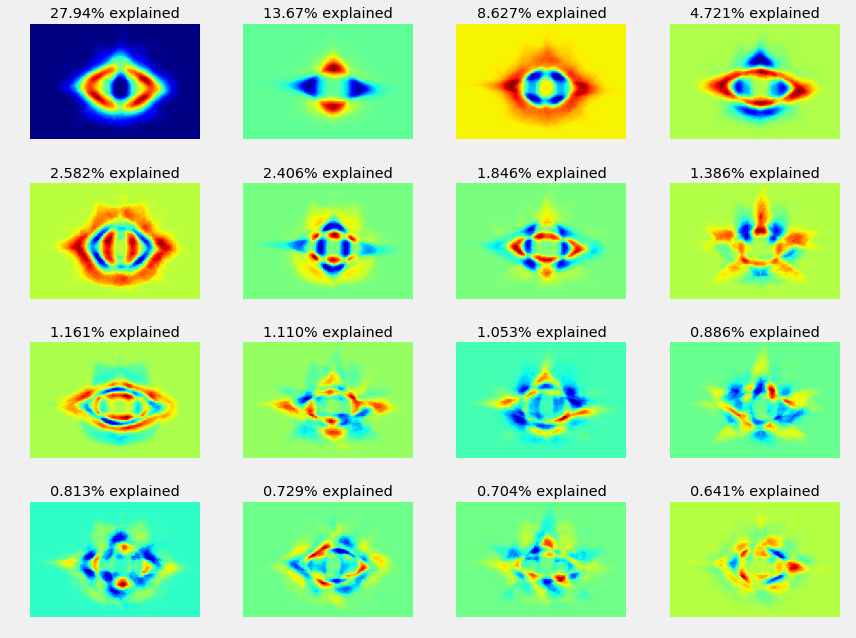
<div class="caption">selfishgene looks at the variance of a leaf image</div>

selfishgene also spends some time looking into image reconstruction, model variations around the mean image, and eigen vectors; he explains:

> "The upper most row contains the data distributions of each eigenvector (i.e. the histogram along that "direction") The second row contains what we already saw in a previous plot, what we called the variance directions. The forth row contains the median image of leafs. notice that this row is identical for all eigenvectors The third row holds the 2nd percentile images of each eigenvector. it's easier to think of this as the median image minus the eigenvector image multiplied by some constant.


<div class="caption">selfishgene looks at model variations</div>

# Feature detection

lorinc suggests splitting each sample in half and treating them as two samples (though he doesn't pursue this approach). lorinc then finds local maxima and minima from the time series (the leaf graphed in polar coordinates) and notes that the results seem promising:

> Ok, I surprised myself. This worked out pretty well. I think, I can build an extremely efficient feature from this. But this method is NOT robust yet.
> * It is not finding the tips, but the points with the greatest distance from center. (look at leaf#19)
> * It will miserably fail on a more complex, or unfortunately rotated leaf. (look at leaf#78)

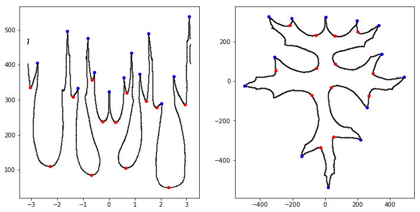
<div class="caption">lorinc measures the minima and maxima of a leaf plotted in polar coordinates</div>

From there, lorinc talks about mathematical morphology, before discovering the presence of noise around each leaf. He spends some time figuring out how to remove noise from the image and concludes with a lovely image showing a distance map superimposed on the leaf:

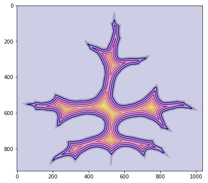
<div class="caption">lerinc measures the distance from the center of a leaf</div>

# Lung Cancer
<aside>
The EDAs I chose for analysis were <a href="https://www.kaggle.com/gzuidhof/full-preprocessing-tutorial">Full Preprocessing Tutorial</a> by <a href="https://www.kaggle.com/gzuidhof">Guido Zuidhof</a>, <a href="https://www.kaggle.com/anokas/exploratory-data-analysis-4">Exploratory Data Analysis</a> by <a href="https://www.kaggle.com/anokas">Mikel Bober-Irizar</a>, and <a href="https://www.kaggle.com/apapiu/exploratory-analysis-visualization">Exploratory Analysis Visualization</a> by <a href="https://www.kaggle.com/apapiu">Alexandru Papiu</a>.
<br /><br />
Other EDAs worth highlighting: <a href="https://www.kaggle.com/amorsili/fast-exploratory-data-analysis-in-r">Fast exploratory data analysis in R</a> by amorsili and <a href="https://www.kaggle.com/mumech/loading-and-processing-the-sample-images">Loading and Processing the Sample Images</a> by mumech.
</aside>

The final image competition I looked at was the [2017 Data Science Bowl](https://www.kaggle.com/c/data-science-bowl-2017/), which asked participants to examine a list of images and predict whether the patients had cancer or not. While this competition did feature structured data (meta information embedded in the images themselves), some of this data was anonymized and all the authors focused on image-analysis only.

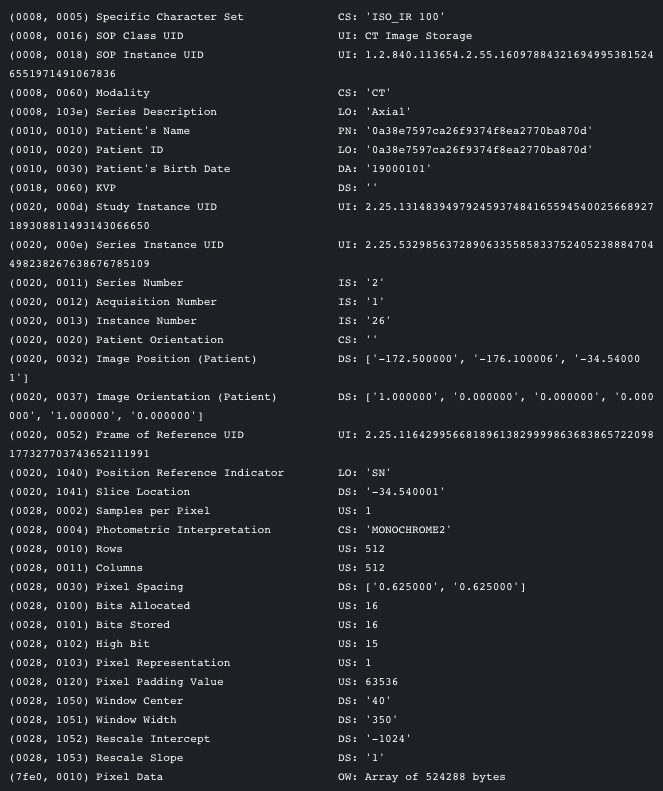
<div class="caption">anokas examines the metadata for a single image. You can see that patient date has been rendered anonymous (1/1/1900)</div>

# Analysis

> Working with these files can be a challenge, especially given their heterogeneous nature. Some preprocessing is required before they are ready for consumption by your CNN. - Guido Zuidhof

Of the three kernel authors, Guido is the only one to discuss his background working with medical images, and it shows in his domain-specific analysis of the dataset:

> Dicom is the de-facto file standard in medical imaging. ... These files contain a lot of metadata (such as the pixel size, so how long one pixel is in every dimension in the real world). This pixel size/coarseness of the scan differs from scan to scan (e.g. the distance between slices may differ), which can hurt performance of CNN approaches. We can deal with this by isomorphic resampling

The other two authors start their EDAs with more general explorations of the dataset and images themselves.

apapie begins by examining the shape of the images, while anokas starts by looking at the number of scans per patient, total number of scans, and a histogram of DICOM files per patient, along with a quick sanity check to see if there's any relationship between row ID and whether a patient has cancer (none is found, implying the dataset is well sorted).

Since some data has been anonymized, factors in the metadata that could have otherwise had predictive value (like age of the patient) are removed, which has the upshot of making the competition more image-focused.

Alexandru takes a distribution of pixels and plots them:

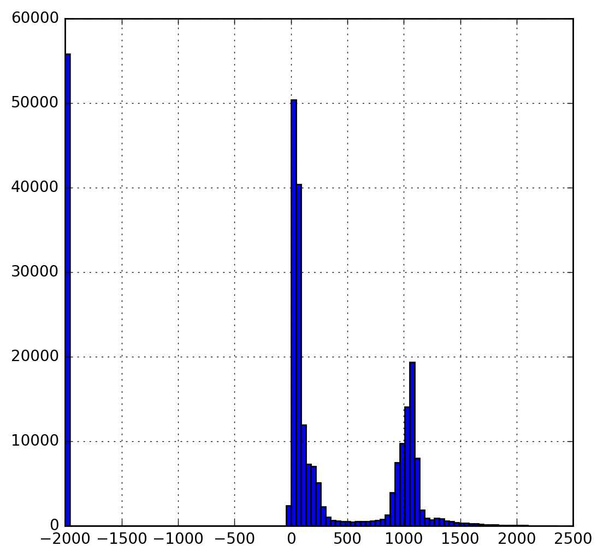

> Interesting - the distribution seems to be roughly bimodal with a bunch of pixels set at - 2000 - probably for missing values.

Guido sheds some more light in his EDA on why this is, namely being due to what HU units represent (air, tissue and bone):


## Images

Each author continues by examining the images themselves:


<div class="caption">anokas looks at a set of patient images side by side</div>

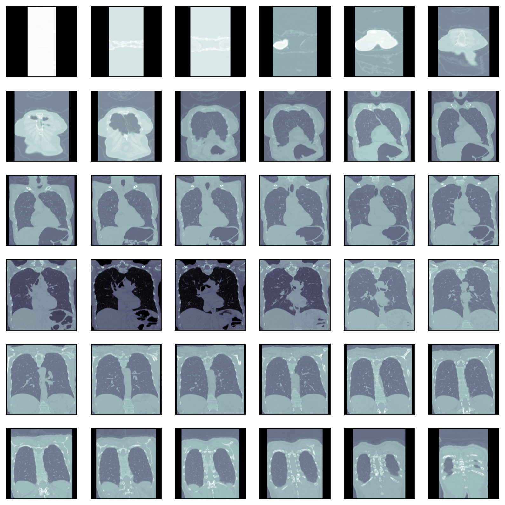
<div class="caption">Alexandru looks at images from the X angle</div>


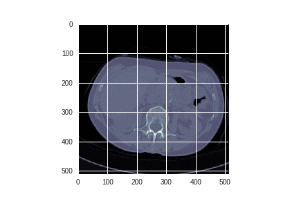
<div class="caption">anokas builds a gif that moves through a set of patient images</div>

Alexandru spent some time exploring whether edge detection could enhance the images.


<div class="caption">After increasing the threshold, Alexandru was able to render some visually striking images</div>

Alexandru concludes that:

> Interesting results, however the issue here is that the filter will also detect the blood vessels in the lung. So some sort of 3-D surface detection that differentiates between spheres and tubes would be more suitable for this situation.

Meanwhile, Guido discusses resampling, focusing on the fundemental nature of the DICOM image:

> A scan may have a pixel spacing of [2.5, 0.5, 0.5], which means that the distance between slices is 2.5 millimeters. For a different scan this may be [1.5, 0.725, 0.725], this can be problematic for automatic analysis (e.g. using ConvNets)! A common method of dealing with this is resampling the full dataset to a certain isotropic resolution. If we choose to resample everything to 1mm1mm1mm pixels we can use 3D convnets without worrying about learning zoom/slice thickness invariance.

Later in his EDA, Guido is able to do a 3D plot of the inner cavity by combining multiple DICOM images:

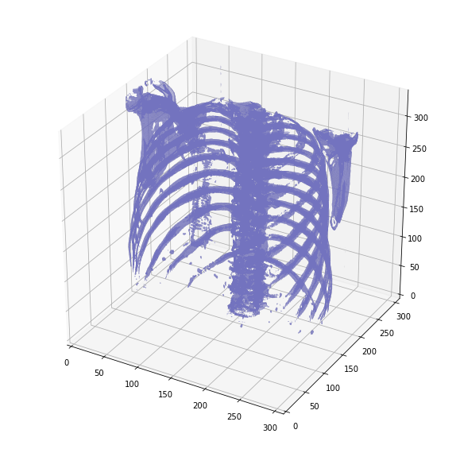
<div class="caption">3D plot</div>

And another version, after removing the surrounding air to reduce memory:


<div class="caption">3D plot without air</div>

# Conclusions

In the lung cancer competition, Guido, given his familiarity with medical image formats, was able to leverage that to draw significantly more nuanced conclusions. That being said, the other two authors' lack of familiarity did not prevent them from drawing equally interesting insights. But there was much more variability between all three.

Based on this analysis, it seems that structured data problems tend to lead to exploratory data analyses that are more similar, and image problems that are less similar (with NLP somewhere in between). As well, the more domain-specific problems tend to be a bit more varied in their analyses (lung cancer).
