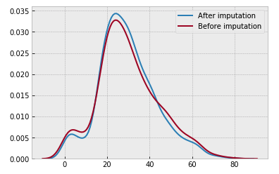

[Some anecdote to kick things off] Your boss comes to you with a terabyte of pictures of dog butts and says "I want you to build me a machine learning model that will recognize only the finest dog butts in this set." Where do you begin?

If you're like a lot of people on [Kaggle](https://kaggle.com), the first thing you do is understand what data you're working with. That's the part I'm curious about understanding.

When exploring a new dataset, **are there patterns or best practices around how people understand the data?** If there are, understanding those will help give guidance to our hypothetical problem above.

<a href="https://www.kaggle.com/tentotheminus9/r-eda/notebook">Example of an EDA</a>

To find out, I chose a number of **Exploratory Data Analyses** (or EDAs) that were made publicly available on Kaggle. These analyses mix interactive code snippets alongside prose, and can help offer a birds-eye view of the data or tease out patterns in the data.

> Data Scientists spend [the] vast majority of their time by [doing] data preparation, not model optimization. - [lorinc](https://www.kaggle.com/lorinc/feature-extraction-from-images)

I simultaneously looked at [feature engineering](https://www.quora.com/Does-deep-learning-reduce-the-importance-of-feature-engineering), taking existing data and transforming it in such a way as to impart additional meaning (for example, taking a timestamp and pulling out a `DAY_OF_WEEK` column, which might come in handy for predicting sales in a store).

I wanted to look at a variety of EDAs, across a variety of domains. I chose the following three domains:

* [Structured Data](#structured-data)
* [NLP (Natural Language)](#nlp)
* [Image](#images)

Feel free to [jump ahead to the conclusions below](#conclusions), or continue on to dive into the datasets.

<aside class="center"><h3>Criteria</h3>For each category I chose two competitions where the submission date had passed, and sorted (roughly) by how many teams had submitted.  For each competition I searched for EDA tags, and chose three kernels that were highly rated or well commented. Final scores did not factor in (some EDAs didn't even submit a score).</aside>

<h1 class="center">Structured Data</h1>

A structured data problem is characterized by spreadsheets containing training and test data. The spreadsheets may contain categorical variables (colors, like `green`, `red`, and `blue`), continuous variables (ages, like `4`, `15`, and `67`) and ordinal variables (educational level, like `elementary`, `high school`, `college`).

<aside>
<h3>Terms</h3>

<strong>Imputation</strong> &mdash; Filling in missing values in the data

<strong>Binning</strong> &mdash; Combining continuous data into buckets, a form of feature engineering

</aside>

The training spreadsheet has a target column that you're trying to solve for, which will be missing in the test data. As a result, the majority of the EDAs I examined focused on teasing out potential correlations between the target variable and the other columns.

In this particular domain, because you're mostly looking for correlations between different variables, I think there's only so many ways you can slice and dice the data (without incorporating foreign data sources). For  visualizations, you have more options, but even so, [some techniques seem better suited for a task at hand than others](https://towardsdatascience.com/5-quick-and-easy-data-visualizations-in-python-with-code-a2284bae952f), resulting in a lot of similar-looking notebooks.

Where you can really let your imagination run wild is feature engineering. Each of the authors I looked at had a different approach to their feature engineering, whether it was choosing how to bin a feature or combining categorical features into new ones.

Let's take a deeper look at two competitions, the [Titanic competition](https://www.kaggle.com/c/titanic) followed by the [House Prices competition](https://www.kaggle.com/c/house-prices-advanced-regression-techniques).

  

  

  <h1><a href="https://www.kaggle.com/c/titanic">Titanic</a></h1>
  
<a href="https://www.flickr.com/photos/viaggioroutard/32746842734/in/photolist-RTJ8sN-7reGoc-7rdfgb-7reqrP-7rhfiJ-b4aUUF-bv64XJ-91NeZE-q2mfUz-eFvcpv-VMircS-pzVRNe-dF1MGZ-WCozhj-95TEWr-gkyMjV-75JPMM-7r8VAM-7r8K54-7ricVq-7rcJaC-7r8WZP-7rcUuc-7rgRJC-7rgFnC-oktnFk-7rdZK1-7rhNjL-adsXVC-7rcKPj-4YLEGK-7rhHQs-7r8TaB-7r8SoZ-e5wPAJ-8xv5oh-bvPFMY-7r8V3n-4YTM15-axQxWs-d1iAyQ-918Vc6-2gmvHf-8RCNJR-4YLEBM-b4aUXr-usDiD-c8Yp5o-22nLofY-okatX">Viaggio Routard</a>

  

The Titanic competition is a popular beginners' competition, and lots of folks on Kaggle cycle through it. As a result the EDAs tend to be well written and thoroughly documented, and were amongst the clearest EDAs I saw. The dataset includes a training spreadsheet with a column `Survived` indicating whether a passenger survived or not, along with other supplementary data like their age, gender, ticket fare price, and more.

<aside>
The EDAs I chose for analysis were <a href="https://www.kaggle.com/ash316/eda-to-prediction-dietanic">EDA to Prediction Dietanic</a> by I, Coder, <a href="https://www.kaggle.com/dejavu23/titanic-survival-for-beginners-eda-to-ml">Titanic Survival for Beginners EDA to ML</a> by deja vu, and <a href="https://www.kaggle.com/jkokatjuhha/in-depth-visualisations-simple-methods">In Depth Visualisations Simple Methods</a> by Jekaterina Kokatjuhha.
</aside>

All three of the EDAs start with raw metrics, viewing a few sample rows and printing descriptive information about the CSV file like types of the columns and means and medians.

I, Coder describes the dataset

Handling null or missing values is a crucial step in data preparation. One EDA handles this right upfront, while the other two tackle missing values during the feature engineering stages.

I, Coder argues against assigning a random number to fill in missing ages:

> As we had seen earlier, the Age feature has 177 null values. To replace these NaN values, we can assign them the mean age of the dataset. But the problem is, there were many people with many different ages. We just cant assign a 4 year kid with the mean age that is 29 years. Is there any way to find out what age-band does the passenger lie?? Bingo!!!!, we can check the Name feature. Looking upon the feature, we can see that the names have a salutation like Mr or Mrs. Thus we can assign the mean values of Mr and Mrs to the respective groups.

I, Coder imputing ages

Whereas I, Coder combines feature engineering as part of the pure data analysis, the other two authors consider it as a discrete step.

All three kernel authors rely heavily on charts and visualizations to get a high level understanding of the data and find potential correlations. Charts used include factorplots, crosstabs, bar and pie charts, violin plots, and more.

deja vu plots survival by gender

You're probably familiar with the line "women and children first" in regards to the Titanic disaster, and for each author, age and gender feature heavily in their initial data analyses. Income background (as indicated by the price of the ticket) also comes in for some detailed inspection.

> The number of men on the ship is lot more than the number of women. Still the number of women saved is almost twice the number of males saved. The survival rates for a women on the ship is around 75% while that for men in around 18-19%. - I, Coder

Both Jekaterina and I, Coder draw conclusions based on visual inspection of the charts and data, with Jekaterina writing:

> * Sex: Survival chances of women are higher.
> * Pclass: Having a first class ticket is beneficial for the survival.
> * SibSp and Parch: middle size families had higher survival rate than the people who travelled alone or big families. The reasoning might be that alone people would want to sacrifice themselves to help others. Regarding the big families I would explain that it is hard to manage the whole family and therefore people would search for the family members insetad of getting on the boat.
> * Embarked C has a higher survival rate. It would be interesting to see if, for instance, the majority of Pclass 1 went on board in embarked C.

Jekaterina builds a stacked chart illustrating Pclass and Embarked

Deja Vu's EDA records an accuracy number at each step of his analysis, providing a nice bit of feedback as to how important each feature is to the final prediction.

## Feature Engineering

Jekaterina pulls out cabin letter.

When it comes to feature engineering, there's more variability amongst the three kernel authors.

Each author chooses different numbers of buckets for continuous variables like age and fare. Meanwhile, each approaches family relationships differently, with I, Coder building a `SibSip` - whether an individual is alone or with family (either spouse or siblings) - along with `family_size` and `alone`, while Jekaterina pulls out a cabin bin and suggests a feature for `child` or `adult`. I, Coder in particular is aggressive in his culling of irrelevant columns:

> Name--> We don't need name feature as it cannot be converted into any categorical value.
>
> Age--> We have the Age_band feature, so no need of this.
>
> Ticket--> It is any random string that cannot be categorised.
>
> Fare--> We have the Fare_cat feature, so unneeded
>
> Cabin--> A lot of NaN values and also many passengers have multiple cabins. So this is a useless feature.
>
> Fare_Range--> We have the fare_cat feature.
>
> PassengerId--> Cannot be categorised.

For the imputation step, Jekaterina writes:

> * Embarked: fill embarked with a major class
> * Pclass: because there is only one missing value in Fare we will fill it with a median of the corresponding Pclass
> * Age: There are several imputing techniques, we will use the random number from the range mean +- std

She concludes her kernel by ensuring the new imputed data did not disrupt the mean:

Jekaterina checking if the imputation disrupted the mean

## Takeaways

All three kernel authors spend time up front examining the data and describing the overall shape.

I, Coder looks at the total null values, whereas Jekaterina does that near the end.

Everyone starts with looking at the breakdown of survivors, and then the breakdown of survivors by gender. Cross tabs, factor plots, and violin plots are all popular graphs. Jekaterina also plots some really fascinating graphs.

The authors diverge a bit more when it comes to feature engineering. The authors differ on when to engineer new features, with some treating it as a discrete step and others tackling it during their initial analysis of the data. Choices around binning differ, with age, title and fare all receiving different number of buckets, and only Jekaterina engineering a discrete `child` / `adult` feature.

Approaches to imputation differ as well. I, Coder recommends looking at existing data to predict imputation values, whereas Jekaterina ensures her imputed data did not impact the mean.

There's some clear similarities in how the authors think about and approach the data, with the main divergences concerning visualizations and feature engineering.

<h1 class="banner"><a href="https://www.kaggle.com/c/house-prices-advanced-regression-techniques">House Prices</a></h1>

by <a href="https://www.flickr.com/photos/120360673@N04/13855784355/in/photolist-n7ovXH-gjrMhS-eDwNQx-fFyccW-eDCzpL-fQDNaP-cA4RYd-cA4MtL-cA4HuL-fKnTsf-cA4LzU-ssvhf2-fKnAV9-daEeEz-gtpvp8-cA4R5o-cA4XQ7-cA4NSA-g2hXow-cA4SQw-eDBSFb-9eW1ng-g2j9Z5-cA4xwN-fFyJkx-9EzH9a-UD524Z-gttD2c-v9HAST-R7GoBF-v9KGVk-irUqRZ-koMrNT-fKv1e1-cA4UCE-ggDSAS-cA4C4A-gi21pE-cA4wdd-qmiDzR-rSUbew-gnDV6V-gjucTQ-fK7FS6-fK7bD6-duD885-fKbUqP-ggrui7-DUB1dh-dsvoVH">American Advisors Group</a>

[House Prices](https://www.kaggle.com/c/house-prices-advanced-regression-techniques) is another structured data competition. This one boasts many more variables than the Titanic competition, and includes categorical, ordinal and continuous features.

 

> With 79 explanatory variables describing (almost) every aspect of residential homes in Ames, Iowa, this competition challenges you to predict the final price of each home.

While similar in kind to Titanic, it's considerably more complicated.

<aside class="center">The EDAs I chose for analysis were <a href="https://www.kaggle.com/pmarcelino/comprehensive-data-exploration-with-python">Comprehensive Data Exploration with Python</a> by Pedro Marcelino, <a href="https://www.kaggle.com/xchmiao/detailed-data-exploration-in-python">Detailed Data Exploration in Python</a> by Angela, and <a href="https://www.kaggle.com/caicell/fun-python-eda-step-by-step">Fun Python EDA Step by Step</a> by Sang-eon Park.</aside>

Pedro plots the sale price

Angela and Pedro spend some time upfront investigating the initial data like we saw in Titanic. Angela plots the sale price in a histogram and builds a heatmap of the features, while Pedro plots the sale price and draws the following conclusions about the sale price:

> * Deviate from the normal distribution.
> * Have appreciable positive skewness.
> * Show peakedness.

Pedro then puts himself in the shoes of a buyer and speculates which features would matter to him, examining the correlations between his picks and the sale price. Later he builds a heatmap to glean a more objective view of feature relationships before zooming in on a couple promising candidates.

Plotting features against sale price

By contrast, Angela starts with a more objective approach, listing numerical features by their correlation with `SalePrice`. She also plots features against the sale price, looking for patterns in the data.

Sang-eon starts his kernel with a bang, aggressively culling missing values and outliers (with the exception of `LotFrontage` which he imputes using linear regression). Only then does he begin plotting various features against the sale price.

Pedro waits until looking for correlations among the data to examine the problem of missing data. He asks:

> * How prevalent is the missing data?
> * Is missing data random or does it have a pattern?
>
> The answer to these questions is important for practical reasons because missing data can imply a reduction of the sample size. This can prevent us from proceeding with the analysis. Moreover, from a substantive perspective, we need to ensure that the missing data process is not biased and hidding an inconvenient truth.

To address these, Pedro plots the totals and percents of missing cells, and chooses to delete columns where 15% or more cells contain missing data. He again relies on subjective choices to determine which features to remove:

> ...will we miss this data? I don't think so. None of these variables seem to be very important, since most of them are not aspects in which we think about when buying a house (maybe that's the reason why data is missing?). Moreover, looking closer at the variables, we could say that variables like 'PoolQC', 'MiscFeature' and 'FireplaceQu' are strong candidates for outliers, so we'll be happy to delete them.

Pedro's approach to the missing data is to either remove columns (features) entirely if they feature a large number of missing values, or remove rows where there are only a few missing. He does not impute any variables. He also establishes a heuristic for tackling outliers:

> The primary concern here is to establish a threshold that defines an observation as an outlier. To do so, we'll standardize the data. In this context, data standardization means converting data values to have mean of 0 and a standard deviation of 1.

He concludes that there's nothing to worry from a stastical standpoint, but after returning to visual inspections of the data, deletes a few single data points he finds questionable.

## Feature Engineering

Sang-eon examines the skewness and kurtosis of the data, and performs a Wilxoc-rank Sum test. He concludes his kernel with a very nice looking plot:

Sang-eon with a 3d plot of features

Meanwhile, Pedro discusses Normality, Homoscedasticity, Linearity, and Absence of correlated errors; he normalizes the data and discovers that the other three are resolved as well. Success!

## Takeaways

None of the three kernel authors does much feature engineering, possibly because there's so many features already present in the dataset.

There's a wide range of strategies for determining how to approach the data, with some authors adopting a subjective strategy and others jumping straight to more objective measurements. There's also no clear consensus on when and how to cull missing values or outliers.

There's more of a focus on statistical methods and integrity overall than in the Titanic competition, possibly because there's so many more features to handle; it's possible that negative statistical effects might have a larger overall effect than in the previous competition.

<h1 class="center">Natural Language</h1>

Natural Language, or NLP, competitions, have datasets that contain words or sentences. While the core data type is the same as in structured data competitions - text - the tools available for analyzing natural language tend to be specialized, resulting in different strategies for analysis.

In its original form, natural language is not easily decipherable by machine learning models. To consume it requires an intermediary transformation step into 1s and 0s. One such popular technique is called [Bag of Words](https://en.wikipedia.org/wiki/Bag-of-words_model), whereby a sentence is effectively transformed into a collection of booleans indicating whether a particular word is present or not.

Because of this, the first step of most notebooks tends to be transforming the text into something machine readable, and that step usually looks the same across notebooks. Once that's done, authors diverge considerably in their approaches and employ a variety of different visualizations and techniques for feature engineering.

<h1 class="banner">[Toxic Comment Classification](https://www.kaggle.com/c/jigsaw-toxic-comment-classification-challenge)</h1>

_Warning: some of these comments might burn your eyeballs._

by <a href="https://www.flickr.com/photos/navaneethkn/7975953800/in/photolist-d9NRbQ-dEZp2L-dQinfV-8ZqMDd-GyaoHJ-oGKC67-5Kj4pp-8YybhA-8Yva5t-7Xh81B-oEZ6w8-4G19MZ-cm3zDf-3c7z32-GXuYz-oyayD-96qUSC-6UYVbr-bjWoro-duyWt-7jD4Nc-6KNazu-op1rhC-DY1c6F-bYNV7U-byHgQ3-cmFxgG-cm3zEC-8m74XJ-oZEcpA-9Kd3gM-7t1H1q-m9ZbHK-9r7F3j-r3kU-8ZPcAU-8RLfw5-TsHmuW-98S9zG-8Mzx2B-c6ZoZ9-7Bpck-8bnj49-4AJUnS-vag3VE-7Bp97-jeiiRG-bHbYQa-dJQMhT-N7SSSy">navaneethkn</a>

The first NLP competition I looked at was the [Toxic Comment Classifcation Competition](https://www.kaggle.com/c/jigsaw-toxic-comment-classification-challenge<Paste>), which included a dataset featuring a large number of comments from Wikipedia talk page edits that been scored on a toxicity scale.

<aside class="center">
The EDAs I chose for analysis were <a href="https://www.kaggle.com/jagangupta/stop-the-s-toxic-comments-eda">Stop the S@#$ - Toxic Comments EDA</a> by Jagan, <a href="https://www.kaggle.com/rhodiumbeng/classifying-multi-label-comments-0-9741-lb">Classifying Multi-label Comments</a> by Rhodium Beng, and <a href="https://www.kaggle.com/fcostartistican/don-t-mess-with-my-mothjer">Don't Mess With My Mothjer</a> by Francisco Mendez.
</aside>

All three authors begin by describing the dataset and pulling a few comments at random. While there's no missing values, there is a lot of noise in the comments, but its unclear whether this noise will be useful in the final data analysis.

Jagan plots the distribution of images per toxic category

> The toxicity is not evenly spread out across classes. Hence we might face class imbalance problems &mdash; Jagan

Francisco immediately throws away words "lacking meaning" (e.g., "and" or "the"). Using a biplot, he plots out in which category a particular word is most likely to fit.

> From the biplot most of the words are organized as expected, with some exceptions, fat is associated to identity hate, which is surprissing because is the only non-race word on the bottom of the chart, there are some generic offensive words in the middle of the chart, meaning that they can be used for any awful purposes, other ones as die are exclusively associated to threat which make total sense some others as a$$ (sorry I feel uncomfortable writing it as it appear on the data) is associated with threat, on the middle left of the chart there are some unrecognizable words, which are shown using the code &mdash; Francisco Mendez

Francisco then asks whether there's a correlation between typos and toxicity.

> Apparently there is, and surprisingly, mother when is misspelled is never related to hate or threat, but when it is properly spelled there are some hate and threat comments that have the word mother in it ... Is it that people tend to write more carefully when they are threating somebody or when they hate it?

As Francisco digs further, he finds that in many cases, toxic comments would contain copy-pasted phrases, over and over again. After rerunning his analysis after removing duplicate words, he discoveres a new set of correlations.

> Here there are some new words the ones that can be highlited are gay used mainly on threat comments and hate. Some general mild words as mother, hell, piece, stupid, idiot and shut are used for any toxic general purpose, meantime any derivative of the f-word is used in toxic and obscene comments. Also from the biplot is possible to realize that toxic and insult are similar and the least aggressive ones, while hate and threat are the most serious ones.

All three authors utilize visualizations of the data to great effect. (Given the subject matter I won't embed the images but you can find them on each author's kernel.)

Rhodium builds a histogram of character length as well as a heatmap between categories, finding that some labels are highly correlated; for instance, an insult is 74% likely to also be obscene.

Jagan plots some word clouds, a heatmap, and a crosstab, observing:

> A Severe toxic comment is always toxic 
> Other classes seem to be a subset of toxic barring a few exceptions

## Feature Engineering

Rhodium lowercases his text, manually turns contractions into things, and manually cleans punctuation.

Jagan plots various of his features against toxicity looking for correlations. Among other things he discovers that spammers tend to be more toxic.

Jagan discussing feature engineering

For single words and pairs of words, Jagan and Rhodium both plot the top words TF-IDF:

> TF stands for term frequency; essentially how often a word appears in the text ... You can understand it as a normalisation of the relativ text frequency by the overall document frequency. This will lead to words standing out that are characteristic for a specific author, which is pretty much what we want to achieve in order build a prediction model. &mdash; <a href="https://www.kaggle.com/headsortails/treemap-house-of-horror-spooky-eda-lda-features">Heads or Tails</a>

## Takeaways

There seem to be a few best practices all the authors follow, including things like lower casing text, handling contractions, and cleaning up punctuation were all areas the authors looked at. However, some authors also considered that these could be potential features and not just noise (for instance, Francesco discovering a correlation between typos and toxicity).

<h1 class="banner">[Spooky Author Identification](https://www.kaggle.com/c/spooky-author-identification).</h1>

by <a href="https://www.flickr.com/photos/gaelvaroquaux/29632530995/in/photolist-M9wt5P-97P7tg-4vzLRF-61r11U-Zt2GHV-cY8aNJ-cY7ZgL-UXxYV9-b4qibP-4tm3wK-7haukg-2JiX6D-cVsp9-cY7XLU-4eeRFT-8PsYcb-cY7X8j-5jUhKv-jVRzRb-97Sb5A-7aBbJH-dZNRw2-smkRf-gxqQt3-aqqb74-gxs9eF-62dAE-FnZJs-62dXh-ZWp8CL-DpiJqc-WuwzSK-FnXvG-Ef1yLk-7omXUv-r5iPPD-pDGN7f-61hnvE-FnZKU-FnXv1-n28gM8-quLHEs-iAsBz-WBEwee-5z3uaW-pEQPCo-efPVZU-YbEZgy-dVfyAo-nHKteU">Gael Varoquaux</a>

The [Spooky Author Identification](https://www.kaggle.com/c/spooky-author-identification) provided snippets of text from three horror-themed authors - Edgar Allan Poe, HP Lovecraft, or Mary Wollstonecraft Shelley - and asked participants to build a model capable of predicting which writer authored a particular bit of text.

What's interesting about this dataset is its simplicity; there's very little unstructured data accompanying the text, other than author. As a result, all the EDAs focused solely on different approaches to parsing and analyzing language.

<aside>
The EDAs I chose for analysis were <a href="https://www.kaggle.com/arthurtok/spooky-nlp-and-topic-modelling-tutorial">Spooky NLP and Topic Modelling Tutorial</a> by Anisotropic, <a href="https://www.kaggle.com/ambarish/tutorial-detailed-spooky-fun-eda-and-modelling">Tutorial Detailed Spooky Fun EDA and Modelling</a> by Bukun<a href="https://www.kaggle.com/headsortails/treemap-house-of-horror-spooky-eda-lda-features">Treemap House of Horror Spooky EDA LDA Features</a> by Heads or Tails.
</aside>

Each author begins by examining the dataset, picking out a few rows, and plotting the number of stories per author. Bukun also looks at word lengths per author, while Anisotropic plots a bar graph of overall word counts:

> Notice anything odd about the words that appear in this word frequency plot? Do these words actually tell us much about the themes and concepts that Mary Shelley wants to portray to the reader in her stories? These words are all so commonly occuring words which you could find just anywhere else. Not just in spooky stories and novels by our three authors but also in newspapers, kid book, religious texts - really almost every other english text. Therefore we must find some way to preprocess our dataset first to strip out all these commonly occurring words which do not bring much to the table. - Anisotropic

Each author builds word clouds showing the most frequent words largest:

Heads or Tails builds a word cloud of the 50 most common words

Heads or Tails also plots overall sentences, sentence, and word length per author, and discovers subtle but measurable differences between the authors.

Anisotropic and Bukun discuss tokenization, and removing stop words:

> The work at this stage attempts to reduce as many different variations of similar words into a single term ( different branches all reduced to single word stem). Therefore if we have "running", "runs" and "run", you would really want these three distinct words to collapse into just the word "run". (However of course you lose granularity of the past, present or future tense). &mdash; Anisotropic

After the tokenization, stop word removal and lemmatization, Anisotropic rebuilds the graph of top 50 words:

Bukun, meanwhile, plots his top 10 words overall and by author, finding a different set:

Heads or Tails does this as well, additionally looking at top words by author, after tokenization and stemming.

Bukun and Heads or Tails both then use TF-IDF to to find the most "important" words for a particular author.

Heads or Tails plots the most significant words by author in a bit of a different chart

Bukun looks at top bigrams and trigrams (collections of two and three words, respectively).

Heads or Tails plots the word relationships for bigrams

Both Bukun and Heads or Tails perform a sentiment analysis, and look at overall negativity per author.

Bukun uses something called "NRC Sentiment lexicon" to examine the amount of "Fear", "Surprise", and "Joy" in each snippet of text, and visualizes the sentiment of various authors using word clouds, tables, bar charts.

Bukun plots a word cloud for words matching Joy

## Feature engineering

Bukun suggests a number of possible features to add, including number of commas, semicolons, colons, blanks, words with capitals or beginning with capitals, and graphs each one. There do appear to be some correlations for some authors against some of these features.

Heads or Tails notes that:

> We have already noticed that our three authors can be identified by the names of their most prominent characters; with Mary Shelley writing about “Raymond” or Lovecraft about “Herbert West”. But what about names in general? Are some authors more likely to use names under certain circumstances? After sentence or character length this is one of our first feature-engineering ideas on our quest for knowledge

From this insight, Heads or Tails relies on the `babynames` package, featuring a list of most popular names per a given year, to add an additional feature to the data.

Bukun and Heads or Tails both look at the gender pronoun breakdown between authors, and Heads or Tails also looks at sentence topics, starting word per author, and last word per author, number of unique words, fraction of distinct words per sentence, dialogue markers and alliteration (which is a cool idea!)

heads or tails plots various measurements of alliteration by author

Heads or Tails ends his kernel with an alluvian plot showcasing feature interaction:

Heads or Tails' alluvian plot showcasing feature interaction

## Takeaways

This is a fascinating competition to study since the text snippets are longer and there's no structured data to rely on.

Kernels tended to leverage NLP best practices, like lowercasing words, stemming, and tokenization. Kernels also tended to use more advanced techniques than were seen in the Toxic kernels, like sentiment analysis and bi- and trigram analysis.

In both competitions, kernel authors used [TF-IDF](https://www.kaggle.com/headsortails/treemap-house-of-horror-spooky-eda-lda-features).

When it came to features, authors engineered a variety of new features including average words per sentence, punctuation choices, and whether words were duplicated. 

<h1 class="center">Images</h1>

So far, the competitions we've looked at have been purely text-based (either language, strings or numbers). The last two competitions I examined ([lung cancer](https://www.kaggle.com/c/data-science-bowl-2017/) and [leaf classification](https://www.kaggle.com/c/leaf-classification/)) were both more domain specific. As a result, the analyses tended to assume an advanced audience, and authors skipped over rudimentary analysis and in favor of exploring different techniques for image analysis.

I saw a great variety in terms of the visualization techniques used, along with features that were engineered. In particular, some authors in the lung cancer competition drew upon existing medical knowledge in order to engineer extremely domain-specific features. I can't speak to how effective those features were, but I can say that the visualizations they produced were stunning.

<h1 class="banner">[Leaf Classification](https://www.kaggle.com/c/leaf-classification/)</h1>

The Leaf Classification competition included 1,584 masked images of leaves, organized by species. Participants were instructured to build a build a model capable of classifying new images into one of the categories.

<aside>
The EDAs I chose for analysis were <a href="https://www.kaggle.com/lorinc/feature-extraction-from-images">Feature Extraction From Images</a> by lorinc, <a href="https://www.kaggle.com/selfishgene/visualizing-pca-with-leaf-dataset">Visualizing PCA with Leaf Dataset</a> by selfishgene, and <a href="https://www.kaggle.com/josealberto/fast-image-exploration">Fast Image Exploration</a> by Jose Alberto.
</aside>

A good first step is to look at the images of the leaves, which is how two of the EDAs start.

selfishgene examines the leaf specimens

Jose plots the various species, and notes that there are 10 images per species. He also looks at the similarity of leaves, within a category, to each other:

Jose compares leaves within a category

Meanwhile, lorinc jumps straight into analysis, locating the center of each leaf and applying edge detection. lorinc also converts the outline of the leaf into polar coordinates, in order to more effectively measure the center of the leaf:

> Later we might want to switch to another measure of centrality, based on how efficient this center is, when we generate a time-series from the shape, using the distance between the edge and the center. One way to do that is just measure the (Euclidean) distance between the center and the edge... but there is a better way - we project the Cartesian coordinates into Polar coordinates.

selfishgene chooses to look at the variance direction of the images, writing:

> Each image can be though of as a different "direction" in the high dimensional image space

selfishgene looks at the variance of a leaf image

selfishgene also spends some time looking into image reconstruction, model variations around the mean image, and eigen vectors; he explains:

> "The upper most row contains the data distributions of each eigenvector (i.e. the histogram along that "direction") The second row contains what we already saw in a previous plot, what we called the variance directions. The forth row contains the median image of leafs. notice that this row is identical for all eigenvectors The third row holds the 2nd percentile images of each eigenvector. it's easier to think of this as the median image minus the eigenvector image multiplied by some constant.

selfishgene looks at model variations

## Feature detection

lorinc suggests splitting each sample in half and treating them as two samples (though he doesn't pursue this approach). lorinc finds local maxima and minima from the time series (e.g., the leaf graphed in polar coordinates) and notes:

> Ok, I surprised myself. This worked out pretty well. I think, I can build an extremely efficient feature from this. But this method is NOT robust yet.
> * It is not finding the tips, but the points with the greatest distance from center. (look at leaf#19)
> * It will miserably fail on a more complex, or unfortunately rotated leaf. (look at leaf#78)

lorinc measures the minima and maxima of a leaf plotted in polar coordinates

From there, lorinc talks about mathematical morphology, before discovering the presence of noise around each leaf. He spends some time figuring out how to remove noise from the image and concludes with a lovely image showing a distance map superimposed on the leaf:

lerinc measures the distance from the center of a leaf

<h1 class="banner">[Lung Cancer](https://www.kaggle.com/c/data-science-bowl-2017/)</h1>

anokas examines the metadata for a single image. You can see that patient date has been rendered anonymous (1/1/1900)

The final image competition I looked at was the [2017 Data Science Bowl](https://www.kaggle.com/c/data-science-bowl-2017/), which asked participants to examine a list of images and predict whether the patients had cancer or not. While this competition did feature structured data (meta information embedded in the images themselves), some of this data was anonymized, meaning that features that could have otherwise had predictive value (like the age of the patient) were removed. This meant that all the kernels focusing exclusively on image analysis.

<aside>
The EDAs I chose for analysis were <a href="https://www.kaggle.com/gzuidhof/full-preprocessing-tutorial">Full Preprocessing Tutorial</a> by Guido Zuidhof, <a href="https://www.kaggle.com/anokas/exploratory-data-analysis-4">Exploratory Data Analysis</a> by Mikel Bober-Irizar, and <a href="https://www.kaggle.com/apapiu/exploratory-analysis-visualization">Exploratory Analysis Visualization</a> by Alexandru Papiu.
</aside>

Of the three kernel authors, Guido is the only one to discuss his background working with medical images, and it shows in his domain-specific analysis of the dataset:

> Dicom is the de-facto file standard in medical imaging. ... These files contain a lot of metadata (such as the pixel size, so how long one pixel is in every dimension in the real world). This pixel size/coarseness of the scan differs from scan to scan (e.g. the distance between slices may differ), which can hurt performance of CNN approaches. We can deal with this by isomorphic resampling

The other two authors start their EDAs with more general explorations of the dataset and images themselves.

apapie begins by examining the shape of the images, while anokas starts by looking at the number of scans per patient, total number of scans, and a histogram of DICOM files per patient, along with a quick sanity check to see if there's any relationship between row ID and whether a patient has cancer (none is found, implying that the dataset is well sorted).

Alexandru takes a distribution of pixels and plots them:

> Interesting - the distribution seems to be roughly bimodal with a bunch of pixels set at - 2000 - probably for missing values.

Guido sheds some more light in his EDA on why this is, namely being due to what HU units represent (air, tissue and bone):

## Images

Each author continues by examining the images themselves:

anokas looks at a set of patient images side by side

Alexandru looks at images from the X angle

anokas builds a gif that moves through a set of patient images

Alexandru spent some time exploring whether edge detection could enhance the images.

After increasing the threshold, Alexandru was able to render some visually striking images

Alexandru concludes that:

> Interesting results, however the issue here is that the filter will also detect the blood vessels in the lung. So some sort of 3-D surface detection that differentiates between spheres and tubes would be more suitable for this situation.

Meanwhile, Guido discusses resampling, focusing on the fundemental nature of the DICOM image:

> A scan may have a pixel spacing of [2.5, 0.5, 0.5], which means that the distance between slices is 2.5 millimeters. For a different scan this may be [1.5, 0.725, 0.725], this can be problematic for automatic analysis (e.g. using ConvNets)! A common method of dealing with this is resampling the full dataset to a certain isotropic resolution. If we choose to resample everything to 1mm1mm1mm pixels we can use 3D convnets without worrying about learning zoom/slice thickness invariance.

Later in his EDA, Guido is able to do a 3D plot of the inner cavity by combining multiple DICOM images:

3D plot

And another version, after removing the surrounding air to reduce memory:

3D plot without air

## Takeaways

This competition featured the most differences between kernels of any I saw. Guido, given his familiarity with medical image formats, was able to leverage that background to draw significantly more nuanced conclusions. That said, the other two authors' lack of medical familiarity did not prevent them from drawing equally fascinating conclusions.

# Conclusions

What did I find?

For **Structured Data** competitions, EDAs tended to tread similar ground. For instance, EDAs in the [Titanic competition](https://www.kaggle.com/c/titanic) were almost identical in their selections of columns, and in what order to study them. However, they showed more diversity in their choices of features to engineer along with the visualizations they used to examine the data.

**Natural Language** datasets share similarities across EDAs in how the authors process and manipulate the text, but there's more variability in the features the authors choose to engineer, as well as differing conclusions drawn from those analyses.

Finally, **Image** competitions showed the most diversity in terms of analysis and feature engineering.

The image competitions I saw were mostly aimed at advanced audiences, and were in fairly domain-specific areas, which may have resulted in the more advanced diversity; it makes sense that as datasets become more specialized or esoteric, the amount of introductory analysis and explanation decreases, while the amount of deep or specialized analysis increases, and indeed this is what I found.

On a more Kaggle-specific level, the notebooks I saw were all written with either a beginner or advanced audience in mind. More popular competitions, or ones aimed at a more general audience, tended to have EDAs that were exhaustive in their analyses. In these EDAs, I also saw a trend of interweaving supplementary prose or the use of narrative devices alongside the analysis, as tools to help beginners better understand the techniques. By comparison, notebooks aimed at domain experts tended to do away with superfluous framings, and many also skipped over rudimentary data analyses, instead diving straight into domain-specific techniques.

Finally, many EDAs were extremely useful and in-depth, without actually implementing a model or making predictions. Can one come up with an accurate model without being able to perform a rudimentary data analysis? I assume not, but I don't know.

I will continue to journal my learnings in this space; if you're interested, sign up for my mailing list!
