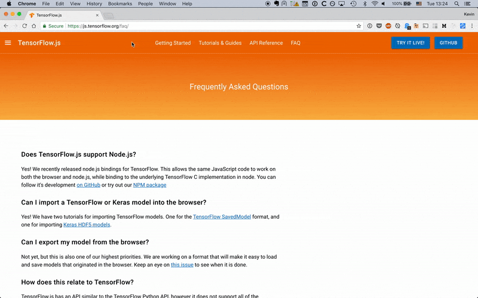

Up until fairly recently, just getting started writing your first line of machine learning code required a  hefty upfront investment in time and money. For example, just last year [I built my own PC specifically for machine learning](http://thekevinscott.com/deep-learning-cryptocurrency-pc-1-hardware/). I researched the parts and assembled it myself. Just doing that cost me around $1600 and 30 hours of setup time, and I'm still trying to wrangle the computer's configuration, libraries, and make it work with various frameworks.

The good news is that getting started with machine learning today has never been easier. In fact, if you're reading this it means you already have the tools you need to dive right in. **You can now learn the machine learning framework Tensorflow right in your browser, using Javascript.**


[Tensorflow.js was released](https://www.youtube.com/watch?v=OmofOvMApTU) at Google's I/O 2018. [Running machine learning in the browser opens up a world of use cases](http://thekevinscott.com/reasons-for-machine-learning-in-the-browser/), and is a great opportunity to use Javascript to learn about machine learning concepts and frameworks.

If you're new to Javascript or it's been a while since you've written any frontend code, some of the recent languages changes might throw you for a loop. I'll walk through the basics of modern Javascript you'll need to get the basic Tensorflow.js examples running.

# Setup Tutorial
Let's state one thing up front: **all you need to run Tensorflow.js is your web browser**. That's it. No web server, no transpiler, no special software besides your web browser is necessary to run Tensorflow.js. And the code you develop locally is the same code you'll be able to ship to your users to run on their machines. Let's see how to get the Hello World example running with just a web browser.

## How to run the `Getting Started` example using only your browser

Every modern web browser ships with some sort of interactive Javascript Console built in. I use Chrome, which includes a Javascript Console you can open with "View > Developer > Javascript Console".



This Javascript Console lets you write Javascript and execute it immediately. We'll use this to run the Getting Started example from the [Tensorflow.js docs](https://js.tensorflow.org/#getting-started).

The first thing is to include the Tensorflow.js Javascript file. A hosted version of the file is available via the CDN (Content Delivery Network) below. A quick way to include an external `.js` file via the console is:

```
var script = document.createElement('script');
script.src = "https://cdn.jsdelivr.net/npm/@tensorflow/tfjs@0.10.0";
document.getElementsByTagName('head')[0].appendChild(script);
```

Copy and paste this into your Javascript Console and you'll have a copy of Tensorflow saved as `tf`. Once that's done, you can run the rest of the Getting Started example (the Javascript between the second `<script>` tag) by pasting it directly into your console.

## How to run the Getting Started example using a Javascript hosting platform

An alternative approach is to use an online Javascript hosting platform. Three popular ones are [CodePen](https://codepen.io/), [JSFiddle](https://jsfiddle.net/), and [JSBin](https://jsbin.com/). These platforms can automatically include scripts for you and take care of transpiling your code in the browser, which makes getting started a cinch.

You can view [the following example on Codepen](https://codepen.io/anon/pen/aGapZL) to see an implementation working. Make sure to open your browser console, as explained above, to see the output.

## How to run the Getting Started example locally

Finally, you can save the `.html` file and open it locally on your computer, even without a web server. Copy the html code into a file, and open it in your web browser. For instance, if you save the file onto your desktop and you're on a Mac, you might open it in your browser with the following URL:

`file:///Users/YOURNAME/Desktop/sample.html`

It is important to note that viewing `html` files this way introduces limitations, including issues with referencing relative links, handling ajax calls and security, among other things. But it's a quick and easy way to get something running in your browser.

# The Modern Javascript Development Workflow

Hopefully by this point, you can see how easy it is to get something basic to show up in your browser. If you begin looking at the Tensorflow.js examples, you might be thinking *how do I organize my files?* or *how do I manage third party libraries in my code?* or even *what's with these syntax errors?*

As soon as you move beyond the basic Hello World example above and into some of the other examples, you'll begin to run into syntax issues and organization issues, and that's where a strong Javascript pipeline comes in.

## A little bit of Javascript history

As our expectations for web apps has grown over the past decade, the Javascript ecosystem has exploded in complexity. Traditionally Javascript has gotten a lot of flak for its language design, but over the past few years it's matured a lot, while still boasting one of the largest userbases of any programming language.

One of the major additions has been updates to the language itself. You'll see references to `ES5`, `ES6`, `ES2015`, `E2016` being bandied around. `ES` stands for `ECMAScript` and [Javascript is based on this standard](https://benmccormick.org/2015/09/14/es5-es6-es2016-es-next-whats-going-on-with-javascript-versioning/). `5` and `6` were traditionally used to refer to versions of the standard, but nowadays years are used for additional clarity.

Modern browsers mostly implement the up-to-date spec, but there's cutting edge features that are not included, and older browsers (like older versions of IE) won't always support the up-to-date spec. ([You can see browser support here](https://caniuse.com/#search=es6)). Because of this instability, it's considered good practice to use a bundler to convert Javascript code to something with wide-spread adoption (like ES5), enabling developers to write code using modern conveniences while still supporting a broad range of devices.

Many of the Tensorflow.js examples make use of new syntax that is not yet widely supported in browsers. I'll explain what they are first and then explain how to get them working.

### `import` and `export`

`import` and `export` are two bits of syntax recently introduced into Javascript for importing modules. The saga of javascript modules is [long and winding](https://ponyfoo.com/articles/brief-history-of-modularity), but the [community has largely settled on `import` over `require`](https://insights.untapt.com/webpack-import-require-and-you-3fd7f5ea93c0). Unfortunately, `import` is not (currently) supported by any browsers, so to use it you need to use a packager.

In the Getting Started docs, you'll see an example of `import` first thing:

```
import * as tf from '@tensorflow/tfjs';
```

This is basically the same as writing:

```
var tf = require('@tensorflow/tfjs');
```

You also might see something like:

```
import { util, tensor2d } from '@tensorflow/tfjs';
```

Whose equivalent using `require` is:

```
var tf = require("@tensorflow/tfjs");
var util = tf.util;
var tensor2d = tf.tensor2d
```

### `async` and `await`

Javascript has traditionally been used heavily with UIs, which are inherently asynchronous. There have been [three broad patterns for handling asynchronous code: callbacks, promises, and async/await](https://medium.com/@stevekonves/three-javascript-async-patterns-1d2e7094860a
).

`async`/`await` provides a way of defining asynchronous functions in a synchronous way. [Many of the Tensorflow.js examples](https://js.tensorflow.org/tutorials/webcam-transfer-learning.html) make use this `async` / `await` syntax.

Here's two versions of the same code, the first written with `async`/`await`, the second using promises:

```
// With async/await
async function loadMobilenet() {
  const mobilenet = await tf.loadModel(
      'https://storage.googleapis.com/tfjs-models/tfjs/mobilenet_v1_0.25_224/model.json');

  // Return a model that outputs an internal activation.
  const layer = mobilenet.getLayer('conv_pw_13_relu');
  return tf.model({inputs: model.inputs, outputs: layer.output});
});
```

```
// With promises
function loadMobilenet() {
  return tf.loadModel('https://storage.googleapis.com/tfjs-models/tfjs/mobilenet_v1_0.25_224/model.json').then(function (mobilenet) {
    // Return a model that outputs an internal activation.
    const layer = mobilenet.getLayer('conv_pw_13_relu');
    return tf.model({inputs: model.inputs, outputs: layer.output});
  });
});
```

* * *

Both of these language features - `import`/`export` and `async`/`await` - make writing Javascript a much more pleasant experience. Let's see how we can use them.

## Javascript Tooling

On the Getting Started docs, you'll see:

> **Note**: Because we use ES2017 syntax (such as `import`), this workflow assumes you are using a bundler/transpiler to convert your code to something the browser understands. See our examples to see how we use Parcel to build our code. However you are free to use any build tool that you prefer.

At its most basic, a bundler is a program that takes your Javascript code and "bundles" it up into a compatible file for the browser. As the Javascript ecosystem has grown, bundlers have taken on increased responsibility as the orchestators of the whole production. Modern-day bundlers will transpile code (convert ES2018 code to ES5, along with other non-standard dialects like React or Typescript, using something like [`babel`](https://babeljs.io/)), set up "hot reloading" to refresh the browser with code changes without reloading the page, and many other things.

[Grunt](https://gruntjs.com/) and [Gulp](http://gulpjs.com/) used to be popular bundlers but have recently fallen out of favor to [`webpack`](https://webpack.js.org/). Other bundlers include [`parcel`](https://parceljs.org/) and [`rollup`](https://rollupjs.org/guide/en). The Tensorflow.js examples use Parcel, which boasts a zero configuration approach.

## Package managers
Often, when encountering a Javascript library, you'll see installation instructions like `yarn add @tensorflow/tfjs` or `npm install @tensorflow/tfjs`.

[`yarn`](https://yarnpkg.com/en/) and [`npm`](https://www.npmjs.com/) are both package managers. They're command line tools used to install and keep track of your third party Javascript dependencies.

`yarn` and `npm` are pretty similar and the decision of which one to use is largely up to personal preference (though you'll find plenty of holy wars online if you're into that sort of thing).

Either one will save your dependencies into a `package.json` file which should be checked into your git repository. This file will enable other developers to quickly install all the necessary dependencies for your project and get things running quickly.

* * *

You'll need to install `npm` or `yarn`, along with `Node.js`; once that's done, following the instructions on any of the Tensorflow.js examples should work out of the box.

Again, you don't need any of these tools to work with these examples, but using them makes programming worlds easier. If you intend to do any sort of serious Javascript development, I would encourage you to play with these tools, along with other popular Javascript tools like [React](https://reactjs.org/) and [Typescript](https://www.typescriptlang.org://www.typescriptlang.org/), which make handling larger codebases much more manageable.
